.. -----------------------------------------------------------------------------
    (c) Crown copyright Met Office. All rights reserved.
    The file LICENCE, distributed with this code, contains details of the terms
    under which the code may be used.
   -----------------------------------------------------------------------------

.. attention::

   This documentation has been transfered directly from the UM to LFRic;
   It is still a work in progress. There are still UM-specific references
   and terminology that are yet to be updated.

===============================================
The Parametrization of Boundary Layer Processes
===============================================

:Author: A. Lock, J. Edwards and I. Boutle

.. role:: raw-latex(raw)
   :format: latex
..

Introduction and code versions
==============================

This is the documentation for the "boundary layer" parametrization of
vertical turbulent transports of heat, moisture and horizontal momentum.
It includes surface exchange but *not* the parametrization of the
surface itself. This is covered within the surface (JULES)
documentation. Although commonly referred to as the "boundary layer"
parametrization, it includes a free-tropospheric component. Turbulent
fluxes are calculated up to "BL_LEVELS" which is currently set so that
the entire troposphere is included.

Generally speaking, only version 9C of the boundary layer
parametrization will be documented here as it is now the only supported
version. However, the documentation still makes occasional references to
previous versions of the scheme (8A, 9B) as it is useful to retain the
history of how we have got to where we are. Version 9 interfaces to the
JULES surface code, which is now the only supported surface code within
the UM.

Several options for higher order closures are available in the 1A
version of the UM boundary layer scheme and these are documented
separately in ``:umdp:025``.

.. _sec_closure:

Model variables and turbulence closure
======================================

Given source terms, :math:`{\mathcal{S}}` say, from processes other than
boundary layer turbulence, Reynolds' averaging gives the following
equation for conserved scalar variables, :math:`\chi`, and the two
horizontal components of momentum, :math:`{\mathbf{u}}` on a sphere gives:

.. math:: :label: cons_eqn_scal

   \frac{\partial \chi}{\partial t}
   = - \frac{1}{r^2 \rho} \, \frac{\partial }{\partial z} \left( r^2 \rho
   \overline{w'\chi'} \right)
   + {\mathcal{S}}

.. math:: :label: cons_eqn_uv

   \frac{\partial {\mathbf{u}}}{\partial t}
   = \frac{1}{r^2 \rho} \, \frac{\partial }{\partial z} \left( r^2 {\bf \tau}
   \right)
   + {\mathcal{S}}

where :math:`\overline{w'\chi'}` and :math:`{\bf \tau}` are the vertical
turbulent fluxes to be parametrized, :math:`r` is the height from the
centre of the planet and :math:`\rho` is density. The scalar variables
treated by :eq:`cons_eqn_scal`, which are
approximately conserved under moist adiabatic ascent, are:

.. math:: :label: thetal

   \theta_{\ell}= T_L + \frac{g}{c_p} z = T - \frac{L}{c_p} q_{\ell}
                   - \frac{L_s}{c_p} q_f + \frac{g}{c_p} z

.. math:: :label: qt

   q_t = q_v + q_{\ell}+ q_f

where :math:`T` is temperature, :math:`q_v` is specific humidity,
:math:`q_{\ell}` and :math:`q_f` the specific liquid and frozen water
contents respectively, and :math:`L_s=L+L_f` is the latent heat of
sublimation. Note that :math:`\theta_{\ell}` is based on 'liquid/frozen
water static energy' (:math:`= c_p T + g z - L q_{\ell}-
L_s q_f`) rather than potential temperature, :math:`\theta`. Note also
that the option to use mixing ratios in the boundary layer code instead
of specific quantities is also available and the details of the
necessary changes are documented in appendix :ref:`Appendix: changing between
specific humidities and mixing ratios <app_mixratio>`.
Ultimately turbulent motions are dissipated as heat and so the source
term :math:`{\cal S}` in :eq:`cons_eqn_scal` can include an
approximation for that frictional heating, as described in
appendix :ref:`Appendix: including the heating from turbulence dissipation
<app_fricheat>`. Finally, the ice cloud contributions in
:eq:`thetal` and :eq:`qt` can optionally be ignored
(l_noice_in_turb), which will be more appropriate if the time scales for
ice melting or sublimation are longer than those of the turbulence (and
so may be more appropriate if the ice itself is not being mixed by
parametrized turbulence). In this instance the saturation humidity will
be calculated with respect to liquid water at all temperatures and, for
consistency, only liquid cloud fractions with be considered.

An additional variable used for diagnostic purposes is

.. math:: :label: thetavl

   \theta_{v\ell}= \theta_{\ell}(1 + c_v q_t)

where :math:`c_v=(1/\epsilon) -1` and :math:`\epsilon` is the ratio of
the molecular weights of water vapour and dry air (i.e., :math:`\epsilon
= M_v/M_a \approx 0.62198`). Thus :math:`\theta_{v\ell}` is a conserved
variable that is equal to virtual potential temperature
(:math:`\theta_v`) in cloud-free air and so is used as a simplified
measure of buoyancy.

A 'first-order' closure is used to parametrize the turbulent fluxes,
although non-local terms are also included. Under the 9C scheme, an
alternative methodology is optionally available, see section
:ref:`The revised scalar flux-gradient formulation <sec_rev_flux_grad>`. The
standard closures are:

.. math:: :label: scal_closure

   \overline{w'\chi'} = - K_h \frac{\partial \chi}{\partial z} +
   K_h^{\mathrm{surf}}\gamma_{\chi}

.. math:: :label: uv_closure

   {\bf \tau} = K_m \frac{\partial {\mathbf{u}}}{\partial z} + {\bf \tau}^{nl}

Separate eddy-diffusivities are calculated for momentum, :math:`K_m`,
and for scalar variables, :math:`K_h`. The second term on the right hand
side represents a non-local flux in unstable boundary layers. Currently
it is only applied for transport arising from surface-driven turbulence
(:math:`K_h^{\mathrm{surf}}`) and is non-zero only for
:math:`\chi=\theta_{\ell}`, as described in
section :ref:`Gradient adjustment <sec_gradadj>`.

Thus, the parametrization reduces to determining :math:`K_h`,
:math:`K_m` and :math:`\gamma_{\chi}` and :math:`{\bf \tau}^{nl}`. Two
methods are used to determine :math:`K_h` and :math:`K_m` and how they
are combined for :eq:`scal_closure` and
:eq:`uv_closure` is described in
section :ref:`Shear-driven mixing and interaction between the local and
non-local schemes <sec_shear>`. The first method is a local Richardson
number (:math:`Ri`) based scheme. It is calculated for all regimes (but
will be responsible for all mixing in stable conditions), over all
levels up to the specified BL_LEVELS and is described in
section :ref:`The local scheme <sec_local>`. The second method is a non-locally
specified
profile scheme. This is exclusively for unstable boundary layers, is
calculated up to level NL_BL_LEVELS (typically around 6km AMSL) and is
described in more detail in section :ref:`The non-local scheme <sec_nonlocal>`.
In this
regime, mixing is assumed to occur in (or lead rapidly to the formation
of) well-mixed layers (in which conserved variables are approximately
uniform with height) that are capped by an inversion. Mixing is assumed
to be driven either from the surface in a 'surface mixed layer' (SML, by
a positive surface buoyancy flux and by surface stresses) or by
cloud-top buoyancy sources (radiative and evaporative cooling, see
appendix :ref:`Appendix: Definitions of the velocity scales <app_vscales>`). As
described in section
:ref:`The non-local scheme <sec_nonlocal>`, separate :math:`K`-profiles are
used for these
two turbulence sources. If the cloud-top sources generate mixing
throughout the SML the layer is said to be 'coupled' but if the
:math:`K`-profile representing surface-driven mixing does not extend up
to cloud-top, the layer is referred to as being 'decoupled'. As
decoupled layers are restricted to being buoyancy driven and typically
below 6km, they are referred to as decoupled stratocumulus (DSC) layers.
The calculation of :math:`\gamma_{\chi}` is described in
section :ref:`Gradient adjustment <sec_gradadj>` and, finally, fluxes across
the top of
both SML and DSC layers (the entrainment fluxes) are specified
explicitly through a separate entrainment parametrization, as described
in section :ref:`Entrainment fluxes <sec_entr>`.

The strategy used to determine precisely where and when the resulting
eddy-diffusivities should be applied is described in
section :ref:`Diagnosis of boundary layer depth and type <sec_types>`. The
buoyancy parameters, finite difference
and other notation used here are defined in
appendices :ref:`Appendix: Derivation and definitions of the buoyancy
parameters <app_buoyp>` and :ref:`Appendix: Notation <app_not>`. Further papers
describing this scheme and its performance are
`Lock et al. (2000)`_ (noting the corrigendum in
`Lock et al. (2001)`_),
`Martin et al. (2000)`_,
`Lock (2001)`_, `Bush et al. (1999)`_ and
`Brown et al. (2008)`_.

.. _sec_types:

Diagnosis of boundary layer depth and type
==========================================

The non-locally specified :math:`K`-profiles require the height of the
base and top of the layer to be diagnosed (see
section :ref:`The non-local scheme <sec_nonlocal>`). Furthermore, as stated in
section :ref:`Model variables and turbulence closure <sec_closure>`, the mixing
generated by the non-local
:math:`K` profiles is assumed to occur in (or lead rapidly to the
formation of) well-mixed layers capped by an inversion. Thus, the
accurate diagnosis of their vertical extent is crucial. How to make this
diagnosis is dependent on the boundary layer mixing regime which has
been categorised into 7 distinct 'boundary layer types':

- **Type I**: Stable boundary layer (with or without cloud) -- turbulent
  diffusivities are calculated by the 'local' scheme
  (section :ref:`The local scheme <sec_local>`)

- **Type II**: Boundary layer with stratocumulus over a stable
  near-surface layer -- as Type I but with a turbulently mixed cloud
  layer driven from its top (a DSC layer, diagnosis described in section
  :ref:`Diagnosis of the vertical extent of the K-profiles <sec_decouple>`)

- **Type III**: Well mixed boundary layer -- the classic single mixed
  layer which may be cloud-topped or clear but is predominantly
  buoyancy-driven (c.f. a possible type VII below) -- diagnosis described
  in section :ref:`The diagnostic parcel ascent and cumulus diagnosis
  <sec_adiapar>`)

- **Type IV**: Unstable boundary layer with a DSC layer not over cumulus
  (see section :ref:`Diagnosis of the vertical extent of the K-profiles
  <sec_decouple>`) -- the surface-based and
  cloud-top-driven non-local :math:`K` profiles may or may not overlap
  and cloud-top entrainment can still include the surface forcing (see
  section :ref:`Entrainment fluxes <sec_entr>`)

- **Type V**: Boundary layer with a DSC layer over cumulus -- the cumulus
  (treated by the model's mass-flux convection scheme) provides coupling
  with the SML (cumulus diagnosis described in section
  :ref:`The diagnostic parcel ascent and cumulus diagnosis <sec_adiapar>`)

- **Type VI**: Cumulus-capped boundary layer -- no turbulent
  diffusivities are allowed [#fnote1]_ at or above the LCL as the mass-flux
  convection scheme operates here (cumulus diagnosis described in
  section :ref:`The diagnostic parcel ascent and cumulus diagnosis
  <sec_adiapar>`)

- **Type VII**: Shear-dominated unstable layer -- potentially wind-shear
  might allow deeper turbulent mixing in unstable boundary layers than
  is apparent purely from the thermodynamic profiles (sufficient even to
  inhibit the formation of cumulus); the possibilities are discussed in
  section :ref:`Shear-driven mixing and interaction between the local and
  non-local schemes <sec_shear>`.

Types I to VI are shown schematically in :numref:`Fig. %s <fig:bltypes>`.

   Schematic representation of boundary layer types I to VI. The top of the
   upward arrows indicate the height :math:`z_{\mathrm{par}}` while the top of
   their solid line portions indicate :math:`z_{\mathrm{h}}`.

   .. list-table::
      :align: center
      :widths: 46 46

      * - .. image:: wcrp_bltypes1.svg
                     :width: 92%
        - .. image:: wcrp_bltypes2.svg
                     :width: 92%

.. _sec_adiapar:

The diagnostic parcel ascent and cumulus diagnosis
--------------------------------------------------

**Summary**: the depth of the non-local :math:`K`-profiles for
surface-driven turbulence (with NTML grid-levels in the mixed layer and
top at height :math:`z_{\mathrm{h}}` , as required for
:eq:`kmsurf`) is determined from:

#. a diagnostic moist parcel ascent; top at grid-level NTPAR, height
   :math:`z_{\mathrm{par}}` :math:`=z_{\mathrm{ \mathrm{NTPAR}}+\frac{1}{2}}`.
   Typically this is an adiabatic parcel but entraining options are
   available.

#. a diagnosis of cumulus-capped layers (if cumulus-capped then NTML and
   :math:`z_{\mathrm{h}}` are set to the LCL [#fnote2]_, if not then to the
   parcel
   top)

Note that this process is only performed for unstable boundary layers
(defined by a positive surface buoyancy flux, i.e.,
:math:`\overline{w'b}_S>0`).

**Step 1:** the method assumes that the height to which turbulent mixing
driven by surface processes can extend in unstable boundary layers (and
therefore the vertical extent of the :math:`K` profile for
surface-driven turbulence) can be determined solely from the properties
of the thermodynamic profiles. In more detail, the first step in
calculating :math:`z_{\mathrm{h}}` is to lift a parcel, with properties from
the first grid-level (:math:`k=k_s`) above the top of the surface layer,
upwards allowing for latent heat release. The top of the surface layer
is taken to be at the lower of :math:`z=0.1`\ :math:`z_{\mathrm{h}}` (this is
then consistent with the :math:`K`-profiles, see
section :ref:`Surface-driven turbulence <sec_nlsurf>`; :math:`z_{\mathrm{h}}`
is taken from the
previous timestep) and the grid-level above which :math:`\theta_{v\ell}`
starts to increase with height. The ascent is stopped at the grid-level
NTPAR (height
:math:`z_{\mathrm{par}}` :math:`=z_{\mathrm{ \mathrm{NTPAR}}+\frac{1}{2}}`)
above which the parcel becomes more negatively buoyant than a given
threshold, :math:`\theta_v'`. Note that the parcel properties themselves
are not perturbed in order to preserve the height of the mixed-layer's
lifting condensation level (LCL). The calculation of the parcel's
buoyancy excess is described in section :ref:`Calculation of parcel buoyancy
excess <sec_parxs>`.
Currently,

.. math:: :label: parcel_pert

   \theta_v' = \mathrm{max} \left[A_{plume},
              \, \mathrm{min} \left[ B_{plume} \sigma_{Tv1},
              \, G_{max}z_{\mathrm{h}}\right] \right]

where :math:`A_{plume}=0.2`, :math:`B_{plume}=3.26`,
:math:`G_{max}=10^{-3}`\ Km\ :math:`^{-1}`,
:math:`\sigma_{Tv1} = 1.93\, \overline{w'\theta_v'}_S/w_m` and
:math:`w_m^3=u_*^3+0.25\,z_{\mathrm{h}}\overline{w'b}_S`. Following
`Holtslag and Boville (1993)`_,
:math:`\theta_v'` is related to the magnitude of the gradient
adjustment, :math:`\gamma_{\theta_{\ell}}` (see section
:ref:`Gradient adjustment <sec_gradadj>`). Thus, :math:`B_{plume}=A_{ga}`,
although
somewhat arbitrary limits have been placed on the magnitude of
:math:`\theta_v'` for numerical security (the upper limit being
consistent with that applied to :math:`\gamma_{\theta_{\ell}}` in
:eq:`gradadj` ). Within limits, then, :math:`\theta_v'`
represents a typical buoyancy excess of boundary layer plumes.

The pressure at the LCL, :math:`P_{LCL}=P_{k_s}
(T_{LCL}/T_{k_s})^{(1/\kappa)}`, where :math:`\kappa=R/c_p`. The
temperature at the LCL, :math:`T_{LCL}`, is calculated using
approximations in `Bolton (1980)`_ as

.. math:: T_{LCL} = 55 + \frac{2840}{3.5 \log(T_{k_s}) - log(e_{k_s}) - 4.805}

where the vapour pressure of air in grid-level :math:`k_s`,
:math:`e_{k_s} =
q_{k_s} P_{k_s}/(100 \, \epsilon)`. The full-level below that containing
the LCL is labelled NLCL and
:math:`z_{\mathrm{lcl}}` :math:`=z_{\mathrm{ \mathrm{NLCL}}+\frac{1}{2}}`. If
the parcel rises above the top of the LCL transition zone (defined as
1.1\ :math:`z_{\mathrm{lcl}}` , its ascent can also be stopped at the
grid-level at which it has maximum buoyancy excess over the environment.
This is identified as the grid-level above which

.. math::

   \frac{d\theta_v}{dz}|_{\mathrm{env}} >
     \Gamma_{\mathrm{inv}}\, \frac{d\theta_v}{dz}|_{\mathrm{par}}

where currently the tolerance for identifying inversions by this method,
:math:`\Gamma_{\mathrm{inv}}=1.1`. This use of the height of maximum excess
(if lower than that given by the straight buoyancy threshold,
:math:`\theta_v'`) is typically of little consequence in stratocumulus
regions (which tend to be well-mixed beneath large inversions), but can
be necessary in order to identify the capping inversion in cumulus cases
(e.g. in the trade wind regions).

**Step 2:** having established :math:`z_{\mathrm{par}}` , a crucial
additional test is to determine whether this layer is well-mixed (i.e.,
stratocumulus-capped) or cumulus-capped. The parcel ascent can rise to
cloud-top in both cases but cumulus cloud layers are observed not to be
as well-mixed as stratocumulus layers. Recall that application of the
:math:`K` profiles is expected to form or maintain well-mixed layers and
so their current formulation is inappropriate for cumulus cloud layers.
Specifically, a logical flag (CUMULUS) is set to true if

.. math::

   \left| \frac{ \Delta_{\mathrm{cld}} q_t}{\Delta_{\mathrm{cld}} z} \right| >
     C_t \, \left| \frac{ \Delta_{\mathrm{sub}} q_t}{\Delta_{\mathrm{sub}} z}
     \right|

where the cloud-layer gradient, :math:`\Delta_{\mathrm{cld}}`, is taken
between both NTPAR and NTPAR-1 (to allow for the possibility that a Sc
layer has just deepened by a grid-level) and NLCL and the sub-cloud
layer gradient, :math:`\Delta_{\mathrm{sub}}`, between grid-levels NLCL and
:math:`k_s`. Currently the threshold factor, :math:`C_t = 1.1`. If
cumulus is diagnosed, the top of the surface-based mixed layer
(:math:`z_{\mathrm{h}}` ) is set to :math:`z_{\mathrm{lcl}}` (rather than to
:math:`z_{\mathrm{par}}` , as illustrated in :numref:`Fig. %s <fig:bltypes>` for
types V and VI). There is then an option to diagnose the thickness of
the LCL transition zone, see section :ref:`Diagnosis of the LCL transition zone
thickness <sec_lclmixing>`.
Otherwise, the boundary layer surface-driven mixing is capped at
:math:`z_{\mathrm{lcl}}` so that mixing into the cumulus cloud layer is only
carried out by the model's mass-flux convection scheme and not by the
eddy viscosity based boundary layer scheme. Note that basing the CUMULUS
diagnosis on cloud and sub-cloud layer gradients limits the model only
to being able to resolve cumulus with cloud and sub-cloud layers at
least 2 grid-levels (and optionally 400m) thick. Otherwise the layer is
considered well-mixed to :math:`z_{\mathrm{par}}` with an option to include a
representation of fluxes into the capping inversion (see
section :ref:`Diagnosis of inversion thickness <sec_dzi>`).

If the parcel ascent fails to find an inversion below 3km (or BL_LEVELS)
but the LCL is below BL_LEVELS, then the layer is assumed to be
cumulus-capped. If the LCL is above BL_LEVELS, then again cumulus is
diagnosed with NTML\ :math:`=\mathrm{min}[`\ NLCL, BL_LEVELS\ :math:`-1]`,
in the hope that the mass-flux convection scheme (in its moist or dry
mode) will transport the surface fluxes higher! Clearly this restriction
on the boundary layer scheme is not desirable and so a value of
BL_LEVELS above the tropopause is recommended.

Note that if cumulus is not diagnosed then a further, subgrid estimation
of the height of the capping inversion is attempted for
:math:`z_{\mathrm{h}}`  (as described in section :ref:`Diagnosis of a sub-grid
inversion <sec_sginv>`).

.. _sec_parxs:

Calculation of parcel buoyancy excess
^^^^^^^^^^^^^^^^^^^^^^^^^^^^^^^^^^^^^

As described in appendix :ref:`Appendix: Derivation and definitions of the
buoyancy parameters <app_buoyp>`, virtual temperature,
:math:`T_v =
T(1 + c_v q_v - q_{\ell}- q_f)`, is used as the measure of buoyancy. The
condensed water in the parcel at a grid-level :math:`k`
(:math:`q_{\ell f}^p`, the superscript :math:`^p` indicating parcel
properties) is estimated using a Taylor expansion of :math:`q_s` about
the environment at that grid-level
(:math:`q_s^p \approx {q_s}_k + \alpha_L (T^p-T_k)`). Assuming that
:math:`q_{\ell f}^p=q_t^p - q_s^p` gives

.. math:: :label: qlpar

   q_{\ell f}^p = \mathrm{max}\left[ 0.0, \, a_L \left( q_t^p - {q_s}_k
            - \alpha_L (\theta_{\ell}^p - (g z_k/c_p)-T_k)\right)
     \right]

where the buoyancy parameters :math:`a_L` and :math:`\alpha_L` are
defined in appendix :ref:`Appendix: Derivation and definitions of the buoyancy
parameters <app_buoyp>`. Recall that the parcel has
:math:`q_t` and :math:`\theta_{\ell}` taken from grid-level :math:`k_s`
which are conserved during its ascent. Note that :eq:`qlpar`
will not give condensation until the parcel becomes saturated. In the
environment the cloud scheme will allow some condensation (and therefore
warming and stabilisation of the environment profile) to take place
before the grid-level becomes saturated in the mean. To allow for this
in the parcel (without applying the cloud scheme),
:eq:`qlpar` is also calculated at each grid-level but using
the environment grid-box mean :math:`q_t` and :math:`\theta_{\ell}` to
give :math:`q_{\ell f}^e`. The difference in the environment's condensed
water as determined by the UM cloud scheme (i.e., :math:`q_{\ell}+q_f`)
and by :eq:`qlpar` (i.e., :math:`q_{\ell f}^e`) is then added
to :math:`q^p_{lf}`.

Given :math:`q_{\ell f}^p`, :eq:`thetal` implies
:math:`T^p = \theta_{\ell}^p - (g z_k/c_p)
+ (L q_{\ell f}^p/c_p)` (using :math:`L_s` if :math:`T_k` is below the
melting point) and :eq:`qt` implies
:math:`q_v^p = q_t^p - q_{\ell f}^p` and thus :math:`T_v^p` can be
calculated. Recall that the diagnosis of the parcel's maximum buoyancy
excess over the environment (described in
section :ref:`The diagnostic parcel ascent and cumulus diagnosis <sec_adiapar>`) required :math:`\theta_v`. This is
approximated as :math:`\theta_v = T_v + (g z_k/c_p)`.

.. _sec_decouple:

Diagnosis of the vertical extent of the K-profiles
--------------------------------------------------

The diagnosis of mixed layers with turbulence driven from cloud-top has
been separated in to three stages. These are:

#. diagnose the existence of a decoupled stratocumulus (DSC) layer with
   approximately uniform :math:`\theta_{v\ell}` (label the top
   grid-level in the mixed-layer NTDSC and diagnose the subgrid height
   of its capping inversion, :math:`z_{\mathrm{h}}^{\mathrm{Sc}}` , see
   section :ref:`Diagnosis of a sub-grid inversion <sec_sginv>`)

#. diagnose an approximate depth of the DSC layer, :math:`z_{\mathrm{ml}}`,
   in order to be able to calculate the representative turbulent
   velocity scales (see appendix :ref:`Appendix: Definitions of the velocity
   scales <app_vscales>`).

#. calculate the depth of the :math:`K` profiles (see
   section :ref:`The non-local scheme <sec_nonlocal>`) in both SML and DSC
   layers using
   constraints on the TKE budget of the layer. This includes the
   diagnosis of recoupling of DSC layers and decoupling of SMLs

**Step 1**: the diagnosis of DSC layers depends on whether cumulus
convection has been diagnosed. If a cumulus-capped layer under an
inversion within BL_LEVELS has been diagnosed, grid-levels NTPAR and
NTPAR+1 are tested to see if they contain significant layer cloud
(:math:`C_F>` SC_CFTOL). This threshold for identifying potentially
turbulently-mixed cloud layers is currently SC_CFTOL\ :math:`=0.1`. If
there is significant cloud, NTDSC is set to NTPAR.

Alternatively, if a well-mixed surface-driven boundary layer was
diagnosed, then from grid-level NTML\ :math:`+2` upwards, a cloud-top
grid-level (:math:`k_{ct}`) is sought such that :math:`{C_F}_{k_{ct}}>`
SC_CFTOL and :math:`{C_F}_{k_{ct}+1}<` SC_CFTOL. If
:math:`\Delta_{k_{ct}} \theta_{v\ell}/
\Delta_{k_{ct}} z < 10^{-3}`\ Km\ :math:`^{-1}` (i.e.,
:math:`\theta_{v\ell}` is approximately well-mixed over at least two
grid-levels), then NTDSC is set to :math:`k_{ct}`. If grid-levels
:math:`k_{ct}` and :math:`k_{ct}-1` are not well-mixed, grid-levels
:math:`k_{ct}-1` and :math:`k_{ct}-2` are tested using the same
criterion. If they are not well-mixed either, the cloud-layer is ignored
for the purposes of turbulent mixing. If grid-levels :math:`k_{ct}-1`
and :math:`k_{ct}-2` are identified as well-mixed a further test is
applied to determine whether the :math:`\theta_v` (rather than
:math:`\theta_{v\ell}`) gradient across grid-levels :math:`k_{ct}` and
:math:`k_{ct}-1` is greater than adiabatic (i.e., whether grid-levels
:math:`k_{ct}` and :math:`k_{ct}-1` actually form part of an inversion --
note that by ignoring the :math:`q_{\ell}` contribution to buoyancy,
:math:`\theta_{v\ell}` is not a good variable to use to measure the
strength of cloud-capping inversions). To do this, the :math:`\theta_v`
gradient between grid-levels :math:`k_{ct}` and :math:`k_{ct}-1` is
compared with that for a parcel lifted adiabatically from grid-level
:math:`k_{ct}-1`, in exactly the same way as for the SML parcel ascent
(see section :ref:`Calculation of parcel buoyancy excess <sec_parxs>`). If
:math:`d\theta_v/dz|_{\rm env} > \Gamma_{\rm inv} d\theta_v/dz|_{\rm par}`
between grid-levels
:math:`k_{ct}` and :math:`k_{ct}-1` then NTDSC is set to
:math:`k_{ct}-1`; if not then NTDSC is set to :math:`k_{ct}` (recall
that grid-levels :math:`k_{ct}-1` and :math:`k_{ct}-2` have already been
identified as well-mixed).

**Step 2** is to diagnose an approximate depth of the DSC layer,
:math:`z_{\mathrm{ml}}`. The bottom grid-level of the mixed-layer (NBDSC) is
diagnosed as the lowest grid-level, descending from NTDSC, where
:math:`{\theta_{v\ell}}_{\mathrm{ \mathrm{NTDSC}}} + \theta_{v\ell}'` is
less than :math:`\theta_{v\ell}` of the environment. The parcel
perturbation is given by

.. math:: :label: dscd_pert

   \theta_{v\ell}' = - \, \frac{ \tau_{rc} \Delta_F}{z_{rc}}

where :math:`\Delta_F` (Kms\ :math:`^{-1}`) is the magnitude of the
cloud-top radiative divergence (see appendix :ref:`Appendix: Definitions of the
velocity scales <app_vscales>`),
:math:`\tau_{rc}` is a timescale for the exposure of boundary layer
eddies to the cloud-top radiative cooling (taken to be 200s) and
:math:`z_{rc}` is a depth-scale for the radiatively cooled layer (taken
to be 50m). These values of :math:`\tau_{rc}` and :math:`z_{rc}` are
only estimates (and will in reality vary from one cloud to another) but
they are consistent with, for example, the observations of
`Nicholls and Turton (1986)`_. If the parcel failed to fall (i.e.,
NBDSC equals NTDSC) in a DSC layer *not* overlying cumulus, then the
layer is assumed not to be well-mixed. At the top of a cumulus layer,
the DSC layer is given a minimum depth of
:math:`\Delta_{\mathrm{ \mathrm{NTDSC}}+\frac{1}{2}} z`. Otherwise, the
layer depth, :math:`z_{\mathrm{ml}}`, is measured from the top of layer NTDSC
to the base of layer NBDSC.

**Step 3**: the step 2 calculation of :math:`z_{\mathrm{ml}}` is used to
calculate the representative velocity scales for the DSC layer but its
calculation is only crude. Here, the vertical extent of the
:math:`K`-profiles is determined more accurately by ensuring that the
magnitude of the integrated buoyancy consumption of TKE within the mixed
layer is less than or equal to a fraction, :math:`D_t`, of the buoyancy
production, following `Turton and Nicholls (1987)`_.

Following appendix :ref:`Appendix: Derivation and definitions of the buoyancy
parameters <app_buoyp>` the grid-box mean buoyancy flux
can be written as:

.. math:: :label: eq:wb_cont

   \overline{w'b}= g \left[ (1-C_F) \left(\beta_T \overline{w'\theta_{\ell}'} +
   \beta_q \overline{w'q_t'}\right) +
       C_F \left( \tilde{\beta_T} \overline{w'\theta_{\ell}'} + \tilde{\beta_q}
       \overline{w'q_t'}\right)
     \right]

As standard, the fluxes in :eq:`eq:wb_cont` are then
expanded using the first-order closure in
:eq:`scal_closure` as:

.. math:: :label: eq:wx_std

   \begin{aligned}
   \overline{w'\theta_{\ell}'}_k &=&
   -K_h^{\mathrm{surf}}\,\frac{\widetilde{\Delta_k \theta_{\ell}}}{\Delta_k z}
                -K_h^{\mathrm{Sc}}\,\frac{\Delta_k \theta_{\ell}}{\Delta_k z}
   \\
   \overline{w'q_t'}_k  &=&  -\left(K_h^{\mathrm{surf}}+
   K_h^{\mathrm{Sc}}\right) \,
                \,\frac{\Delta_k q_t}{\Delta_k z}
   \end{aligned}

where
:math:`\widetilde{\Delta_k \theta_{\ell}} = \Delta_k \theta_{\ell}-
\gamma_{\theta_{\ell}} \Delta_k z` in order to include the non-local (or
gradient adjustment) term. If the alternative flux-gradient option is
used, see section :ref:`The revised scalar flux-gradient formulation
<sec_rev_flux_grad>`, then additional terms
are needed.

Large-eddy simulations have demonstrated that the crucial region in
determining when decoupling of stratocumulus will occur (i.e., when the
:math:`K` profiles no longer span the entire layer from cloud-top to the
surface) is in a thin layer of unsaturated air just below cloud-base,
where :math:`\overline{w'b}` first becomes negative. Thus, in the above
calculation, it is crucial both to have an accurate measure of
cloud-base height (which will have to be subgrid) and to include
successfully this thin unsaturated layer in the buoyancy consumption
integral. Thus, the :math:`\overline{w'b}` integration is performed over
the cloud and sub-cloud layers separately and the cloud-fraction is
taken to be uniform within the cloud layer (and zero below cloud-base).
The height of cloud-base is given by :eq:`zc_calc`.

An iterative method is then used to find the vertical extent of mixing
(within certain bounds, as described below) such that the magnitude of
buoyancy consumption of TKE within the mixed layer equals a fraction,
:math:`D_t`, of the buoyancy production, i.e.,

.. math:: :label: deccrit

   \sum_{z_{k-\frac{1}{2}} > z_i-z_{\mathrm{ml}}}^{z_{k-\frac{1}{2}} < z_i}
     \left|\left[ \overline{w'b}|_{z_{k-\frac{1}{2}}}<0 \right]\right| \,
     \Delta_k z \,
     \leq \, D_t \,
     \sum_{z_{k-\frac{1}{2}} > z_i-z_{\mathrm{ml}}}^{z_{k-\frac{1}{2}} < z_i}
     \left[ \overline{w'b}|_{z_{k-\frac{1}{2}}}>0 \right] \, \Delta_k z

Note that, for simplicity, the :math:`{\mathcal{E}}_h` factors are not
included in :math:`K_h^{\mathrm{surf}}` or :math:`K_h^{\mathrm{Sc}}` when
calculating :eq:`eq:wx_std` under the assumption that
they will be small. This process is applied to all unstable mixed
layers. For stratocumulus layers, observations and LES suggest a value
of :math:`D_t=0.1`. A separate value of :math:`D_t` can be used for the
sub-cloud layer in cumulus capped boundary layers if this method is used
to determine the LCL transition zone thickness, see section
:ref:`Diagnosis of the LCL transition zone thickness <sec_lclmixing>`. For
cloud-free mixed layers, :math:`D_t=1` is
used, purely to keep negative buoyancy fluxes down to a reasonably
realistic level (for example, if the parcel top diagnostic returned too
high a boundary layer depth).

The first step is to test for whether a well-mixed layer is possible
(either decoupling what has so far been diagnosed as a well-mixed layer
or, if one exists, recoupling a decoupled stratocumulus layer), i.e., to
test whether :eq:`deccrit` is satisfied with both
:math:`K_h^{\mathrm{surf}}` and :math:`K_h^{\mathrm{Sc}}` extending from the
surface to the cloud-top. If recoupling is possible then the various
flags identifying the DSC layer are reset (*this includes setting the
cumulus diagnosis to false*), any surface-driven entrainment originally
applied at :math:`z_{\mathrm{h}}` is added to the entrainment at
:math:`z_{\mathrm{h}}^{\mathrm{Sc}}` (after rescaling for the inversion strength
at :math:`z_{\mathrm{h}}^{\mathrm{Sc}}` ) and :math:`z_{\mathrm{b}}` is set to
0.1\ :math:`z_{\mathrm{h}}` (for the reason discussed above). If decoupling
is diagnosed, :math:`z_{\mathrm{h}}^{\mathrm{Sc}}` is set to the original
:math:`z_{\mathrm{h}}` (inversion height), although the entrainment across
this inversion is not recalculated (and so keeps any surface-driven
component -- the COUPLED flag is therefore set to true, see
section :ref:`Entrainment fluxes <sec_entr>`).

If a decoupled layer is diagnosed, then an iteration is performed to
find the highest :math:`z_{\mathrm{h}}` (so top of the
:math:`K_h^{\mathrm{surf}}`
profile) that still satisfies :eq:`deccrit`, but with
:math:`K_h^{\mathrm{Sc}}=0` in :eq:`eq:wx_std`. The iteration
proceeds with :math:`z_{\mathrm{h}}` stepping from its lowest permissible
height to its highest (currently 3 steps are used). If at any stage
:eq:`deccrit` is violated, then the step below (therefore
containing the height that would give equality in
:eq:`deccrit`) is divided by 4 and 3 of those steps are
taken downwards. If :eq:`deccrit` is met the step above is
again reduced by a factor of 4 and 3 steps taken upwards. A total of 3
sweeps are possible, each with a smaller step so that
:math:`z_{\mathrm{h}}` approaches the height that gives equality in
:eq:`deccrit`. The accuracy with which this is achieved
will be the difference in the maximum and minimum permissible heights of
:math:`z_{\mathrm{h}}`  divided by :math:`2\times4\times4 = 32`, which will
typically be less than 30m. The top grid-level of the SML, NTML, is
defined as the highest grid-level such that :math:`K_h^{\mathrm{Sc}}` is
non-zero at the half-level above.

The above process is then repeated to find the appropriate
:math:`z_{\mathrm{b}}` for :math:`K_h^{\mathrm{Sc}}`, i.e., for the base of
top-driven mixing. Some constraints are placed on :math:`z_{\mathrm{b}}` ,
namely that it should never go below :math:`0.1`\ :math:`z_{\mathrm{h}}` (to
avoid affecting the continuity of the :math:`K` profiles at the top of
the surface layer, see :eq:`ws_defn`). If cumulus
convection has been diagnosed then :math:`z_{\mathrm{b}}` is not allowed to
go below :math:`z_{\mathrm{ \mathrm{NTML}}+\frac{1}{2}}` (unless the layer
is diagnosed to recouple completely). Finally, :math:`z_{\mathrm{b}}` must
always be at or below :math:`z_{\mathrm{ \mathrm{NTDSC}}-1}`, so that
mixing in decoupled layers is always resolved, and at least
:math:`\Delta z_{rad}` (the cloud-top radiative cooling depth defined in
section :ref:`Integration of \overline{w'b} close to the inversion
<sec_wbint_inv>`) below the t inversion. The base
grid-level of the DSC layer, NBDSC, is defined (analogously to NTDSC) as
the lowest grid-level such that :math:`K_h^{\mathrm{Sc}}` is non-zero at the
half-level below.

A possible extension to this diagnosis would be to include the shear
contribution to the TKE budget in :eq:`deccrit` and so
allow shear-driven mixing to help maintain well-mixed layers.

Surface layer :math:`\overline{w'b}` integration
^^^^^^^^^^^^^^^^^^^^^^^^^^^^^^^^^^^^^^^^^^^^^^^^

In the surface layer, below :math:`z_i/10`, the :math:`K` profiles have
a different functional form from the rest of the mixed layer. Rather
than include this additional complexity in the :math:`\overline{w'b}`
integration, the surface layer is treated separately. In place of the
finite-difference form of :math:`\overline{w'b}`, see
:eq:`eq:wb_cont` and :eq:`eq:wx_std`
above, :math:`\overline{w'b}` is assumed to be linear between
:math:`\overline{w'b}_S` at the surface and zero at a level which must
be estimated. The surface layer integration is then from the surface up
to :math:`z_{{\rm K_{SURF}}}`, where :math:`\theta`-level K_SURF is the first
above
:math:`z_i/10`. The level where :math:`\overline{w'b}` is zero is found
by linear interpolation across the grid-levels where the diagnosed
cloud-free buoyancy flux would become negative. This is where
:math:`\beta_T
\widetilde{\Delta_k \theta_{\ell}} + \beta_q \Delta_k q_t` becomes
positive and so where the cloud-free part of :math:`\overline{w'b}`
(i.e., that part below cloud-base which is important for decoupling)
becomes negative.

.. _sec_wbint_inv:

Integration of :math:`\overline{w'b}` close to the inversion
^^^^^^^^^^^^^^^^^^^^^^^^^^^^^^^^^^^^^^^^^^^^^^^^^^^^^^^^^^^^

Because of the large gradients often seen in fluxes close to the
inversion (in particular, in the LW radiative flux), simple finite
difference flux calculations, :eq:`eq:wx_std`, can be
significantly inaccurate in this region. An example is shown in
:numref:`Fig. %s <fig:inv_integ>`. Calculating
:math:`\overline{w'\theta_{\ell}'}_{\mathrm{ \mathrm{NTML}}+\frac{1}{2}}`
from :eq:`eq:wx_std` gives a negative value, largely
because :math:`\Delta_{\mathrm{ \mathrm{NTML}}+1} \theta_{\ell}` is
positive and so the local flux is large and negative. In reality,
:math:`\overline{w'\theta_{\ell}'}` becomes positive only a short
distance below cloud-top such that the integral here will tend also to
be positive.

The solution adopted is to integrate :math:`\overline{w'b}` analytically
across the region just below the inversion, labelled
:math:`\Delta z_{rad}` in Fig, :numref:`%s <fig:inv_integ>`. Since
:math:`\Delta_{\mathrm{ \mathrm{NTML}}} \theta_{\ell}` can also be
significantly positive (when the grid-level inversion is rising or
falling, for example), the base of this region is taken to be the lower
of the first :math:`\theta`-level below :math:`z_h-100` m (a physically
reasonable depth over which cloud-top radiative cooling might be
expected to occur) and :math:`z_{\mathrm{ \mathrm{NTML}}-1}`.

   Subgrid (lines) and model (symbols) fluxes of :math:`\theta_{\ell}`:
   turbulent flux (dash-dotted, crosses), radiative flux (dashed, triangles)
   and total flux (solid). The shaded area illustrates the integrated turbulent
   flux that would be obtained were :eq:`eq:wx_std` used.

   .. list-table::
      :align: center
      :widths: 100

      * - .. image:: ideal_invinteg.svg

Then,

.. math:: :label: wthl_int

   \begin{aligned}
   \int_{z_h-\Delta z_{rad}}^{z_h} \, \overline{w'\theta_{\ell}'}\, dz  & = &
   \int_{z_h-\Delta z_{rad}}^{z_h} \, F_{\theta_{\ell}}^{Tot} -
   F_{\theta_{\ell}}^{NT}\, dz
   \\
   & = &  I^{Tot} - I^{rad} - I^{ppn}
   \end{aligned}

For the radiative flux, it could be assumed that the subgrid flux
distribution is exponentially dependent on the grid-level LWP, for
example. This would give:

.. math:: :label: irad

   I^{rad} = \frac{\Delta z_{rad}}
     {\ln(F^{rad}|_{z_h}/F^{rad}|_{z_h-\Delta  z_{rad}} ) }
      \left(F^{rad}|_{z_h}-F^{rad}|_{z_h-\Delta  z_{rad}} \right)

However, off-line tests indicated this could give a strong and spurious
sensitivity to :math:`F^{rad}|_{z_h-\Delta z_{rad}}`. Furthermore, for
most realistic scenarios, the logarithmic factor in :eq:`irad`
tends to be close to 3. Consequently, we approximate :math:`I^{rad} =
\Delta z_{rad} ( F^{rad}|_{z_h}-F^{rad}|_{z_h-\Delta z_{rad}} ) /3`. In
addition, :math:`F^{rad}|_{z_h}-F^{rad}|_{z_h-\Delta z_{rad}}` is
approximated as :math:`\Delta F`, the radiative flux change across
cloud-top used in the calculation of :math:`V_{\mathrm{Sc}}`
:eq:`ctraddiv`. The precipitation flux is assumed to vary
linearly across this region, as does the total flux, and so its
contribution to :math:`I^{Tot}` cancels with :math:`I^{ppn}` in
:eq:`wthl_int`. Finally, for simplicity, the total flux is
taken to be constant and equal to the inversion value, such that
:math:`I^{Tot} = \Delta z_{rad} F^{Tot}|_{z_h}`. With these
approximations, :eq:`wthl_int` becomes

.. math::

   \begin{aligned}
   \int_{z_h-\Delta z_{rad}}^{z_h} \, \overline{w'\theta_{\ell}'}\, dz  & = &
   \Delta  z_{rad} \left(-w_e \Delta \theta_{\ell}+ \Delta F\right)
   - \Delta z_{rad} \Delta F/ 3
   \\
   & = & \Delta  z_{rad} \left(-w_e \Delta \theta_{\ell}+ \frac{2}{3} \Delta
   F\right)
   \end{aligned}

For the integral of :math:`\overline{w'q_t'}` across this cloud-top
region, :math:`\overline{w'q_t'}` is also taken to be constant so that:

.. math::

   \int_{z_h-\Delta z_{rad}}^{z_h} \, \overline{w'q_t'}\, dz =
     - \Delta  z_{rad} w_e \Delta q_t

The integrated buoyancy flux is then found from
:eq:`eq:wb_cont` using the mixed layer cloud fraction
and buoyancy coefficients evaluated at the grid-level above
:math:`z_h -\Delta z_{rad}`.

.. _sec_dzi:

Diagnosis of inversion thickness
--------------------------------

Terminating the diagnostic parcel ascent at its level of neutral
buoyancy ignores any overshooting through the parcel's own inertia as it
enters the inversion region. This overshooting region effectively
defines the depth of the inversion over which the negative entrainment
heat fluxes are seen. Typically this will be small relative to the model
vertical grid but at higher vertical resolution or when a strongly
surface-heated boundary layer is capped by weak stability inversions
could be resolved. Following `Beare (2008)`_, a simple
energetic argument gives a realistic prediction of the top of the
inversion, :math:`z_{top}`, in LES from

.. math:: :label: dz_param

   6.3 \, w_m^2  =  \int_{z_{nb}}^{z_{top}} \, b \, dz

where :math:`z_{nb}` is the level of neutral buoyancy (found by linear
interpolation between grid-levels), :math:`w_m` is the boundary layer
velocity scale defined in section :ref:`Surface-driven turbulence <sec_nlsurf>`
and :math:`b` is
the parcel buoyancy. Note that the constant in
:eq:`dz_param` is the same as in
`Beare (2008)`_ because :math:`6.3 = 2.5 * 4^{2/3}` and
:math:`w_m^3` differs by a factor of 4. The buoyancy integration in
:eq:`dz_param`, that is itself dependent on
:math:`z_{top}`, is performed working upwards from
:math:`z_{\mathrm{par}}` assuming piece-wise linear variation of :math:`b`
between grid-levels. Note that the standard definition of the boundary
layer top in the UM is the height of the first flux level below the
level of neutral buoyancy, so
:math:`z_{\mathrm{par}}` :math:`=z_{\mathrm{ \mathrm{NTPAR}}+\frac{1}{2}}`. The
inversion thickness is then defined as

.. math:: :label: dz_definition

   \Delta z_i  =  z_{top} -z_{\mathrm{par}}

.. _sec_lclmixing:

Diagnosis of the LCL transition zone thickness
----------------------------------------------

As described in section :ref:`The diagnostic parcel ascent and cumulus
diagnosis <sec_adiapar>`, when cumulus convection
has been diagnosed surface-driven mixing was originally capped at
:math:`z_{\mathrm{lcl}}` so that mixing into the cumulus cloud layer was only
carried out by the model's mass-flux convection scheme. This was seen to
lead to errors in the mean profiles across the LCL, with superadiabats
being the most extreme manifestation. Using the boundary layer
parametrization to couple cloud and sub-cloud layers would have the
numerical advantage of being implicit. There is also observational and
LES evidence that appropriately-scaled buoyancy fluxes up to the LCL are
indistinguishable from those in cloud-free convective boundary layers
and so the non-local surface-driven mixed layer K-profiles remain
accurate up to this level. To diagnose the depth to which these profiles
should penetrate above the LCL, the algorithm given in
section :ref:`Diagnosis of the vertical extent of the K-profiles
<sec_decouple>` to diagnose the extent of the K-profiles
in decoupled boundary layers can be used (using the switch kprof_cu).
This ensures that the magnitude of the integrated buoyancy consumption
of TKE within the mixed layer is less than or equal to a fraction,
:math:`D_t`, of the buoyancy production. In cumulus layers, cloudy
thermals will generate positive buoyancy fluxes (and are handled by the
convection scheme) but it is assumed that there will also be cloud-free
thermals within the grid box that may penetrate above the grid-box mean
LCL (but are too dry to reach their own LCL). Thus their buoyancy flux
is given by :eq:`eq:wb_cont` with :math:`C_F=0`.
Restricting the negative integral of this buoyancy flux then gives a new
definition for :math:`z_{\mathrm{h}}`  that is then used in the calculation
of the surface-driven K-profiles in section :ref:`Surface-driven turbulence
<sec_nlsurf>` -- the
larger the value of :math:`D_t`, the higher :math:`z_{\mathrm{h}}` will be.
Typically :math:`D_t=0.1` for decoupled stratocumulus layers while
idealised clear-sky convective boundary layers (where the magnitude of
the entrainment buoyancy flux is a fraction, :math:`A_1`, of the surface
flux) would have :math:`D_t = A_1^2 \sim 0.05`. For GA7 :math:`D_t` has
been set to 0.05 for this cumulus transition zone calculation. Because
the Gregory-Rowntree convection scheme triggers from the LCL, that is
used as a minimum constraint on the boundary layer mixing depth (so that
the massflux and turbulence schemes remain coupled). With other
convection schemes this may not be appropriate and so this minimum
constraint can be relaxed, which is achieved by setting it to half the
height of the LCL (the factor of a half is arbitrary, with no
sensitivity to this choice given that the diagnosis parcel reached the
LCL, but ensures the iteration starts well below the LCL).

.. _sec_local:

The local scheme
================

A first order 'mixing length' closure is used:

.. math:: :label: kmlocal

   K_m = {\mathcal{L}}_m^2 \, (S+S_d) \, f_m(Ri)

.. math:: :label: khlocal

   K_h = {\mathcal{L}}_h \, {\mathcal{L}}_m \,
           (S+S_d) \, f_h(Ri)

where :math:`{\mathcal{L}}_m` and :math:`{\mathcal{L}}_h` are the neutral mixing
lengths and :math:`S` is the resolved vertical shear of the horizontal
wind components, :math:`S = \left| \partial {\mathbf{u}}/\partial z \right|`.
A representation of the wind shear, :math:`S_d`, generated by drainage
flows in complex terrain can also be included, as described below. Near
the surface simple finite difference calculations for the vertical
gradients can become inaccurate because of the quasi-logarithmic
profiles of variables :raw-latex:`\cite[]{Ayra1991}`. Currently this is
ignored above grid-level 2 and the neutral mixing lengths are given by

.. math::

   {\mathcal{L}}_m = \frac{k(z+z_{0m})}{1+k(z+z_{0m})/\lambda_m}

.. math::

   {\mathcal{L}}_h = \frac{k(z+z_{0m})}{1+k(z+z_{0m})/\lambda_h}

where :math:`z_{0m}` includes the orographic component. For the lowest
interior grid-level (:math:`k=1`) they are calculated, incorporating
this log profile correction, as

.. math::

   \tilde{{\mathcal{L}}}_{X,k-1/2} = \frac{k \Delta_{k-1/2} z}{
       ln\left( \frac{z_k + z_{0m}}{z_{k-1} + z_{0m}} \right)
       + \frac{k \Delta_{k-1/2} z}{\lambda_X} }

If near-surface resolution is increased this logarithmic correction
should be considered over more levels.

The asymptotic mixing lengths are given by

.. math:: :label: asymp_ml

   \begin{aligned}
   \lambda_m &=&\mathrm{max}\left[\lambda_0,\, 0.15 z_{\mathrm{loc}}, 2 h_B
   \right]
   \\
   \lambda_h &=&\mathrm{max}\left[\lambda_0,\, 0.15 z_{\mathrm{loc}}\right]
   \end{aligned}

where :math:`\lambda_0` is a minimum mixing length read in from the
namelist and :math:`z_{\mathrm{loc}}` is defined below. The orographic
blending height, :math:`h_B` (only used within the boundary layer, as
defined below), is given by

.. math:: h_B = {\rm max}\left[z_1+(z_{0m})_{\mbox{veg}}, 2^{1/2} \sigma_h
   \right]

where :math:`\sigma_h` is the standard deviation of the height of the
subgrid orography and :math:`(z_{0m})_{\mathrm{veg}}` is the vegetative
part of the roughness length. The constants in
:eq:`asymp_ml` can be considered 'tuned' (see, in
particular, the operational modifications described in
appendix :ref:`Appendix: Operational modifications <app_opmods>`).

The Richardson number, :math:`Ri`, that is used as a local measure of
stability is given by

.. math:: :label: ridefn

   Ri = \frac{\Delta B / \Delta z}{(S+S_d)^2}

The measure of buoyancy used in :math:`Ri` is

.. math:: :label: Bdefn

   \Delta B = g\left(   \overline{\beta_T} \Delta \theta_{\ell}
              + \overline{\beta_q} \Delta q_t    \right)

where :math:`\overline{\beta_T}` and :math:`\overline{\beta_q}` are the
grid-box mean (i.e., cloud weighted) buoyancy coefficients, that can be
defined in two different ways, see appendix :ref:`Appendix: Derivation and
definitions of the buoyancy parameters <app_buoyp>` and
section :ref:`Finite difference calculations <sec_fd_ri>`. Note that
:eq:`Bdefn` reduces
to a virtual temperature approximation of buoyancy in cloud-free air and
that neutral buoyancy (in cloudy as well as cloud-free air) is implied
by vertically uniform :math:`\theta_{\ell}` and :math:`q_t`. This is
then entirely consistent with the assumption that :math:`\theta_{\ell}`
and :math:`q_t` are conserved variables within the boundary layer
scheme.

As described in `Lock (2012)`_, the wind shear generated
by drainage flows in complex terrain is thought to lead to additional
vertical mixing. This wind shear can be approximated as

.. math:: S_d = \frac{\Delta B }{ \Delta z} \, \alpha_d \, t_d \, {\cal Z}_d

The representative slope of the local terrain, :math:`\alpha_d`, is
given by

.. math:: \alpha_d^2 = \frac{1.0}{ 25.0 + (l_h/\sigma_h)^2}

with :math:`l_h` a specified horizontal scale for the terrain, currently
taken to be 1500 m (empirically derived for Scottish orography in the
UKV), and :math:`\sigma_h` the standard deviation of the full subgrid
orographic height. :math:`\sigma_h` should also be taken as the average
over the surrounding area of each grid box (typically 6 to 8 grid
lengths), in order to be representative of the local area over which
such flows will be underresolved. The above formula is used so that
:math:`\alpha_d \sim \sigma_h/l_h` for small :math:`\sigma_h` but only
tends to 0.2 for large values. To limit the vertical extent of
:math:`S_d` to be below approximately :math:`z=\sigma_h`, a
height-dependent factor is included,
:math:`{\cal Z}_d = 0.5( 1 - {\rm tanh}\left[ 4 ((z/\sigma_h)-1)
\right])`. The timescale, :math:`t_d`, takes a fixed value of 30
minutes, for simplicity.

Initially, the lowest half-level at which :math:`Ri>Ri_{crit}` is taken
to be a measure of the boundary layer top (:math:`z_{\mathrm{loc}}` ) and the
full-level below is designated NTLOC. In general :math:`Ri_{crit}=1` but
a value of 0.25 is recommended for use with the 'SHARPEST' stability
functions, see below. If the boundary layer was diagnosed as
cumulus-capped by the non-local scheme (see section :ref:`Diagnosis of boundary
layer depth and type <sec_types>`)
then :math:`z_{\mathrm{loc}}` is lowered to :math:`z_{\mathrm{lcl}}` (and
:math:`K_h` and :math:`K_m` are set to zero from the base of grid-level
NLCL upwards) so that transports into and within the cumulus cloud layer
can be performed solely by the mass-flux convection scheme. Depending on
the switch local_fa, above NTLOC turbulently-mixed layers (where
:math:`Ri<Ri_{crit}`) are identified and within each layer
:math:`z_{\mathrm{loc}}` in :eq:`asymp_ml` is set to the layer
thickness. Outside of these turbulent layers the mixing lengths are set
to :math:`\lambda_0`.

For :math:`Ri < 0`, the standard UM stability functions are given by

.. math:: :label: unstable_stab

   \begin{aligned}
   f_m & =& 1 - \frac{g_0 \,Ri}
           {1+D_m(\tilde{{\mathcal{L}}}_m/\tilde{{\mathcal{L}}}_h)|Ri|^{1/2} }
   \\
   f_h & =& \frac{1}{Pr_N}\left(1 - \frac{g_0 \,Ri}
           {1+D_h(\tilde{{\mathcal{L}}}_m/\tilde{{\mathcal{L}}}_h)|Ri|^{1/2}
           }\right)
   \end{aligned}

with :math:`g_0=10`, :math:`D_m=g_0/4` and :math:`D_h=g_0/25`. If the
stability dependent Prandtl number option is chosen (see below) the
neutral Prandtl number, :math:`Pr_N`, is set to :math:`0.7`; otherwise
:math:`Pr_N=1`. Alternatives are those from the Met Office large-eddy
model (LEM), `Brown (1999) 2`_:

.. math:: :label: unstable_stab_lem

   \begin{aligned}
   f_m & =& (1 - c_{LEM} Ri)^{1/2}
   \\
   f_h & =& \frac{1}{Pr_N}\left(1 - b_{LEM} Ri\right)^{1/2}
   \end{aligned}

where :math:`Pr_N = 0.7`, and the constants :math:`b_{LEM}` and
:math:`c_{LEM}` can take the values 40 and 16 respectively in the
"standard" LEM model or both be 1.43 in the "conventional" model.

For stable conditions (:math:`Ri > 0`), several forms for the stability
functions are available. The 'long-tailed' functions are

.. math:: f_{\rm stable} = \frac{1}{1+g_0 Ri}

Alternative functions, which decrease as :math:`1/Ri^2` with increasing
stability are, from `Louis (1979)`_:

.. math:: f_{\rm stable} = \frac{1}{(1+ 5 Ri)^2}

and the family of "sharp" functions can be written in terms of a
transitional Richardson number, :math:`Ri_{t}`, as:

.. math::

   f_{\mathrm{stable}} =
   \begin{cases}
     (1 - 5Ri)^2 & {\mathrm{for}}\ 0<Ri<Ri_{t} \\
     (A_{Ri} + B_{Ri} Ri)^{-2} & {\mathrm{for}}\ Ri>Ri_{t}
   \end{cases}

where

.. math::

   \begin{aligned}
   A_{Ri} & = & \left(1-g_0 Ri_{t}\right)/\left(1- g_0 Ri_{t}/2\right)^2
   \\
   B_{Ri} & = & (g_0/2) /\left(1 - g_0 Ri_{t}/2\right)^2
   \end{aligned}

For the 'SHARPEST' function of `Derbyshire (1997)`_,
:math:`Ri_{t}=0.1`, while larger values give even sharper reduction of
turbulence with increasing :math:`Ri`. An additional option, used
operationally in some configurations (originally in the Mesoscale Model,
hence called 'MES tails'), is to blend linearly from Louis functions at
the surface to SHARPEST by 200m.

A stability dependent Prandtl number (:math:`Pr=f_m/f_h`) is generally
used following `Mailhot and Lock (2004)`_ with:

.. math:: Pr=\min \left( Pr_{\rm max}, \, Pr_N(1+2Ri) \, \right).

The maximum permitted Prandtl number, :math:`Pr_{\mathrm{max}}`, is currently
set to :math:`5` for model stability reasons. The stability functions
for :math:`Ri>0` are then given by:

.. math::

   f_m  = \frac{Pr}{Pr_N} \, f_{\mathrm{stable}}

.. math::

   f_h  = \frac{1}{Pr_N}  \, f_{\mathrm{stable}}

Note that writing the functions in this way ensures that :math:`f_m=1`
under neutral conditions and the effect of the variation in :math:`Pr`
is for :math:`f_m` to decrease slower with increasing :math:`Ri` than
:math:`f_{\mathrm{stable}}`, which can be explained through increasing
gravity-wave activity.

Finally, the LEM stable functions are also available which cut off all
turbulence beyond a critical Richardson number, :math:`Ri_c=0.25`:

.. math::

   f_m  = \left( 1 - \frac{Ri}{Ri_c} \right)^4

.. math:: :label: stable_stab_lem

   f_h  = \frac{1}{Pr_N} \left( 1 - \frac{Ri}{Ri_c} \right)^4 (1 - g_{LEM} Ri)

with :math:`g_{LEM}=1.2`.

.. _sec_fd_ri:

Finite difference calculations
------------------------------

The Charney-Phillips vertical grid staggering used in the UM stores the
horizontal wind components (:math:`u`, :math:`v`) on grid-levels,
:math:`\rho`-levels, that are staggered relative to scalar variables
(such as :math:`\theta_{\ell}` and :math:`q_t`) and vertical velocity,
:math:`w`. While much of the boundary layer scheme is grid-independent,
this has serious implications for the calculation of :math:`Ri`. There
are two obvious possibilities, to calculate :math:`Ri` (and thence
:math:`K(Ri)`) on either :math:`\theta`-levels or :math:`\rho`-levels
and then interpolate either :math:`K_h` or :math:`K_m` to be able to
calculate the required fluxes. To do the former requires averaging the
buoyancy gradient in the numerator (and is referred to by
`Cullen and James (1994)`_ as the ':math:`\theta`-bar' method), the
latter the wind shear in the denominator (referred to as the
':math:`\rho`-bar' method). Single-column model and other tests
demonstrated that the ':math:`\rho`-bar' method could readily generate
instabilities just above the top of the boundary layer because averaging
the wind shear into this stable air tended to reduce :math:`Ri` and so
promote mixing. Fortunately, the ':math:`\theta`-bar' method tended to
increase :math:`Ri` above inversions and so damp mixing. Thus,
:math:`Ri` is calculated on :math:`\theta`-levels as

.. math::

   Ri_k = \frac{DBDZ_k}
            {(\Delta_{k+\frac{1}{2}} {\mathbf{u}}/\Delta_{k+\frac{1}{2}} z)^2}

The buoyancy gradient on :math:`\theta`-level :math:`k` can be
calculated in two different ways, depending on the switch
i_interp_local. The long-standing method is given by

.. math::

   DBDZ_k = g\left( \overline{\beta_T}_{k} (D\theta_{\ell}DZ)_k
            + \overline{\beta_q}_{k} (Dq_t DZ)_k    \right)

where :math:`\overline{\beta_T}` and :math:`\overline{\beta_q}` are the
grid-box mean (i.e., cloud-fraction weighted) buoyancy coefficients,
defined in appendix :ref:`Appendix: Derivation and definitions of the buoyancy
parameters <app_buoyp>`. Note that because this is
defined on :math:`\theta`-levels, no vertical interpolation of cloud
variables (fractional area and water contents), to which the buoyancy
coefficients are very sensitive, is required. The volume-weighted
gradients of :math:`\theta_{\ell}` and :math:`q_t` are calculated as

.. math:: :label: gradient_interp

   (D\chi DZ)_k =\left( (z_{k}-z_{k-\frac{1}{2}}) \, \frac{\Delta_{k+1}
   \chi}{\Delta_{k+1} z} +
       (z_{k+\frac{1}{2}}-z_{k}) \, \frac{\Delta_{k} \chi}{\Delta_{k} z}
     \right) / \Delta_{k+\frac{1}{2}} z

as long as :math:`\chi_{k-1}` is defined on an atmospheric model level.
To calculate :math:`DBDZ_1`, between the surface and the lowest
:math:`\theta`-level, either the buoyancy gradient from level 1 to 2 can
be extrapolated, i.e.,

.. math:: (D\chi DZ)_1 = \frac{\Delta_{2} \chi}{\Delta_{2} z}

or surface properties can be used. Over sea, the sea-surface temperature
and :math:`q_{sat}` can be used. Over a heterogeneous (tiled) land
surface the appropriate moisture variable varies between tiles. For the
orographic form drag (`8.8 <#section_2>`__), an average :math:`Ri_{SL}`
of the surface layer is calculated but, as discussed above, subsequent
vertical averaging of :math:`Ri` would potentially be numerically
unstable. In principle, the tile-average of :math:`(Dq_t DZ)_1` could be
calculated but for now, over land, the grid-box average surface
temperature is used to calculate :math:`(D\theta_{\ell}DZ)_1` and
:math:`(Dq_t DZ)_1` is extrapolated from above (i.e.,
:math:`(Dq_t DZ)_1 = (Dq_t DZ)_2)`).

As noted above, a feature of the previous option is that applying the
cloudy buoyancy coefficients at a cloud top level, :math:`k` say, to
strong gradients interpolated between :math:`k-1` and :math:`k+1`, can
yield an unstable :math:`DBDZ_k` despite strong static stability,
especially when the upper level is very dry. This can be related to
cloud-top entrainment instability but this process is intended to be
represented within the non-local scheme. Hence, the alternative method
is to calculate the buoyancy gradient directly on :math:`\rho`-levels
and then interpolate this vertically to give :math:`DBDZ_k`, using
:eq:`gradient_interp`. This then requires a cloud
fraction on :math:`\rho`-levels. The difficulty comes where there is a
change in cloud fraction between levels. For this "edge" fraction,
:math:`f_{edge}` (the fraction of the grid-box that is cloudy in one
level but not in the other), the change in supersaturation
(:math:`s = q_t-q_{sat}`) between levels is used to estimate the
vertical fraction likely to contain cloud, :math:`f_{lev}`. For example,
where :math:`C_F` decreases with height,
:math:`f_{lev}={q_c}_{k-1}/(s_{k-1}-s_{k})`, where :math:`q_c` is the
total condensate, and :math:`f_{lev}` also constrained to be less than
unity. The total cloud volume fraction is then given by
:math:`f_{tot} = {\mathrm{min}}[{C_F}_{k-1},{C_F}_k] + f_{edge}f_{lev}` and
this is used to weight the saturated contribution to the buoyancy
parameters on :math:`rho`-levels, e.g.,
:math:`\overline{\beta_T}_{k-1/2} = f_{tot} \tilde{\beta_T}_{k-1/2} +
(1-f_{tot}){\beta_T}_{k-1/2})`,
where the saturated and unsaturated buoyancy parameters are also
intepolated to :math:`\rho`-levels using
:eq:`gradient_interp`.

Having calculated :math:`Ri` on :math:`\theta`-levels, :math:`{K_m}_{k}`
and :math:`{K_h}_{k}` are calculated, still on :math:`\theta`-levels, as
in :eq:`kmlocal` and :eq:`khlocal`. Finally,
:math:`K_h` must be interpolated to :math:`\rho`-levels:

.. math::

   {K_h}_{k+\frac{1}{2}} = \left(
       (z_{k+\frac{1}{2}}-z_{k}) {K_h}_{k+1} +
       (z_{k+1}-z_{k+\frac{1}{2}}) {K_h}_{k} \right) / \Delta_{k} z

Note that in the code the convention is for fluxes to be held on the
half-level below the variable itself. Consequently, RHOKM(K), and
therefore RI(K), are held on the 'half-level' below :math:`\rho`-level
K, which is :math:`\theta`-level K-1.

In addition to the above, the log profile correction applied to
:math:`{\cal L}_h` (to give :math:`\tilde{{\mathcal{L}}}_h`) must be applied
*after*
interpolation of :math:`K_h` to level :math:`k+\frac{1}{2}` in order
that the correct cancellation with the finite difference scalar gradient
in the flux calculation can occur. In the unstable stability functions
:eq:`unstable_stab`, however,
:math:`\tilde{{\mathcal{L}}}_h` must be calculated on :math:`\theta`-levels
(i.e., the same as :math:`\tilde{{\cal L}}_m` and :math:`Ri`) in order to
maintain the same stability
dependence.

.. _sec_shear:

Shear-driven mixing and interaction between the local and non-local schemes
---------------------------------------------------------------------------

The general approach is to take :math:`K_{\chi}` in
:eq:`scal_closure` and
:eq:`uv_closure` as

.. math:: :label: klnl

   K_{\chi} = \mathrm{max} \left[
   (K_{\chi}^{\mathrm{surf}}+K_{\chi}^{\mathrm{Sc}}),
                                 K_{\chi}(Ri) \right]

As noted in section :ref:`Model variables and turbulence closure
<sec_closure>`, this implies that mixing in
stable boundary layers is determined exclusively by the local scheme,
:math:`K_{\chi}(Ri)`. Continuing to calculate :math:`K_{\chi}(Ri)` in
unstable boundary layers and using :eq:`klnl` is seen as the
simplest way of achieving a relatively smooth transition between stable
and unstable boundary layers.

At the top of unstable mixed layers, great care is taken to ensure the
parametrized entrainment mixing is implemented faithfully, see
section :ref:`Entrainment fluxes <sec_entr>`). Consequently, if a subgrid
inversion has
been diagnosed capping a mixed layer (see
section :ref:`Diagnosis of a sub-grid inversion <sec_sginv>`), then
:math:`K_{\chi}(Ri)` is set to
zero at the interfaces either side of the inversion grid-level. There
are also options (using the switch Keep_Ri_FA) to set
:math:`K_{\chi}(Ri)` to zero entirely above unstable boundary layers or
across the LCL in cumulus-capped layers.

However, the mixed-layer depths were only diagnosed from thermodynamic
constraints. In near neutral boundary layers, shear generation of
turbulence might be expected to allow mixing to extend into regions of
weak static stability (and potentially to inhibit the formation of
cumulus). Currently, therefore, if NTLOC\ :math:`>`\ NTML+1 (in layers
that are not cumulus-capped) :math:`K_{\chi}(Ri)` is left unconstrained
by the SML part of the non-local scheme (and so not set to zero from the
SML inversion upwards) and similarly if NTLOC\ :math:`>`\ NTDSC+1. It is
realised that this does not cover the case of shear-driven mixing into
cloud layers that have been diagnosed as cumulus-capped (which would be
poorly represented by the current convection scheme). Several methods
have been introduced that attempt to alleviate this problem, giving rise
to the diagnosis of a "shear-dominated boundary layer" type (type VII),
discussed in section :ref:`Diagnosis of boundary layer depth and type
<sec_types>`. The first (the "shear-dominated
boundary layer fix") simply sets the CUMULUS flag to false if NTLOC
:math:`>` NTPAR. This then ensures that the locally-determined :math:`K`
are not set to zero above the LCL. Several more rigorous options are
available that incorporate a "dynamic criteria" in the diagnosis of
boundary layer type. The first of these prohibits the diagnosis of
cumulus boundary layers when the bulk measure of stability,
:math:`-z_i/L`, is small (currently less than 1.6). Here :math:`z_i` is
taken as the top of the diagnosis parcel ascent (or at most 3km) and
:math:`L` is the surface Obukhov length. This test also resets the depth
of the surface-based mixed layer to level 1 since the top of the parcel
ascent may not be suitable (having previously been diagnosed as cumulus
cloud top). The second method effectively increases the importance of
the Richardson number diagnosis and has been developed from analysis of
cold-air outbreaks :raw-latex:`\cite[]{bodas-salcedo2012}`. Because of
the strong surface buoyancy generation of turbulence in these regimes, a
calculation of :math:`Ri` is made that allows for the gradient
adjustment by the non-local scheme, i.e., using
:math:`\widetilde{\Delta_k \theta_{\ell}}` (see
:eq:`eq:wx_std`). The height, :math:`z_{\mathrm{loc}}` , where
:math:`Ri>Ri_{crit}=0.25` is found. It is then hypothesised that this
level of turbulent instability (that incorporates the effects of shear)
only needs extend some fractional distance into the cloud layer to
disrupt the formation of cumulus elements. Thus, if
:math:`z_{\rm loc}> z_{\rm lcl}+ f_{\rm sh}
\left(z_{\rm par}-z_{\rm lcl}\right)`, where :math:`f_{\mathrm{sh}}` is a
tunable parameter (:math:`0<f_{\mathrm{sh}}<1`), then the convection scheme
triggering is suppressed (the CUMULUS flag is set to false) and the top
of the non-local surface-based mixing coefficient is reset to
:math:`z_{\mathrm{par}}` (as it would have been before convection was
diagnosed from the parcel ascent).

A diagnostic is calculated, ZHT
:math:`=\mathrm{max}[z_{\mathrm{h}}, z_{\mathrm{h}}^{\mathrm{Sc}},
z_{\mathrm{loc}}]`, that
gives a measure of the maximum height of turbulent mixing (STASH 3,304).
Recall, :math:`z_{\mathrm{loc}}` is the boundary layer depth diagnosed by
:math:`Ri >
Ri_{crit}`, :math:`z_{\mathrm{h}}^{\mathrm{Sc}}` is the top of any stratocumulus
layer and :math:`z_{\mathrm{h}}` is the top of surface-based mixed layer,
found by adiabatic parcel ascent but reset to the LCL in cumulus capped
layers. Another diagnostic is available, the "boundary layer depth"
(STASH 25), that is set to :math:`=\mathrm{max}[z_{\mathrm{h}},
z_{\mathrm{loc}}]`
and so represents the depth of the stable boundary layer or "surface"
mixed layer. Also available are three diagnostics that represent the
calculated value of each of the individual terms in STASH 3,304: 3,356
is set to :math:`z_{\mathrm{h}}` ; 3,357 is
:math:`z_{\mathrm{h}}^{\mathrm{Sc}}`  and
3,358 is :math:`z_{\mathrm{loc}}` .

.. _sec_nonlocal:

The non-local scheme
====================

This method of calculating :math:`K` values for unstable conditions is
non-local in the sense that, at a given height within the boundary
layer, :math:`K` is determined not by any local properties of the mean
profiles at that height but solely by the magnitude of the turbulence
forcing applied to the layer (as measured by the representative velocity
scales described in appendix :ref:`Appendix: Definitions of the velocity scales
<app_vscales>`) and the height
within the layer. The non-local scheme is therefore particularly robust
but care must be taken where the profiles are applied. The calculation
of the vertical position and extent of the :math:`K` profiles is
described in section :ref:`Diagnosis of boundary layer depth and type
<sec_types>`.

.. _sec_nlsurf:

Surface-driven turbulence
-------------------------

For turbulence sources at the surface (namely surface drag with velocity
scale :math:`u_*`, and positive surface buoyancy fluxes with velocity
scale :math:`w_*`) in a layer with top at
:math:`z=`\ :math:`z_{\mathrm{h}}` , base at :math:`z=0` we set

.. math:: :label: kmsurf

   K_m^{\mathrm{surf}}= k \ z_{\mathrm{h}}\ w_m \ \frac{z}{z_{\mathrm{h}}}
               \left( 1 - {\mathcal{E}}_m^{\mathrm{surf}}
               \frac{z}{z_{\mathrm{h}}} \right)^2

where :math:`w_m^3 = u_*^3 + w_s^3`, :math:`u_*` is the friction
velocity (including the orographic roughness component) and :math:`w_s`
is defined below. For the 9C version of the scheme, :math:`z_{\mathrm{h}}` is
the diagnosed subgrid inversion height (see
section :ref:`Diagnosis of a sub-grid inversion <sec_sginv>`) for both
:math:`K_h^{\mathrm{surf}}` and
:math:`K_m^{\mathrm{surf}}`. In the 8A version, :math:`K_m^{\mathrm{surf}}` uses
:math:`z_{\mathrm{h}}` :math:`=z_{\mathrm{ \mathrm{NTML}}+\frac{1}{2}}`. The
factor :math:`{\mathcal{E}}_m^{\mathrm{surf}}` is chosen so that
:math:`K_m^{\mathrm{surf}}` will tend to
:math:`K_m|_{\mathrm{ \mathrm{NTML}}+\frac{1}{2}}` as :math:`z` tends to
:math:`z_{\mathrm{h}}` , where
:math:`K_m|_{\mathrm{ \mathrm{NTML}}+\frac{1}{2}}` is the entrainment
eddy-diffusivity (given by :eq:`khent`, although, in order to
avoid altering the shape function too much,
:math:`{\mathcal{E}}_m^{\mathrm{surf}}` is not allowed to fall below
:math:`0.7`).
A similar factor, :math:`{\cal E}_h^{\rm surf}`, is used in the
:math:`K_h^{\mathrm{surf}}` profile even though the
entrainment fluxes of the thermodynamic variables will usually be
specified explicitly rather than through an eddy-diffusivity (see
section :ref:`Entrainment fluxes <sec_entr>`).

The form of :math:`w_s` differs between the surface layer
(:math:`z < 0.1`\ :math:`z_{\mathrm{h}}` ) and the rest of the mixed-layer:

.. math:: :label: ws_defn

   w_s^3 =
     \begin{cases}
       2.5 \, \frac{z}{z_{\mathrm{h}}} w_*^3   & {\mathrm{surface}\ layer} \\
       0.25 \, w_*^3                 & {\mathrm{mixed}\ layer}   \\
     \end{cases}

and :math:`w_*^3=z_{\mathrm{h}}\overline{w'b}_S` using :math:`z_{\mathrm{h}}`
from
the current timestep (note that the use of :math:`w_*` here will be
inconsistent with the use of :math:`V_{\mathrm{heat}}` in the entrainment
parametrization in cloudy boundary layers). Note that :math:`w_s` is
continuous across :math:`0.1`\ :math:`z_{\mathrm{h}}` and constant with
height in the mixed layer. This form for :math:`w_s` is motivated by a
desire to match the model's surface transfer formulation within the
surface layer (as described further in section :ref:`Comparison with Holtslag
and Boville (1993)_ <sec_hbcomp>`)
and to use a cubic sum of velocity scales within the mixed layer
(consistent with dimensional analysis of the TKE equation, see
`Holtslag and Boville (1993)`_).

The formula for :math:`K_h^{\mathrm{surf}}` is identical to
:eq:`kmsurf` but with :math:`w_m` replaced by
:math:`w_h=w_m/Pr`, where the turbulent Prandtl number is given by:

.. math:: :label: prandtl_nl

   Pr = 0.75 \frac{u_*^4 + (4/25)w_s^3 w_m}{u_*^4 + (8/25)w_s^3 w_m}

Thus :math:`Pr` varies from 0.75 in neutral conditions to 0.375 in
convective. The origin of the functional form of
:eq:`prandtl_nl` is unknown.

.. _sec_hbcomp:

Comparison with `Holtslag and Boville (1993)`_
^^^^^^^^^^^^^^^^^^^^^^^^^^^^^^^^^^^^^^^^^^^^^^^^^^^^^^^^^^^^^^^^^^^^^^^^^^^^^^^

The surface-driven :math:`K` profiles are the same as those in
`Holtslag and Boville (1993)`_, HB93,
except for :eq:`ws_defn` and
:eq:`prandtl_nl` and the inclusion of the :math:`{\cal E}_m^{\rm surf}` terms.
For the latter, HB93 effectively set
:math:`{\cal E}_m^{\rm surf} =1`. To generate entrainment, however, they simply
use
:math:`K_m^{\mathrm{surf}}|_{\mathrm{ \mathrm{NTML}}+\frac{1}{2}}`, as
evaluated from :eq:`kmsurf` with a subgrid calculation of
:math:`z_{\mathrm{h}}` :math:`>z_{\mathrm{ \mathrm{NTML}}+\frac{1}{2}}`, rather
than using a separate entrainment parametrization.

The difference in :eq:`ws_defn` arises from the surface
layer, where HB93 match :math:`w_m` to their surface exchange functions
(i.e., :math:`w_m = u_* / \phi_m`) which results in proportionality
constants of 6 and 0.6 for :math:`w_s` in the surface and mixed layers
respectively. This matching is greatly simplified because their
non-dimensional shear
:math:`\phi_m = ( 1 + 15 k (z/z_i) w_*^3 / u_*^3 )^{-(1/3)}`. To match
:math:`w_m`, through :eq:`ws_defn`, to the UM function,
:math:`\phi_m = ( 1 + 16
k (z/z_i) w_*^3 / u_*^3 )^{-(1/4)}`, would require a complex function of
:math:`u_*` and :math:`w_*` in place of the constant and so this is not
attempted.

The formula for the Prandtl number used in the interior in HB93 is also
matched to that used in the surface exchange functions (:math:`Pr_{\rm surf}`,
say). For the UM,

.. math::

   Pr_{\mathrm{surf}} = \frac{\Phi_h}{\Phi_m}
                = \left( 1 + 16 \, k \frac{z}{z_{\mathrm{h}}} \,
                \frac{w_*^3}{u_*^3}
                  \right)^{-1/4}

giving :math:`Pr_{\mathrm{surf}} = 1` in the neutral limit (compared to 0.75
from :eq:`prandtl_nl`). In the convective limit,
:math:`Pr_{\rm surf}|_{0.1\, z_{\rm h}} \rightarrow 0.9 (w_*/u_*)^{-3/4} = 0.9
\beta^{3/4} = 0.14`
(compared to 0.375 from :eq:`prandtl_nl`). Thus, the
Prandtl numbers do not match between the surface layer and interior
formulations in the UM.

The formulation in HB93 gives :math:`Pr` varying from 1 to 0.6 (for
:math:`-z/L` varying from 0 to 10). In convective conditions
(:math:`-z/L=10`), HB93 have :math:`w_m = 0.85 w_*` and
:math:`w_h=1.4 w_*` while the UM has :math:`w_m = 0.65
w_*` and :math:`w_h = 1.7 w_*`. The implications of these differences
from HB93 are unknown. The convective LES in `Lock and Macvean (1999)`_
suggest :math:`w_h
\approx w_*`; I don't know where the larger proportionality constants
come from.

Another difference between the UM and HB93 is that HB93 only apply
gradient adjustment above the surface layer (and this is allowed for in
their mixed layer definition of :math:`Pr`). Simulations in
`Brown (1996)`_, however, suggest that this may lead to a
cold bias at the top of the surface layer. It is attempted to alleviate
this in the UM by the application of gradient adjustment down to the
surface (although this will then lead to a dependence on the height of
the lowest grid-level). The implications of this for matching the
Prandtl number between the surface and interior in the UM is not known.

Cloud-top-driven turbulence
---------------------------

For cloud-top-driven turbulence over a layer of depth :math:`z_{\mathrm{ml}}`
(with top at :math:`z_{\mathrm{h}}` or :math:`z_{\mathrm{h}}^{\mathrm{Sc}}` and
base at
:math:`z_{\mathrm{b}}` , determined as in section :ref:`Diagnosis of the
vertical extent of the K-profiles <sec_decouple>`),

.. math:: :label: kmtop

   K_m^{\mathrm{Sc}}= 0.63 \ k \ z_{\mathrm{ml}}\ V_{\mathrm{Sc}}\left(
   \frac{z'}{z_{\mathrm{ml}}} \right)^2
              \left( 1 - {\mathcal{E}}_m^{\mathrm{Sc}}
              \frac{z'}{z_{\mathrm{ml}}} \right)^{0.8}

where :math:`V_{\mathrm{Sc}}^3= V_{\mathrm{rad}}^3+V_{\mathrm{br}}^3` (see
appendix :ref:`Appendix: Definitions of the velocity scales <app_vscales>`) and
:math:`z'` is height above
:math:`z_{\mathrm{b}}` . Then :math:`K_h = K_m / \mathrm{Pr}`, where
:math:`\mathrm{Pr}=0.75`. The resulting :math:`K_h` profile was derived
against convective cloudy LES, as described in
`Lock (1999)`_. The appropriate Prandtl number
(and therefore :math:`K_m^{\mathrm{Sc}}`) is unknown, 0.75 being chosen
simply as a number in the middle of the range usually quoted for
turbulent mixing in general. As with :eq:`kmsurf`,
:math:`z_{\mathrm{h}}`  (or :math:`z_{\mathrm{h}}^{\mathrm{Sc}}` ) are given by
the
subgrid diagnosis (see section :ref:`Diagnosis of a sub-grid inversion
<sec_sginv>`) except for
:math:`K_m^{\mathrm{Sc}}` in the 8A scheme which uses the height of the
half-level below (:math:`z_{\mathrm{ \mathrm{NTML}}+\frac{1}{2}}` or
:math:`z_{\mathrm{ \mathrm{NTDSC}}+\frac{1}{2}}`). Again following
:eq:`kmsurf`, the factors :math:`{\mathcal{E}}_m^{\mathrm{Sc}}` and
:math:`{\mathcal{E}}_h^{\mathrm{Sc}}` are included in :eq:`kmtop` so
that :math:`K_m^{\mathrm{Sc}}` will tend to
:math:`K_m|_{\mathrm{ \mathrm{NTML}}+\frac{1}{2}}` (and
:math:`K_h^{\mathrm{Sc}}` to
:math:`K_h|_{\mathrm{ \mathrm{NTML}}+\frac{1}{2}}`), given by
:eq:`khent`, as :math:`z` tends to :math:`z_{\mathrm{h}}` (and
here no restriction is made on the magnitude of either :math:`{\cal E}_m^{\rm
Sc}` or :math:`{\mathcal{E}}_h^{\mathrm{Sc}}`).

.. _sec_gradadj:

Gradient adjustment
-------------------

Recall that for :math:`\theta_{\ell}` only we use

.. math:: :label: wthl

   \overline{w'\theta_{\ell}'}= - K_h \frac{\partial \theta_{\ell}}{\partial z}
   + K_h^{\mathrm{surf}}\gamma_{\theta_{\ell}}

where

.. math:: :label: gradadj

   \gamma_{\theta_{\ell}} =
     \mathrm{min}\left[ A_{ga} \frac{\sigma_{T1}}{z_{\mathrm{h}}}, G_{max}
     \right]

:math:`A_{ga}=3.26`, :math:`G_{max}=10^{-3}`\ Km\ :math:`^{-1}` and
:math:`\sigma_{T1} = 1.93 \,
\overline{w'\theta_{\ell}'}_S/w_m`, where for this calculation of
:math:`w_m` (given by
:math:`w_m^3=u_*^3+0.25\,z_{\mathrm{h}}\overline{w'b}_S`)
:math:`z_{\mathrm{h}}` is taken from the previous timestep. The form of
:eq:`gradadj` is similar to that used in HB93 and the
magnitude of :math:`\gamma_{\theta_{\ell}}` is the same as in HB93 in
the convective limit -- the difference in :math:`A_{ga}` exactly allows
for the different constants in :eq:`ws_defn`.

Consistent with the mixed layer assumptions underlying the non-local
scheme, the flux profile produced by the scheme is assumed to be
essentially determined by the specified surface and entrainment values.
Thus, the effect of including this non-local term (:math:`K_h^{\rm surf}
\gamma_{\theta_{\ell}}`) is to allow the model to maintain more
well-mixed :math:`\theta_{\ell}` profiles (i.e., with
:math:`\partial \theta_{\ell}/ \partial z` less negative or even
positive in a cloud-free surface-heated boundary layer, for example),
subject to an arbitrary upper limit included for numerical safety. Hence
the term 'gradient adjustment' rather than non-local flux. When
estimating the buoyancy flux, then (as in
:eq:`eq:wx_std`), it is simplest to allow for the
non-local term by adjusting the :math:`\theta_{\ell}` gradient.

The equivalent term for :math:`q_t` (i.e., :math:`\gamma_{q_t}`) is set
to zero in order to represent crudely the effects on the mixed-layer
:math:`q_t` profile of entrainment drying at the mixed-layer top which
tend to make :math:`q_t` profiles less well mixed than those of
:math:`\theta_{\ell}` :raw-latex:`\cite[]{mahrt1976}`. From UM version
5.5, there is the option to implement the non-gradient stress
parametrization of `Brown and Grant (1997)`_, as described in
section :ref:`Non-gradient stress parametrization <sec_ngstress>`.

.. _sec_ngstress:

Non-gradient stress parametrization
-----------------------------------

There is an option that is operational in the UM to include an
additional non-gradient (or non-local) stress parametrization,
:math:`{\bf \tau}^{nl}` in :eq:`uv_closure`, as proposed by
`Brown and Grant (1997)`_. They showed that with only a
down-gradient stress parametrization, a one-dimensional model produced
wind profiles in the convective boundary layer that were less well-mixed
than predicted by LES, and underestimated the near surface wind.
Furthermore, `Brown et al. (2006)`_ showed that the
operational verification statistics indicate a slow bias in the 10 m
wind over land by day, especially in spring and summer.

The non-gradient stress parametrization in the UM is very similar to
that proposed by `Brown and Grant (1997)`_, written

.. math:: :label: tau_nl

   (\tau_x^{nl},\tau_y^{nl})= \left[
       \frac{2.7w_*^3}{(u_*^3+0.6w_*^3)}\right] \left[ \left(
       \frac{z'}{z_{\mathrm{h}}'}
       \right) \left( 1- \frac{z'}{z_{\mathrm{h}}'} \right)^2 \right]
     (\tau_x^{s},\tau_y^{s})

Here :math:`w_*` is the convective velocity scale, :math:`u_*` is the
friction velocity, and :math:`(\tau_x^{s},\tau_y^{s})` are the surface
stresses. Note that the surface stresses here have to be diagnosed
explicitly (from time-level n fields) but experience has shown these can
become unrealistically large when the near-surface wind is significantly
out of balance with the surface characteristics. As a safety measure,
these surface stresses can be limited such that the implied stress
gradient across the boundary layer is always less than a parameter,
MAX_STRESS_GRAD, currently set to 0.05 ms\ :math:`^{-2}` (which, for
example, gives a maximum :math:`u_*` of 7 ms\ :math:`^{-1}` in a
boundary layer 1km deep). The term involving :math:`u_*` and :math:`w_*`
is as proposed by `Brown and Grant (1997)`_ (although note that
their Table 3 contains a typo), and ensures that the non-gradient stress
is zero in neutral conditions but asymptotes to a stability-independent
fraction of surface stress in convective conditions. The primed
variables in the shape function allow the non-local stress profile to
either be applied across the whole boundary layer (using :math:`z'=z`
and :math:`z_{\mathrm{h}}'=z_{\mathrm{h}}`), as in
`Brown and Grant (1997)`_, or only above the surface layer (using
:math:`z'=z-0.1z_{\mathrm{h}}`,
:math:`z_{\mathrm{h}}'=z_{\mathrm{h}}-0.1z_{\mathrm{h}}`).
The motivation for applying the non-local stress above the surface layer
was to ensure that the match to surface layer similarity was maintained
below :math:`0.1z_{\mathrm{h}}` (although separate tests suggested that the
impact of this change is small).

.. _sec_rev_flux_grad:

The revised scalar flux-gradient formulation
--------------------------------------------

Following detailed analysis of many large-eddy simulations, including
both surface-heated and cloud-top cooled, a revised flux-gradient
relationship has been developed. In this section, the previous version
will be referred to as the standard one. The formulation is given in
terms of the total flux,

.. math:: F_{\chi}^{Tot}=\overline{w'\chi'}+ F_{\chi}^{NT}

where the non-turbulent flux, :math:`F_{\chi}^{NT}`, is the sum of the
radiative (for :math:`\theta_{\ell}`), microphysics and subsidence
fluxes. This is a crucial difference from the old formulation: the mean
profiles in LES are found to respond to the total flux profile (which is
linear in a mixed layer) rather than to the individual components of the
flux. Hence any flux-gradient relationship can never be generic to both
:math:`\overline{w'\theta_{\ell}'}` and :math:`\overline{w'q_t'}` since,
for example, the shape of the :math:`\theta_{\ell}` profile is
determined through interactions with radiation while the :math:`q_t`
profile is not. Physically, this suggests that while processes like
radiation must *locally* generate regions of cold (negatively buoyant)
air at cloud-top, subsequent mixing by turbulent eddies results in a
more-or-less uniformly well-mixed *mean* :math:`\theta_{\ell}` profile
(presumably because these eddies bring locally warm air back up to the
cloud-top region).

So, the new formulation is written:

.. math:: :label: fg_new

   F_{\chi}^{Tot} = F_{\chi}^{NT}|_{z_{\mathrm{b}}}
     -\left(K_h^{\mathrm{surf}}+
     K_h^{\mathrm{Sc}}\right)\frac{\partial\overline{\chi}}{\partial z}
     + \overline{w'\chi'}_{ng}^{\mathrm{surf}}+ \overline{w'\chi'}_{ng}^{\mathrm{Sc}}
     + f_2 \left(F_{\chi}|_{z_h} - F_{\chi}^{NT}|_{z_{\mathrm{b}}} \right)

where :math:`z_h` and :math:`z_{\mathrm{b}}` are the heights of the top and
base of the mixed layer, respectively. It can be seen that
:eq:`fg_new` is composed of a local down-gradient component,
two non-gradient flux terms (one generated by surface-driven turbulence
and the other by cloud-top) and a non-local entrainment flux profile.
The turbulent fluxes are then obtained by subtracting off the
non-turbulent component:

.. math:: \overline{w'\chi'}= F_{\chi}^{Tot} - F_{\chi}^{NT}

The components of :eq:`fg_new` are:

- :math:`K_{h,m}^{\mathrm{surf}}= k z_h w_{h,m}
  \frac{z}{z_h}\left(1-\frac{z}{z_h}\right)^2`

- :math:`K_h^{\rm Sc}= 3.6 k V_{\rm Sc}z_{ml}
  \left(\frac{z'}{z_{ml}}\right)^{3}\left(1-\frac{z'}{z_{ml}} \right)^{2}`

-
  :math:`\overline{w'\chi'}_{ng}^{\mathrm{surf}}=K_h^{\mathrm{surf}}\gamma_{\chi}`
  with :math:`\gamma_{\chi}=A_{ga}\frac{\overline{w'\chi'}_S}{w_h z_h}`
  and :math:`A_{ga}=10`

- :math:`\overline{w'\chi'}_{ng}^{\rm Sc}= f^{Sc} \left(F_{\chi}|_{z_h}-
  F_{\chi}^{NT}|_{z_{\rm b}} \right)` with
  :math:`f^{Sc}=3.5 \, k \, \frac{V_{\rm Sc}}{V_{\rm sum}}
  \left(\frac{z}{z_h}\right)^{3}\left(1-\frac{z}{z_h}\right)`

- :math:`f_2 = 0.5 \, \frac{z}{z_h}\, 2^{(z/z_h)^4}`

In the above equations :math:`k` is von Karman's constant, :math:`z'`
(:math:`=z-z_{\mathrm{b}}`) is height above the mixed layer base,
:math:`z_{ml}` (:math:`=z_h-z_{\mathrm{b}}`) is the mixed layer depth,
:math:`u_*` is the friction velocity, and :math:`w_*` and
:math:`V_{\mathrm{Sc}}` are the velocity scales for surface and cloud-top
buoyancy-driven turbulence.

Although the structure of the surface-driven non-gradient terms is the
same as for the standard flux-gradient formulation,
:eq:`scal_closure`, note that they are now applied to
:math:`q_t` as well as :math:`\theta_{\ell}` and also the empirical
coefficients in the velocity scales have been revised:

- :math:`w_h = (u_*^3 + C_{ws} w_*^3)^{\frac{1}{3}} / Pr_{\mathrm{neut}}`
  with :math:`C_{ws}=0.42` for :math:`\frac{z}{z_h}\geq 0.1` and
  :math:`C_{ws}=4.2 \frac{z}{z_h}` for :math:`\frac{z}{z_h}<0.1`

- :math:`w_m = w_h Pr`

The functional form of the Prandtl number, :math:`Pr`, is unchanged
except that :math:`w_m` is replaced by its neutral value:

.. math::

   Pr =  Pr_{\mathrm{neut}}
     \frac{u_*^4 + w_*^3 {w_m}^{\mathrm{neut}} / 25}
     {u_*^4 + w_*^3 {w_m}^{\mathrm{neut}} Pr_{\mathrm{neut}}/ (25
     Pr_{\mathrm{conv}} )}

and the range is now :math:`Pr_{\mathrm{neut}} = 0.75` to
:math:`Pr_{\rm conv} =
0.6`. As with the standard scheme, a constant Prandtl number of 0.75 is
used to calculate :math:`K_m^{\mathrm{Sc}}`.

Discussion of some of the revisions
^^^^^^^^^^^^^^^^^^^^^^^^^^^^^^^^^^^

.. list-table:: Convective and Neutral limits for velocity scales
   :name: tab:vscales
   :header-rows: 2

   * - Formulation
     - Convective limit
     -
     - Neutral limit
     -

   * -
     - :math:`w_m`
     - :math:`w_h`
     - :math:`w_m`
     - :math:`w_h`

   * - HB
     - :math:`0.84 \,w_*`
     - :math:`1.4 \,w_*`
     - :math:`u_*`
     - :math:`u_*`

   * - UM standard
     - :math:`0.63 \,w_*`
     - :math:`1.7 \,w_*`
     - :math:`u_*`
     - :math:`1.3 \,u_*`

   * - UM revised
     - :math:`0.6  \,w_*`
     - :math:`w_*`
     - :math:`u_*`
     - :math:`1.3 \,u_*`

   Stability dependence of the surface velocity scales, Prandtl number
   (although I hope something is wrong with my coding of HB here!) and
   :math:`d`. Solid lines are from HB, dotted from the standard UM and the
   dashed from the revised formulation. The dash-dotted line for :math:`d` is a
   potential modification, as described in the text.

   .. list-table::
      :align: center
      :widths: 80

      * - .. image:: stab_dep.svg
                     :width: 80%

It is useful to compare the velocity scales in the revised scheme with
those in the standard version, as well as those in
`Holtslag and Boville (1993)`_,
hereafter HB, on which the parametrization was originally based. Recall
that HB and the standard UM set
:math:`w_m = (u_*^3 + C_{ws} w_*^3)^{\frac{1}{3}}` and :math:`w_h
= w_m/Pr`, with :math:`C_{ws} = 0.6` and 0.25, respectively, above the
surface layer. The convective and neutral limits for :math:`w_h` and
:math:`w_m` are given in :numref:`Table %s <tab:vscales>` and the stability
dependencies of several parameters are shown in
:numref:`Fig. %s <fig:stab_dep>`. The parameter :math:`d` in
:numref:`Fig. %s <fig:stab_dep>` contains the stability dependence of the
gradient adjustment parameter:

.. math:: :label: grad_adj

   \gamma_{\chi}= d \frac{\overline{w'\chi'}_S}{w_* z_h}
     \hspace{0.5cm} {\mathrm{with}}  \hspace{0.5cm}
     d^{HB} = 7.2 w_*^2/w_m^2,  \hspace{0.2cm}
     d^{std} = 6.3 w_*/w_m,  \hspace{0.2cm}
     d^{rev} = 10 w_*/w_h

The inclusion of an extra :math:`w_*/w_m` factor in
:math:`\gamma_{\chi}` was a deliberate change by HB from the original
`Troen and Mahrt (1986)`_ formulation
on which the UM was based. This seems an appealing feature (HB's
:math:`\gamma_{\chi}` will tend to zero as :math:`w_* \rightarrow 0`)
and probably should be considered for the revised scheme (the
dash-dotted line in :numref:`Fig. %s <fig:stab_dep>` sets
:math:`d^{std} = 10 w_*^2/w_h^2`). Similarly, :math:`f_2` might benefit
from an additional factor of the form :math:`(V_{\rm surf}^3+
V_{\rm Sc}^3)/ V_{\rm sum}^3` so that it too tends to zero in the
neutral limit. Further analysis of LES and SCM tests will be required to
verify this.

Note that the most significant change from the standard UM scheme is the
change to :math:`w_h` in the convective limit. Since
:math:`\gamma_{\chi}` remains unchanged in the convective limit, this
reduction in :math:`w_h` will result in a significantly smaller
:math:`\overline{w'\chi'}_{ng}^{\mathrm{surf}}` for the revised scheme which
gives better agreement against LES.

Compared to the standard scheme, it appears that the revised
:math:`K_h^{\mathrm{Sc}}` is very different. However,
Fig.\ :numref:`%s <fig:new_ksc>` shows that this actually amounts to a small
adjustment in the shape. In addition, note that the factors
:math:`\varepsilon_h^{surf}` and :math:`\varepsilon_h^{Sc}` have been
removed since the entrainment flux is now carried via the explicit
:math:`f_2` term.

   Standard UM :math:`K_h^{\mathrm{Sc}}` (solid) and revised (dotted), both
   scaled by :math:`k z_h V_{\mathrm{Sc}}`. An upside-down version of
   :math:`K_h^{\mathrm{surf}}` is also shown (dashed) for comparison.

   .. list-table::
      :align: center
      :widths: 100

      * - .. image:: new_ktop_shape.svg

.. _sec_blend:

The blended scheme
==================

For high resolution simulations, the UM has a Smagorinsky-type subgrid
turbulence scheme, described in ``:umdp:028``. However, this scheme is
only truly applicable for horizontal grid-lengths of order :math:`10` m,
and any real-world simulation run at lower resolution than this will
inevitably have unresolved scales somewhere in the domain. Rather than
force the user to make an ad-hoc decision about the scales they are
interested in, and thus grid-length at which to switch from using the
boundary-layer parametrization (1D BL) to the subgrid turbulence scheme
(3D Smag), a method for blending the two parametrizations has been
developed. This blend is regime and scale dependent, allowing a single
parametrization to be used across resolutions, including the completely
unresolved/resolved extremes. This blending process is described in
`Boutle et al. (2014)`_, which gives some examples of its use
and comparison to simulations using either the 1D BL or 3D Smag schemes
only. Updated technical details from `Boutle et al. (2014)`_
are reproduced below. Several options are available that are selected
using the switch ``blending_option``. These all follow the same
principles but differ in their choice of what should constitute the
boundary layer and how to treat non-turbulent layers of the atmosphere.

As shown in `Honnert et al. (2011)`_, the rate at which
turbulent structures become resolved appears to be different for
different aspects of the flow. For example, moisture fluxes are on a
larger scale than heat or momentum fluxes, and so transition to being
sub-grid at lower resolution. This is just one of many challenges when
creating a truly accurate grey-zone parametrization, and so our aim here
is to start from the simplest possible approach which allows the model
to transition from unresolved to resolved turbulence in a plausible way,
without the user having to decide at which grid-length to switch from a
1D, non-local, to a 3D, local sub-grid scheme.

Given some function, :math:`W_{1D}`, which tells us how poorly resolved
the turbulence is (:math:`=1` if unresolved, :math:`=0` if well
resolved), we can use this to blend between the 1D BL and 3D Smag
schemes. Both schemes have a local Richardson number formulation:

.. math:: :label: eq-kri

     K_\chi(Ri) = l^2 S f_\chi(Ri),

where :math:`K_\chi` is the eddy diffusivity, :math:`l` is the mixing
length, :math:`S` is the wind shear, :math:`f_\chi(Ri)` is the stability
function and :math:`\chi` represents conserved heat and moisture
variables, or momentum. Both schemes use the same stability function,
and both schemes can use the full 3D shear for :math:`S`. Therefore the
only difference is in the mixing length, which is calculated as

.. math:: :label: eq-lblend

     l_{\mathrm{blend}} = W_{1D}l_{\mathrm{bl}}+(1-W_{1D})l_{\mathrm{smag}},

where :math:`l_{\mathrm{bl}}^{-1} = (\kappa z)^{-1} + \lambda_0^{-1}` and
:math:`l_{\rm smag}^{-2} = (\kappa z)^{-2} + (c_s \Delta x)^{-2}`,
:math:`\kappa` is
the von Karman constant and :math:`c_s` is the Smagorinsky constant.
Near the surface :math:`l_{\mathrm{bl}}` and :math:`l_{\mathrm{smag}}` are
identical, but the asymptotic values are different and this method
weights the asymptotic value according to the weighting of the two
schemes. For example, at :math:`\Delta x=1` km,
:math:`c_s\Delta x=200` m (for :math:`c_s=0.2`), whereas
:math:`\lambda_0=\max(40\ {\mathrm{m}}, 0.15z_h)`, which allows for a small
mixing length in shallow unresolved boundary layers (e.g. stable ones).

The `Lock et al. (2000)`_ scheme also contains a non-local
component to the turbulent flux, and this is simply down-weighted by
:math:`W_{1D}` to ensure that it becomes less significant as the
turbulence becomes better resolved. Therefore the full eddy diffusivity
is given by

.. math:: K_\chi = \max\left[W_{1D}K_\chi^{\rm NL}, K_\chi(Ri)\right],

where :math:`K_\chi^{\mathrm{NL}}` is the non-local diffusivity and :math:`l`
in Eq. :eq:`eq-kri` is given by :math:`l_{\mathrm{blend}}` in
Eq. :eq:`eq-lblend`. The turbulent flux is then calculated
as

.. math:: F_\chi=-K_\chi\frac{\partial \chi}{\partial z} + W_{1D}F_\chi^{\rm
   NL},

where :math:`F_\chi^{\mathrm{NL}}` is the non-local flux. Therefore when
:math:`W_{1D}=1`, the scheme of `Lock et al. (2000)`_ is recovered,
whilst with :math:`W_{1D}=0` the Smagorinsky-type scheme is recovered.

Now we need to define the function :math:`W_{1D}` to blend the schemes.
Within the boundary layer this is based on the turbulent kinetic energy
partitioning given by `Honnert et al. (2011)`_. We choose the
TKE partitioning because it is most closely linked to the eddy
diffusivity we are trying to parametrize (for example a TKE based scheme
would calculate the eddy diffusivity from the TKE), and simplify the
function slightly, using

.. math:: :label: eq-tanh

     W_{1D} = 1 - \tanh\left(\beta\frac{z_{\mathrm{turb}}}{\Delta
     x}\right)\max\left[0,\min\left[1,r_f\left(l_0-\frac{\Delta
     x}{z_{\mathrm{turb}}}\right)\right] \right],

where :math:`z_{\mathrm{turb}}` is the appropriate lengthscale of the
turbulence, :math:`\beta` is a scaling parameter which controls the
speed of the transition from unresolved to resolved turbulence,
:math:`r_f=\frac{1}{l_0-l_1}`, :math:`l_0=4` and :math:`l_1=0.25`
(N. B. this formula is slightly modified from that given in
:raw-latex:`\cite[]{Boutleetal2014}`).
`Malavelle et al. (2014)`_ demonstrated that this scaling
method was applicable to any type of unstable boundary layer given an
appropriate choice of :math:`z_{\mathrm{turb}}`. In
`Boutle et al. (2014)`_ this functional form was applied
everywhere, adjusting the values of :math:`z_{\mathrm{turb}}` and
:math:`\beta` depending on the regime. The max function is present to
force the lowest resolution simulations to just use the 1D mixing
scheme. An alternative approach that differs above the boundary layer is
described below.

The simplest case is for a well-mixed boundary layer, where the
appropriate lengthscale is the boundary-layer depth (inversion height).
Therefore we set :math:`z_{\mathrm{turb}}=z_h`, which is broadly consistent
with `Malavelle et al. (2014)`_, and choose
:math:`\beta=\beta_{\rm bl}=0.15` to give the best match of our function to
that of
`Honnert et al. (2011)`_. These functions are shown in
:numref:`Figure %s <fig-blend>`\ (a) and are only dissimilar for small
:math:`\Delta
x`, where Eq. :eq:`eq-tanh` tends to zero faster. This is by
choice, to force the highest resolution simulations to use the 3D
turbulence scheme.

   (a) Weighting for the 1D boundary-layer scheme as a function of
   :math:`\Delta x/z_{\mathrm{turb}}`, showing the function of
   Equation :eq:`eq-tanh` (blue solid), the equation in `Boutle et al. (2014)`_
   (black solid) and the TKE partitioning of `Honnert et al. (2011)`_ (mean
   thick dashed, 5th/95th percentiles thin dashed). (b) Schematic showing the
   calculation of :math:`z_{\mathrm{turb}}` used in Eq. :eq:`eq-tanh` for a
   well-mixed layer (black dotted) and a decoupled cloud layer (black solid).

   .. list-table::
      :align: center
      :widths: 49 49

      * - .. image:: honnert_vs_tanh.svg
                     :width: 98%
        - .. image:: zturb_schem.svg
                     :width: 98%

One of the key benefits of the `Lock et al. (2000)`_ scheme is its
ability to represent decoupled stratocumulus layers, and this is a
feature which needs to be maintained in the blended scheme. Physically
they are similar to well-mixed surface driven boundary layers, and the
`Lock et al. (2000)`_ scheme parametrizes them as such. The
appropriate length scale is now the decoupled cloud mixed layer depth,
:math:`z_{\mathrm{sc}}`
:raw-latex:`\cite[i.e.~the depth through which a negatively buoyant parcel
released at cloud top would descend,][]{lock01}`. In this case, below
the decoupled cloud top we set

.. math:: :label: zturb_dsc

     z_{\mathrm{turb}}=\min\left[\max\left(z,z_{\mathrm{sml}}\right),\max\left(z_{\mathrm{sc}},z_h-z\right)\right],

where :math:`z_{\mathrm{sml}}` is the depth of the surface-based mixed layer
:raw-latex:`\cite[i.e.~the depth through which a positively buoyant parcel
released at the surface would ascend,][]{lock00}`. This is shown
schematically in :numref:`Figure %s <fig-blend>`\ (b), and ensures that
:math:`W_{1D}` has a high value in the poorly resolved surface mixed
layer and cloud layer, and a lower value in between those layers. Again,
this choice of :math:`z_{\mathrm{turb}}` is broadly consistent with the
analysis of decoupled stratocumulus LES presented by
`Malavelle et al. (2014)`_. Finally,
`Honnert et al. (2011)`_ also included shallow cumulus
simulations and showed that the relevent length scale there was the
cloud top height. Most of the ``blending_option`` choices apply this to
all regimes diagnosed as cumulus-capped (see section :ref:`Diagnosis of
boundary layer depth and type <sec_types>`)
but alternatively (``blending_option``\ :math:`=`\ 4) this can be
restricted to strictly shallow cumulus clouds, defined as contiguously
cloudy levels (cloud fraction greater than SC_CFTOL) with cloud top
height below input parameter ``shallow_cu_maxtop``. Note that the
diagnosis of shallow cumulus from the diagnosis parcel ascent (that was
used to identify a cumulus regime) was found frequently to indicate deep
convection even when the resolved clouds were shallow because the
diagnosis parcel, being undilute, would penetrate to the tropopause.
However, having decided the regime is shallow convection, we do still
set :math:`z_{\mathrm{turb}}` to the diagnosis parcel top height because, for
current km-scale configurations (without a cumulus convection
parametrization), it was found that the resulting stronger parametrized
vertical mixing was beneficial for the development of the convection,
and that without this a widespread stratiform cloud layer could develop
instead.

Above the boundary layer top, `Boutle et al. (2014)`_ aimed
for any free atmospheric mixing to be done by the 3D Smagorinsky scheme.
Therefore, above the boundary layer top they use :math:`z` as the
appropriate length scale, and in general take :math:`z_{\mathrm{turb}}` in
Eq. :eq:`eq-tanh` as the greater of that defined by
:eq:`zturb_dsc` and :math:`z`. However, this did not give
a particularly fast transition using the value of
:math:`\beta_{\mathrm{bl}}`, therefore they used :math:`\beta_{\mathrm{fa}}=1`
at
a height well above the boundary layer (:math:`z_{\mathrm{fa}}=z_h+1` km),
and transitioned between these regimes linearly using

.. math::

   \beta = \beta_{\mathrm{bl}}\frac{z_{\mathrm{fa}}-z}{z_{\mathrm{fa}}-z_h} +
             \beta_{\mathrm{fa}}\frac{z-z_h}{z_{\mathrm{fa}}-z_h}

However, because the above method still uses :eq:`eq-tanh`,
which depends on :math:`z_{\mathrm{turb}}/\Delta x`, the rate of transition
to 3D Smagorinsky with height above the boundary layer varies in an
undesirable way with grid size. It might be considered more logical to
think of non-turbulent regions of the free troposphere as unresolved
turbulence and so revert to the 1D mixing scheme there. An alternative
treatment(``blending_option``\ :math:`=`\ 3 or 4), then, is to increase
:math:`W_{1D}` above the boundary layer top smoothly, to reach unity by
some physical height :math:`z_{\mathrm{fa}}`, to be independent of both
horizontal and vertical grid sizes. For
:math:`z_{\mathrm{turb}} < z < z_{\mathrm{fa}}`, then, we set

.. math::

   W_{1D} = 1 + \frac{1}{2} \left( W_{1D}|_{z=z_{\mathrm{turb}}} - 1 \right)
       \left[ 1 + {\mathrm{cos}}\left( \pi \,
       \frac{z-z_{\mathrm{turb}}}{z_{\mathrm{fa}}-z_{\mathrm{turb}}}
                        \right) \right]

The cosine term in square brackets transitions smoothly from 2 at
:math:`z=z_{\mathrm{turb}}` to zero at :math:`z_{fa}` where, although
somewhat arbitrary,
:math:`z_{\mathrm{fa}} = {\mathrm{min}}(2 z_{\mathrm{turb}},
z_{\mathrm{turb}}+1 {\mathrm{km}})`.
The former term ensures the transition is well above any shallow
boundary layers while the latter that it does not drift far into the
free atmosphere. In addition, within any layers identified as turbulent,
through having subcritical :math:`Ri`, :math:`z_{\mathrm{turb}}` is set to
the layer depth, in the same way as is done for decoupled stratocumulus
in :eq:`zturb_dsc`.

For current operational convection-permitting model grid sizes (1.5 km
in the UKV), the representation of cumulus convection remains a
challenge. One option is to include a grey-zone convection
parametrization, described in the documentation of that scheme (see
``:umdp:027``). Tests in the UKV, though, showed some detriment to the
spin-up of resolved scale convection (as well as somewhat poor
discrimination of precipitating versus non-precipitating parametrized
convection) that led to the development of an alternative strategy,
namely to abandon the blended turbulence scheme when pure cumulus
convection was diagnosed and leave the representation of cumulus
entirely to the resolved scales. This option
(``blending_option``\ :math:`=`\ 2) is also now discouraged.

.. _sec_entr:

Entrainment fluxes
==================

**Summary**: parametrized entrainment fluxes (at the top of mixed
layers) are specified for momentum through an eddy-diffusivity, as
described in section :ref:`For momentum (and scalars if no subgrid inversion)
<sec_ent_K>`. For scalar variables, if
the inversion is sufficiently sharp so as to be unresolved, the ideal is
to specify the entrainment fluxes explicitly, as described in
section :ref:`Specification of entrainment fluxes in the 9B scheme
<sec_ent_flux>`, based on the subgrid inversion
diagnosis described in section :ref:`Diagnosis of a sub-grid inversion
<sec_sginv>`. Further details
can be found in `Lock (2001)`_. If the profiles are such
that the inversion is sharp but a subgrid inversion cannot be diagnosed,
an eddy-diffusivity similar to that for momentum is used (see
section :ref:`For momentum (and scalars if no subgrid inversion) <sec_ent_K>`).
If the inversion is thick enough to be
resolved then an eddy diffusivity profile is constructed across the
inversion (see section :ref:`Resolved inversions <sec_entr_prof>`) for both
scalars and
momentum fields. For tracer variables (scalars other than
:math:`\theta_{\ell}` and :math:`q_t`), the entrainment fluxes are
specified using an equivalent eddy-diffusivity, as described in
section :ref:`For tracers, when there is a subgrid inversion <sec_ent_K_flux>`.
Note that, as indicated below,
several aspects of the implementation of entrainment fluxes were revised
at the 9C scheme and these are documented separately.

The parametrization of the entrainment rate, :math:`w_e` (given, in the
absence of subsidence, by the rate of rise of the inversion), can be
written (using the notation given in appendix :ref:`Appendix: Definitions of
the velocity scales <app_vscales>`)

.. math:: :label: we_parm

   w_e =  \frac{ A_1 \, V_{\mathrm{sum}}^3/ z_{\mathrm{ml}}+ g \tilde{\beta_T}
   \tilde{\alpha_t}
       \Delta_F}
     {\Delta b + c_T V_{\mathrm{sum}}^2/z_{\mathrm{ml}}}

where
:math:`V_{\mathrm{sum}}^3= V_{\mathrm{heat}}^3+ V_{\mathrm{rad}}^3+
V_{\mathrm{br}}^3+ A_2 u_*^3`.
The constant :math:`A_1` is given a value 0.23, as in
`Lock (1998)`_, and :math:`A_1*A_2=5`, as in
`Driedonks (1982)`_. To allow for weak inversions, the
`Zilitinkevich (1975)`_ correction is included in
:eq:`we_parm` with the constant, :math:`c_T=1`. A further
parametrization for :math:`\alpha_t`, which is the fraction of the
cloud-top radiative divergence (:math:`\Delta_F`, in Kms\ :math:`^{-1}`)
that occurs across the horizontally-averaged inversion in the LES, can
be written

.. math:: \alpha_t = 1 - \exp{ \left\{-\Delta z_i / (2 L_{rad})\right\} }

where the thickness of the inversion is parametrized as
:math:`\Delta z_i =
\mbox{min}[V_{\rm sum}^2/\Delta b, 100]` and :math:`L_{rad}` is a
depth-scale for the radiatively-cooled layer (taken to be 15
:math:`\times
\,\mbox{max}[200/z_c, 1]`, where :math:`z_c` is the cloud depth). To
allow for a feedback with forcing of entrainment by buoyancy reversal
(see appendix :ref:`Appendix: Definitions of the velocity scales
<app_vscales>`),
:math:`\tilde{\alpha_t} = \alpha_t+ Br
(1-\alpha_t)`. following `Lock (1998)`_ and
`Lock (2009)`_. The calculation of the other
quantities required for :eq:`we_parm` is described in
appendix :ref:`Appendix: Definitions of the velocity scales <app_vscales>`. At
some point during the transition to a
decoupled boundary layer the surface-driven entrainment terms (the terms
in :eq:`we_parm` proportional to :math:`V_{\mathrm{heat}}^3` and
:math:`u_*`) will no longer contribute to entrainment at cloud top,
because the two layers will have become entirely decoupled. If the
``entr_smooth_dec`` switch is on then the surface contribution to the
parametrized entrainment at :math:`z_{\mathrm{h}}^{\mathrm{Sc}}` is decreased
linearly as the :math:`\theta_{v\ell}` difference between NTDSC and NTML
increases from 0.5 to 1K. The flag, COUPLED, is set to true and
:math:`z_{\mathrm{h}}^{\mathrm{Sc}}` is used as the mixed-layer depth in
:eq:`we_parm` as long as any surface-driven entrainment
remains. If the ``entr_smooth_dec`` switch is off then this transition
is discontinuous at a :math:`\theta_{v\ell}` difference of 0.5K.

It should be noted that :eq:`we_parm` takes no account of
wind shear anywhere other than at the surface. How to quantify the shear
generation of turbulence in DSC layers is not known. The direct impact
of shear across the inversion is thought to be simply to diffuse the
inversion in the vertical -- this wind shear will contribute little to
the mixed layer TKE and so can not contribute to the full process of
mixing across the inversion and down into the mixed layer that is
entrainment. However, important interactions between wind shear across
inversions and cloud-top radiative cooling have been observed that are
not yet accounted for in the UM.

The least well-determined part of :eq:`we_parm` is the
constant :math:`A_2` -- the constant in the Zilitinkevich correction,
:math:`c_T`, is also approximate but is included to limit the growth of
layers capped by weak inversions and for numerical safety. A further
limit is applied to the value of :math:`w_e` determined by
:eq:`we_parm` such that the inversion cannot rise by more
than one grid-level in a timestep. With current vertical resolutions and
timesteps this is not a serious restriction. The constants :math:`A_1`
and :math:`A_{\mathrm{br}}` appeared to be determined within 10-20 % in
`Lock (1998)`_, although only solid cloud sheets were
simulated (as discussed further in appendix :ref:`Appendix: Definitions of the
velocity scales <app_vscales>`).
Similarly the parametrizations of :math:`\alpha_t` and
:math:`\Delta z_i` were found to be accurate but the parameter
:math:`L_{rad}` is currently only crudely represented in the UM.

.. _sec_ent_flux:

Specification of entrainment fluxes in the 9B scheme
----------------------------------------------------

Note that the 9C scheme (see next section) differs by generalising the
approach to include all processes operating in the inversion grid-level,
rather than just radiation.

If it is assumed that the turbulent fluxes reduce from their extremum at
:math:`z=z_i` (the 'entrainment' fluxes) to zero at :math:`z=h` a small
distance above, then
:math:`\overline{w'\theta_{\ell}'}_{z_i}= - w_e \Delta \theta_{\ell}+ F|_h -
F|_{z_i}`, so that

.. math:: :label: discinv

   \begin{aligned}
   {\mathcal{H}}|_{z_i} & =& - w_e \Delta \theta_{\ell}+ F_{\mathrm{net}}|_h
   \\
   \overline{w'q_t'}_{z_i}& =& - w_e \Delta q_t
   \end{aligned}

where the total heat flux
:math:`{\mathcal{H}} = \overline{w'\theta_{\ell}'}+ F_{\mathrm{net}}` and
:math:`F_{\rm net}
= F- F|_{z_{\rm b}}`. The net radiative flux relative to the base of the
mixed layers is simply calculated as

.. math::

   F_{\mathrm{net}}|_{z_{k+\frac{1}{2}}} = \sum_{k=\mathrm{
   \mathrm{NBDSC}}}^{k} \mathrm{max}\left[
       - \Delta_{k+\frac{1}{2}} z \, {\mathcal{S}}_F(k), \,0 \right]

where NBDSC\ :math:`=1` in SMLs, :math:`{\mathcal{S}}_F` are the temperature
increments (in Ks\ :math:`^{-1}`) from the radiation scheme and
:math:`F_{\mathrm{net}}|_h` is estimated by extrapolating down from
:math:`F|_{z_{\mbox{\tiny \rm NTML}+\frac{3}{2}}
}` using the flux-divergence in grid-level NTML\ :math:`+2` (and
similarly for DSC layers).

The thermodynamic variables' entrainment fluxes, then, are imposed
nominally at the subgrid inversion height (:math:`z_i=`
:math:`z_{\mathrm{h}}` and/or :math:`z_{\mathrm{h}}^{\mathrm{Sc}}` ), diagnosed
as
described in section :ref:`Diagnosis of a sub-grid inversion <sec_sginv>`. The
required grid-level
fluxes (at :math:`z_{\mathrm{ \mathrm{NTDSC}}+\frac{1}{2}}`, for example)
are then estimated using linear interpolation of :math:`{\mathcal{H}}` and
:math:`\overline{w'q_t'}` between :math:`z_{\mathrm{h}}^{\mathrm{Sc}}` and the
base of the mixed layer:

.. math:: :label: fluxinterp

   \begin{aligned}
   \overline{w'\theta_{\ell}'}|_{ z_{\mathrm{ \mathrm{NTDSC}}+\frac{1}{2}} } &
   =& \overline{w'\theta_{\ell}'}|_{z_{\mathrm{b}}}
   - \frac{ z'_{\mathrm{ \mathrm{NTDSC}}+\frac{1}{2}} }{z_{\mathrm{ml}}}
   \left( \tilde{w_e} \Delta \theta_{\ell}+
   \overline{w'\theta_{\ell}'}|_{z_{\mathrm{b}}} - F_{\mathrm{net}}|_{h} \right)
   - F_{\mathrm{net}}|_{ z_{\mathrm{ \mathrm{NTDSC}}+\frac{1}{2}} }
   \\
   \overline{w'q_t'}|_{ z_{\mathrm{ \mathrm{NTDSC}}+\frac{1}{2}} } & =&
   \overline{w'q_t'}|_{z_{\mathrm{b}}}
   - \frac{ z'_{\mathrm{ \mathrm{NTDSC}}+\frac{1}{2}} }{z_{\mathrm{ml}}}
   \left( \tilde{w_e} \Delta q_t + \overline{w'q_t'}|_{z_{\mathrm{b}}} \right)
   \end{aligned}

where :math:`z' = z-z_{\mathrm{b}}`, and similarly for the SML entrainment
fluxes (at :math:`z=z_{\mathrm{ \mathrm{NTML}}+\frac{1}{2}}`). The
turbulent fluxes at the base of the mixed layer are assumed zero except
for the SML where the surface fluxes are used. This interpolation is
illustrated for a SML in :numref:`Fig. %s <fig:fluxinterp>`.

   Idealised profiles of (a) :math:`\overline{w'q_t'}` (dash-dotted line) and
   (b) :math:`{\mathcal{H}}` (dotted line), :math:`\overline{w'\theta_{\ell}'}`
   (dash-dotted) and :math:`F` (dashed). The continuous lines are the turbulent
   fluxes on the model grid indicated by the dashed horizontal lines.

   .. list-table::
      :align: center
      :widths: 100

      * - .. image:: subsent_fig7.svg

Note that, because :eq:`fluxinterp` includes an explicit
balance between the turbulent and radiative fluxes for
:math:`\overline{w'\theta_{\ell}'}`, it is not possible to parametrize
the entrainment fluxes through a single :math:`K_h` for both
:math:`\overline{w'\theta_{\ell}'}` and :math:`\overline{w'q_t'}`.
Furthermore, the radiative forcing of turbulence in the mixed layer is
fixed through the timestep and so it is consistent to assume the
entrainment fluxes (at :math:`z_i`) are also fixed. Hence
:eq:`fluxinterp` are implemented explicitly, rather than
via an eddy-diffusivity. This is discussed further, with reference to
tracer fluxes, in section :ref:`For tracers, when there is a subgrid inversion
<sec_ent_K_flux>`.

In order to allow for the long timesteps used in NWP and to facilitate
movement of the subgrid inversion across grid-levels within a timestep,
the parametrization of :math:`w_e` and the model's subsidence velocity,
:math:`w_S|_{z_i}`, are used to calculate :math:`z_i` at the next
time-level (:math:`z_i^{n+1}`). Currently, the latter is found by linear
interpolation to :math:`z_i` and both are assumed constant in time. If
:math:`z_i^{n+1} < z_{\mathrm{ \mathrm{NTDSC}}+\frac{1}{2}}`, then the
entrainment fluxes there (given by :eq:`fluxinterp`) are
multiplied by the fraction of the timestep that :math:`z_i` was above
this grid-level, namely
:math:`(z_i-z_{\mathrm{ \mathrm{NTDSC}}+\frac{1}{2}})/(z_i - z_i^{n+1})`.
The full entrainment flux at grid-level NTDSC\ :math:`-\frac{1}{2}` must
then also be specified, given by :eq:`fluxinterp` with
:math:`z_{\mathrm{ \mathrm{NTDSC}}+ \frac{1}{2}}` replaced by
:math:`z_{\mathrm{ \mathrm{NTDSC}}- \frac{1}{2}}`. If :math:`z_i` rises
above :math:`z_{\mathrm{ \mathrm{NTDSC}}+\frac{3}{2}}`, the entrainment
flux is specified only at this higher grid-level (multiplied by the
fraction of the timestep that :math:`z_i` is above this half-level) and
the values of the mixed-layer :math:`K` profiles are used in half-level
NTDSC\ :math:`+\frac{1}{2}` (these will be non-zero because
:math:`z_i>z_{\mathrm{ \mathrm{NTDSC}}+ \frac{1}{2}}`). Wherever the
entrainment fluxes are specified explicitly, the eddy-diffusivities
(both non-local and local) are set to zero. Also, the mean value of
:math:`z_i` during the timestep is used in
:eq:`fluxinterp` in order best to approximate the mean
flux gradient across the mixed layer.

Finally, the entrainment flux is adjusted to allow for numerical
entrainment arising from the model's resolved vertical advection (as
discussed in `Lock (2001)`_). This is performed at whichever
grid-level the entrainment fluxes are specified, to allow for any
entrainment implied by a :math:`\theta_{\ell}` subsidence increment,
:math:`\Theta^{\rm S}` (Ks\ :math:`^{-1}`), at the model grid-level below. The
subsidence
increments could be obtained directly in the SCM but in the full 3D UM
advection increments are dominated by the horizontal component. The
subsidence increments are calculated, therefore, from the vertical
velocity field using first order upwind advection (it would clearly be
preferable to use the model's actual vertical advection algorithm in the
GCM although the errors incurred in this diagnostic calculation should
not be very significant). The interpolated entrainment fluxes given by
:eq:`fluxinterp` are therefore calculated not using
:math:`w_e` but using an entrainment velocity, :math:`\tilde{w_e}`, that
is reduced to allow for any subsidence increments applied to the
grid-level below the entrainment flux. To take the case of
:math:`z_{\mbox{\tiny \rm NTDSC}+\frac{1}{2}} <
z_i^{n+1} < z_{\mbox{\tiny \rm NTDSC}+\frac{3}{2}}` as an example, this
reduced entrainment velocity is given by

.. math:: \tilde{w_e} = w_e + \tilde{w_S}

with :math:`\tilde{w_e}` constrained to lie between 0 and :math:`w_e`
and

.. math:: :label: we_num

   \tilde{w_S} = - \, \frac{ \Theta^{\mathrm{S}}_{\mathrm{ \mathrm{NTML}}}
       ( \Delta_{\mathrm{ \mathrm{NTML}}+\frac{1}{2}} z ) }
     { \Delta \theta_{\ell}}

.. _sec_sginv:

Diagnosis of a sub-grid inversion
^^^^^^^^^^^^^^^^^^^^^^^^^^^^^^^^^

The profile of :math:`\theta_{v\ell}` is used to diagnose the height of
a discontinuous inversion because it is approximately conserved under
adiabatic vertical motion and is equal to the virtual potential
temperature, :math:`\theta_v`, in the absence of cloud. This should
ensure it is monotonically increasing with height in the statically
stable free-troposphere of a GCM. If :math:`\theta_{v\ell}` does not
increase monotonically between grid-levels NTML and NTML+2 (or NTDSC and
NTDSC+2), then entrainment fluxes are simply specified via
:eq:`khent` and none of the coupling with subsidence or
radiation described above is attempted (the local scheme is also
currently not set to zero above NTML or NTDSC when this occurs to allow
it to diffuse out this static instability).

   Schematic illustrating the assumptions behind the subgrid diagnosis of
   :math:`z_i`.

   .. list-table::
      :align: center
      :widths: 100

      * - .. image:: nbldoc_zidiag.svg

Having identified the model grid-level at the top of the well-mixed
layer (either level NTML from the parcel ascent, as described in
section :ref:`The diagnostic parcel ascent and cumulus diagnosis
<sec_adiapar>`, or NTDSC for DSC layers, see section
:ref:`Diagnosis of the vertical extent of the K-profiles <sec_decouple>`-- the
analysis is the same for both), the
grid-level above is designated the inversion level within which the
diagnosis of a subgrid :math:`z_i` will be made. It is assumed that
:math:`\theta_{v\ell}` in grid-level NTML\ :math:`+1` represents a
cell-average value. Thus, :math:`z_i` can be calculated by assuming that
the integral of :math:`\theta_{v\ell}` over grid-level NTML\ :math:`+1`
for the model and for a profile with a discontinuous inversion at
:math:`z_i` are equal, as illustrated by the hatched areas in
:numref:`Fig. %s <zi_diag>`. To calculate the integral of the discontinuous
profile, the lapse rate of :math:`\theta_{v\ell}` between grid-levels
NTML\ :math:`-1` and :math:`NTML`, :math:`\gamma^{ \mathrm{ML}}`, is
extended up to :math:`z_i`, while the stable lapse in the free
atmosphere, between grid-levels NTML\ :math:`+2` and NTML\ :math:`+3`,
:math:`\gamma^{\scriptsize \mathrm{FA}}`, is extrapolated down. Equating
these areas gives a quadratic equation in :math:`\Delta z_{disc} =
z_{\mbox{\tiny \rm NTML}+\frac{3}{2}} - z_i` which can be written

.. math:: :label: zi_interp

   a (\Delta z_{disc})^2  + b \ \Delta z_{disc} +c =0

The coefficients are given by

.. math::

   a  = 0.5 (\gamma^{\scriptsize \mathrm{FA}}- \gamma^{ \mathrm{ML}})

.. math::

   b  = - \left( {\theta_{v\ell}}_{\mathrm{ \mathrm{NTML}}+2}
     - \gamma^{\scriptsize \mathrm{FA}}(z_{\mathrm{
       \mathrm{NTML}}+2}-z_{\mathrm{ \mathrm{NTML}}+\frac{3}{2}}) \right)
   + \left( {\theta_{v\ell}}_{\mathrm{ \mathrm{NTML}}}
     + \gamma^{ \mathrm{ML}}(z_{\mathrm{ \mathrm{NTML}}+\frac{3}{2}}-z_{\mathrm{ \mathrm{NTML}}}) \right)

.. math::

   c  = (z_{\mathrm{ \mathrm{NTML}}+\frac{3}{2}}-z_{\mathrm{
   \mathrm{NTML}}+\frac{1}{2}})
   \left( {\theta_{v\ell}}_{\mathrm{ \mathrm{NTML}}+1} -
     \left( {\theta_{v\ell}}_{\mathrm{ \mathrm{NTML}}} +
       \gamma^{ \mathrm{ML}}\left(
         \frac{1}{2}(z_{\mathrm{ \mathrm{NTML}}+\frac{1}{2}}+z_{\mathrm{
         \mathrm{NTML}}+\frac{3}{2}})
         -z_{\mathrm{ \mathrm{NTML}}} \right)     \right)
   \right)

Clearly, care must be taken to ensure that :math:`z_i` is not only
well-defined but also sensible (for example, as a rising inversion
encounters more or less stable regions above). If :math:`b>0` this
suggests the estimated lapse rates are inappropriate and these are
therefore set to zero and :eq:`zi_interp` is
recalculated. The case :math:`c<0` suggests the grid-level designated as
the inversion level should have been considered as part of the mixed
layer and so :math:`z_i` is set to be fractionally below
:math:`z_{\mathrm{ \mathrm{NTML}}+\frac{3}{2}}` (i.e., as high as possible
without attempting to diagnose a subgrid :math:`z_i` in grid-level
NTML\ :math:`+2`). If :math:`b^2-4ac<0` the quadratic equation has no
real roots. In this instance :math:`z_i` is set to fractionally below
:math:`z_{\mathrm{ \mathrm{NTML}}+\frac{1}{2}}` and NTML (and therefore
the eddy-diffusivity profiles) is lowered by a grid-level. In all other
circumstances, the required root is then
:math:`\Delta z_{disc} = (-b - (b^2-4ac)^{1/2}
)/(2a)`; the other root will either be larger or negative (if
:math:`a<0`).

In addition, from variations seen in :math:`z_i` during single-column
model simulations, the error in :math:`\Delta z_{disc}` is estimated to
be around 10% of the vertical resolution,
:math:`\Delta_{\mathrm{ \mathrm{NTML}}+\frac{3}{2}} z`. Accordingly, if
:math:`z_i` is diagnosed as being less than
:math:`z_{\mathrm{ \mathrm{NTML}}+\frac{1}{2}} + 0.1 \, \Delta_{\mathrm{
\mathrm{NTML}}+\frac{3}{2}} z`,
NTML is lowered a grid-level and :math:`z_i` is set fractionally below
:math:`z_{\mathrm{ \mathrm{NTML}}+\frac{1}{2}}`. This small distance below
the grid-level is taken to be :math:`(\Delta t/2) \times 10^{-4}` so
that, were a small rate of rise of :math:`z_i` (of :math:`10^{-4}`
ms\ :math:`^{-1}`, say) to be diagnosed, then :math:`z_i` would spend at
least half the timestep (of length :math:`\Delta t`) in the next
grid-level up. The specified fluxes would then contribute significantly
to that grid-level's evolution. Conversely, if :math:`z_i` is subsiding,
this technique allows the inversion to drop down a grid-level without
requiring this to be detected by the initial parcel ascent.

Having calculated :math:`z_i`, the discontinuous jumps in
:math:`\theta_{\ell}` and :math:`q_t` that are used in the entrainment
calculation are calculated from similar integral assumptions:

.. math:: :label: dqt_disc

   \Delta \chi = \left( {\chi}_{\mathrm{ \mathrm{NTML}}+1} - {\chi}_{\mathrm{
   \mathrm{NTML}}} \right) \,
     \frac{ z_{\mathrm{ \mathrm{NTML}}+\frac{3}{2}} - z_{\mathrm{
     \mathrm{NTML}}+\frac{1}{2}} }
     { z_{\mathrm{ \mathrm{NTML}}+\frac{3}{2}} - z_i }

with :math:`\chi = \theta_{\ell}` and :math:`q_t`. Note that the lapse
rate above the inversion has been ignored as there is no guarantee of
monotonicity in :math:`q_t` in the atmosphere above the inversion. In
addition, :eq:`dqt_disc` will become increasingly
inaccurate as :math:`z_i` tends to
:math:`z_{\mathrm{ \mathrm{NTML}}+\frac{3}{2}}` (and so
:math:`{\chi}_{\mathrm{ \mathrm{NTML}}+1}` approaches
:math:`{\chi}_{\mathrm{ \mathrm{NTML}}}`). Consequently, if the fraction
on the right hand side of :eq:`dqt_disc` is greater than
10, double grid-level jumps are used (i.e.,
:math:`\Delta \chi = {\chi}_{\mbox{\tiny \rm NTML}+2} -
{\chi}_{\mbox{\tiny \rm NTML}}`). Finally, note that
:eq:`dqt_disc` implicitly assumes the structure of the
:math:`\theta_{\ell}` and :math:`q_t` profiles across the inversion
grid-level are consistent with the diagnosed :math:`z_i`. This is very
unlikely to be the case, for example, when running from an analysis so
the 9C scheme uses what has been found to be a more robust algorithm,
see the separate documentation.

It would clearly be advantageous to pass knowledge of this subgrid
inversion structure to other parametrizations in the UM, particularly
the cloud scheme as currently the cloud fraction in level
NTML\ :math:`+1` is essentially meaningless (being diagnosed from a
mixture of cloudy boundary layer air and typically very dry free
tropospheric air).

.. _sec_ent_flux_9c:

Specification of entrainment fluxes across sharp inversions in the 9C scheme
----------------------------------------------------------------------------

As described in section :ref:`Specification of entrainment fluxes in the 9B
scheme <sec_ent_flux>`, when the capping
inversion is thinner than the model vertical grid it is important for
the entrainment flux implementation that the subsidence increments are
realistically and consistently distributed between the inversion
grid-level and the mixed layer. Rather than work with the increments
themselves, though, a more robust solution is to couple the subsidence
and turbulent fluxes across the inversion, exactly analogously to the
coupling of turbulent and radiative fluxes. This allows the total
tendency of the inversion grid-level to be linked to whether the
inversion should be rising or falling (determined from the balance
between the parametrized entrainment rate, :math:`w_e`, and the
large-scale vertical velocity evaluated at the inversion,
:math:`w|_{z_h}`).

   Subgrid (lines) and model (symbols) profiles and fluxes of, top row,
   :math:`q_t` and, bottom row, :math:`\theta_{\ell}`: turbulent fluxes
   (dash-dotted, crosses), subsidence fluxes (dotted, diamonds), radiative flux
   (dashed, triangles) and total flux (solid, squares).

   .. list-table::
      :align: center
      :widths: 100

      * - .. image:: ideal_revflux.svg

An idealised subgrid total flux profile is constructed from the
parametrized entrainment flux and the increments from radiation,
precipitation and subsidence, assuming a well-mixed boundary layer
capped by a diagnosed subgrid inversion. The crucial step is to ensure
that the total flux on the model entrainment grid-level equals the
idealised total flux profile interpolated to that level. Consider the
example illustrated in :numref:`Fig. %s <fig:rev_fluxes>` of a well-mixed
boundary layer up to :math:`\theta`-level :math:`\mathrm{ \mathrm{NTML}}`.
For the subgrid :math:`q_t` profiles, the turbulent flux divergence
generates a moistening across the inversion while subsidence generates
drying. For this example it has been assumed the entrainment rate is
slightly larger than the subsidence velocity at the inversion and so
overall there is a weak moistening relative to the mixed layer (the
total flux gradient is more negative across the inversion than in the
mixed layer), consistent with the rising tendency of the inversion. For
the model, the subsidence flux-divergence associated with the inversion
is split across levels :math:`\mathrm{ \mathrm{NTML}}` and
:math:`\mathrm{ \mathrm{NTML}}+1`. To keep the *net* moistening of the
model's boundary layer and inversion consistent with the total subgrid
flux profile, the model's entrainment flux at
:math:`\mathrm{ \mathrm{NTML}}+1/2` (shown by the cross in
:numref:`Fig. %s <fig:rev_fluxes>`) must be found by subtracting the
subsidence flux at :math:`\mathrm{ \mathrm{NTML}}+1/2` (diamond) from the
total flux interpolated to :math:`\mathrm{ \mathrm{NTML}}+1/2` (square).
Exactly the same arguments follow for the :math:`\theta_{\ell}` fluxes
except that the situation is complicated by the addition of the
radiative flux.

The above arguments can be generalised as follows. Writing
:math:`F_{\chi}^{Tot}` as the total flux of a conserved variable
:math:`\chi` (:math:`=q_t` or :math:`\theta_{\ell}`) and
:math:`F_{\chi}^{NTP}` as the flux from physics sources other than
turbulence (i.e., radiation, :math:`F_{\chi}^{rad}`, in the above
examples, but including precipitation fluxes, :math:`F_{\chi}^{ppn}`, in
the full model) and :math:`F_{\chi}^{subs}` as the flux from resolved
scale subsidence, the total flux at the subgrid inversion height is
given by:

.. math:: :label: fxtot_zi

   F_{\chi}^{Tot}|_{z_h} = - w_e \Delta \chi + F_{\chi}^{NTP}|_{z_t} +
   F_{\chi}^{subs}|_{z_h}

As in section :ref:`Specification of entrainment fluxes in the 9B scheme
<sec_ent_flux>`, :eq:`fxtot_zi` is
derived by integrating the conservation equation for :math:`\chi` over
an inversion in which jumps occur over a thin layer with base at a
height :math:`z_h` and top at :math:`z_t` (in the UM, the inversion is
assumed to be infinitesimally thin so that :math:`z_t=z_h`). This
integration gives :math:`-
w_e \Delta \chi = \overline{w'\chi'}|_{z_h}
-(F_{\chi}^{NTP}|_{z_t}-F_{\chi}^{NTP}|_{z_h})`.
`Lock and Macvean (1999)`_ related the non-turbulent flux divergence,
:math:`F_{\chi}^{NTP}|_{z_t}-F_{\chi}^{NTP}|_{z_h}`, to radiative
cooling occurring within undulations of the cloudy boundary layer top.
Similar considerations need to be borne in mind when calculating all the
non-turbulent fluxes in :eq:`fxtot_zi`. First, the
radiative flux is extrapolated down from
:math:`\mathrm{ \mathrm{NTML}}+\frac{3}{2}` to :math:`z=z_t` using the
divergence in the grid-level above the inversion as representative of
the free-atmospheric divergence. Second, since the microphysical flux is
generated within the cloud, :math:`F_{\chi}^{ppn}|_{z_t} =
{F_{\chi}}^{ppn}_{\mbox{\tiny \rm NTML}+\frac{3}{2}}`. Finally, the
subsidence flux-divergence across level :math:`\mathrm{ \mathrm{NTML}}`
and :math:`\mathrm{ \mathrm{NTML}}+1` is assumed to be associated with the
inversion so :math:`{F_{\chi}}^{Subs}|_{z_h} =
{F_{\chi}}^{Subs}_{\mbox{\tiny \rm NTML}-\frac{1}{2}}`. Thus, the
finite-difference form of :eq:`fxtot_zi` becomes

.. math:: :label: fxtot_zi_fd

   F_{\chi}^{Tot}|_{z_h} = - w_e \Delta \chi +
   F_{\chi}^{rad}|_{z_t} + {F_{\chi}}^{ppn}_{\mathrm{
   \mathrm{NTML}}+\frac{3}{2}} +
   {F_{\chi}}^{subs}_{\mathrm{ \mathrm{NTML}}-\frac{1}{2}}

Then, assuming a linear profile of :math:`F_{\chi}^{Tot}` in the mixed
layer, interpolating the total flux to the inversion flux grid-level
gives

.. math:: :label: fxtot_interp

   F_{\chi}^{Tot}|_{ \mathrm{ \mathrm{NTML}}+\frac{1}{2} } =
   F_{\chi}^{Tot}|_{z_{\mathrm{b}}} +
     \frac{ z'_{\mathrm{ \mathrm{NTML}}+\frac{1}{2}} }{z_{\mathrm{ml}}}
     \left( F_{\chi}^{Tot}|_{z_h} - F_{\chi}^{Tot}|_{z_{\mathrm{b}}} \right)

where :math:`z'` (:math:`=z-z_{\mathrm{b}}`) is height above the base of the
mixed layer at :math:`z=z_{\mathrm{b}}`. Finally, the grid-level turbulent
entrainment flux is given by:

.. math:: :label: rev_entflux

   \overline{w'\chi'}|_{ \mathrm{ \mathrm{NTML}}+\frac{1}{2} } =
   F_{\chi}^{Tot}|_{ \mathrm{ \mathrm{NTML}}+\frac{1}{2} }
                          - F_{\chi}^{NT}|_{ \mathrm{
                            \mathrm{NTML}}+\frac{1}{2} }

This revised algorithm has several advantages over the previous.
Firstly, the fluxes for :math:`q_t` and :math:`\theta_{\ell}` are
coupled independently, whereas in the 9B version the coupling with
subsidence was estimated using only the :math:`\theta_{\ell}` increments
in order to calculate :math:`\tilde{w_e}` in :eq:`we_num`.
Secondly, this method makes it much simpler to include all processes,
and precipitation in particular, in a consistent manner. Thirdly, since
the total grid-level flux,
:math:`F_{\chi}^{Tot}|_{\mathrm{ \mathrm{NTML}}+\frac{1}{2}}` in
:eq:`fxtot_interp`, is used to calculate the
entrainment fluxes, it is straightforward to ensure that the net budget
of the inversion grid-level, namely :math:`- (
F_{\chi}^{Tot}|_{\mbox{\tiny \rm NTML}+\frac{3}{2}} -
F_{\chi}^{Tot}|_{\mbox{\tiny \rm NTML}+\frac{1}{2}})/\Delta z`,
is consistent with the entrainment/subsidence balance. In other words,
to use :math:`\theta_{\ell}` as an example, if the inversion is rising
(falling) then
:math:`F_{\chi}^{Tot}|_{\mathrm{ \mathrm{NTML}}+\frac{1}{2}}` is limited
to ensure that the inversion grid-level will cool (warm). Finally, if
the inversion is rising we don't want the inversion grid-level
:math:`\theta_{\ell}` to cool to less than :math:`\theta_{\ell}` of the
mixed layer by the end of the timestep. In other words, for
:math:`\chi=\theta_{\ell}`, given

.. math::

   \chi_{\mathrm{ \mathrm{NTML}}+1}^{n+1}  = \chi_{\mathrm{
   \mathrm{NTML}}+1}^{n}
   - \frac{\Delta t}{\Delta z} \left(
     F_{\chi}^{Tot}|_{ \mathrm{ \mathrm{NTML}}+\frac{3}{2} } -
     F_{\chi}^{Tot}|_{ \mathrm{ \mathrm{NTML}}+\frac{1}{2} }
   \right)

.. math::

   \chi_{\mathrm{ \mathrm{NTML}}}^{n+1}  = \chi_{\mathrm{ \mathrm{NTML}}}^{n}
   - \frac{\Delta t}{z_{\mathrm{ \mathrm{NTML}}+\frac{1}{2}}} \left(
     F_{\chi}^{Tot}|_{ \mathrm{ \mathrm{NTML}}+\frac{1}{2} } -
     F_{\chi}^{Tot}|_{z_{\mathrm{b}}}
   \right)

where the superscripts :math:`n` and :math:`n+1` refer to the model
timestep, although strictly speaking :math:`n+1` refers to fields after
the boundary layer implicit solver. Requiring that
:math:`\chi_{\mathrm{ \mathrm{NTML}}+1}^{n+1}\geq\chi_{\mathrm{
\mathrm{NTML}}}^{n+1}`
implies

.. math::

   F_{\chi}^{Tot}|_{ \mathrm{ \mathrm{NTML}}+\frac{1}{2} }
     \left( 1+ \frac{\Delta z}{z_{ml}}\right)
     \geq F_{\chi}^{Tot}|_{ \mathrm{ \mathrm{NTML}}+\frac{3}{2} } + \Delta z
     \left(
       \frac{\chi_{\mathrm{ \mathrm{NTML}}}^{n}-\chi_{\mathrm{
       \mathrm{NTML}}+1}^{n}}{\Delta t}
       + \frac{F_{\chi}^{Tot}|_{z_{\mathrm{b}}}}{z_{ml}}          \right)

The same arguments apply for :math:`q_t`, noting that the free
atmosphere can be drier or moister than the mixed layer and so these
cases must be treated separately. If :math:`\theta_{\ell}` of the free
atmosphere is colder than the mixed layer then no subgrid inversion
treatment is attempted and entrainment is modelled using a
straightforward eddy diffusivity.

Calculation of the inversion jumps in the 9C scheme
^^^^^^^^^^^^^^^^^^^^^^^^^^^^^^^^^^^^^^^^^^^^^^^^^^^

In the 9B scheme, the discontinuous jumps in :math:`\theta_{\ell}` and
:math:`q_t` that are used in the entrainment calculation were calculated
from integral assumptions similar to those used to diagnose the subgrid
inversion height, :math:`z_h`, and were given by
:eq:`dqt_disc`. Note that
:math:`{\chi}_{\mathrm{ \mathrm{NTML}}+2}` does not appear in
:eq:`dqt_disc` and so no direct information from the free
atmosphere is used. Only if the budgets of :math:`\theta_{\ell}` and
:math:`q_t` in level :math:`\mathrm{ \mathrm{NTML}}+1` are entirely
consistent with the rise and fall of the subgrid inversion will
:eq:`dqt_disc` give accurate results. This will not be the
case during an assimilation cycle, for example, neither is it likely to
be the case if the convection scheme is detraining into level
:math:`\mathrm{ \mathrm{NTML}}+1`.

Instead, a more robust algorithm is used in the 9C scheme and the
subgrid inversion calculation is only attempted where both
:math:`\theta_{\ell}` and :math:`\theta_{v\ell}` are monotonically
increasing and :math:`q_t` is simply monotonic across the inversion. The
formula used is:

.. math:: :label: dqt_disc_9c

   \Delta \chi = {\chi}_{\mathrm{ \mathrm{NTML}}+2} - {\chi}_{\mathrm{
   \mathrm{NTML}}}
                 - \gamma_{\chi} \left( z_{\mathrm{ \mathrm{NTML}}+2} - z_h
                   \right)

subject to the constraint that the lapse rate adjustment should not
reduce the two grid-length difference by more than half. The
free-atmospheric lapse rates are given by

.. math::

   \gamma_{\theta_{\ell}}  = {\mathrm{max}}\left[ \, 0, \, \frac{
   {\theta_{\ell}}_{\mathrm{ \mathrm{NTML}}+3}-{\theta_{\ell}}_{\mathrm{
   \mathrm{NTML}}+2} }
     { z_{\mathrm{ \mathrm{NTML}}+3} - z_{\mathrm{ \mathrm{NTML}}+2} }
   \right]

.. math::

   \gamma_{q_t}     = {\mathrm{min}}\left[ \, 0, \, \frac{ {q_t}_{\mathrm{
   \mathrm{NTML}}+3}-{q_t}_{\mathrm{ \mathrm{NTML}}+2} }
     { z_{\mathrm{ \mathrm{NTML}}+3} - z_{\mathrm{ \mathrm{NTML}}+2} }
   \right]

.. _sec_subs_calc:

Calculation of the subsidence flux
----------------------------------

The vertical advection or subsidence flux, :math:`{F_{\chi}}^{subs}`, is
calculated by integrating estimates of the vertical advection
increments. These estimates are made at 9B from the model's vertical
velocity field, :math:`w`, using first order upwind advection. As
described above, however, the coupling between different flux profiles
is performed on the model grid and, over land, these coordinate surfaces
follow the underlying terrain. To correct this, the 9C scheme calculates
the subsidence flux in grid-point, rather than physical space, by using
:math:`\dot{\eta}` (where :math:`\eta` is the model's vertical
coordinate) rather than :math:`w`.

The following two examples illustrate why this represents an
improvement. First, consider a boundary layer capped by a horizontal
inversion in a horizontal flow over a rising land surface. Here
:math:`w` will be zero and yet the model will be generating a vertical
advection flux across the inversion grid-levels, because
:math:`\dot{\eta}` is negative. Conversely, consider the same boundary
layer but in a flow that follows the coordinate surfaces, going up and
over a hill. Now there will be no vertical advection flux across the
model's inversion grid-level because :math:`\dot{\eta}` is zero and yet
:math:`w` will be negative on the down-slope thus giving a spurious
subsidence source to the 9B scheme.

Specification of entrainment eddy diffusivity
---------------------------------------------

As discussed above it is considered beneficial to specify the
thermodynamic entrainment fluxes explicitly under the assumption that
both the turbulence forcing and the inversion jumps change slowly
compared to the timestep. Under the circumstance that no subgrid
inversion can be diagnosed, not only is an alternative derivation of the
entrainment fluxes required, but it is also deemed likely that these
assumptions may be violated and so the entrainment fluxes are specified
via an entrainment eddy diffusivity. Currently, this is also the case
for momentum and tracer variables.

.. _sec_ent_K:

For momentum (and scalars if no subgrid inversion)
^^^^^^^^^^^^^^^^^^^^^^^^^^^^^^^^^^^^^^^^^^^^^^^^^^

For momentum, and scalars if a subgrid inversion cannot be diagnosed,
see section :ref:`Diagnosis of a sub-grid inversion <sec_sginv>`, fluxes at the
mixed layer top are
specified through an eddy diffusivity which is given by

.. math:: :label: khent

   \begin{aligned}
   K_h|_{\mathrm{ \mathrm{NTML}}+\frac{1}{2}} & =& w_e \Delta_{\mathrm{
   \mathrm{NTML}}+1} z
   \\
   K_m|_{\mathrm{ \mathrm{NTML}}}          & =& Pr \, w_e \Delta_{\mathrm{
   \mathrm{NTML}}+\frac{1}{2}} z
   \end{aligned}

noting the Charney-Philips grid implying stresses are staggered from
scalar fluxes. The Prandtl number, :math:`Pr`, takes the same form as
for the non-local :math:`K` profiles, see section :ref:`The non-local scheme
<sec_nonlocal>`.

Substituting :eq:`khent` in
:eq:`scal_closure` gives, for example,
:math:`\overline{w'\theta_{\ell}'}|_{\mathrm{ \mathrm{NTML}}+\frac{1}{2}} = -
w_e \Delta_{\mathrm{ \mathrm{NTML}}+1} \theta_{\ell}`.
Note that this gives entrainment buoyancy fluxes identical to
:eq:`discinv` as long as there is no buoyancy reversal
generation of turbulence (i.e.,\ :math:`V_{\mathrm{br}}=0`) and if variations
in the grid-level jumps across the timestep are ignored. The former is
because the other terms in :eq:`we_parm` are inversely
proportional to :math:`\Delta
b`. The latter will never actually be true and can give rise to large
errors if the inversion is rising quickly. Therefore, the thermodynamic
entrainment fluxes are specified explicitly where possible.

The advantages of diagnosing the subgrid inversion are that it allows
consistency between the turbulent and radiative fluxes and large-scale
vertical advection, it reduces grid-resolution errors arising from the
mixed layer depth calculation and it allows a more accurate calculation
of :math:`V_{\mathrm{br}}` and :math:`\alpha_t`. For momentum, because the
jumps across inversions are typically small and variable, it seems
unwise numerically to attempt to specify the inversion stresses
explicitly and so :eq:`khent` is always used. For the 9C
version, the entrainment :math:`K_m` given by :eq:`khent` is
imposed at the height of the temperature inversion
:math:`z_{\mathrm{h}}` (either subgrid or at
:math:`z_{\mathrm{ \mathrm{NTML}}+\frac{1}{2}}`) and
:math:`K_m|_{\mathrm{ \mathrm{NTML}}+\frac{1}{2}}` is calculated from
:eq:`kmsurf` and :eq:`kmtop`, noting the use of
the :math:`{\cal E}` factors.

.. _sec_entr_prof:

Resolved inversions
^^^^^^^^^^^^^^^^^^^

An inversion is defined as being resolved when it extends above the
flux-level above the usual entrainment interface level (see
section :ref:`Diagnosis of inversion thickness <sec_dzi>`), i.e. when

.. math:: z_{\mbox{\tiny \rm NTML}+\frac{1}{2}} + \Delta z_i > z_{\mbox{\tiny
   \rm NTML}+\frac{3}{2}}

When this happens, there is no subgrid inversion diagnosis and the
entrainment parametrization follows the methodology given in
section :ref:`For momentum (and scalars if no subgrid inversion) <sec_ent_K>`
to give
:math:`K_h|_{\mathrm{ \mathrm{NTML}}+\frac{1}{2}}`. The diffusion
coefficient profile within the inversion is then calculated assuming the
:math:`\theta_{v\ell}` flux profile within the inversion decreases
following a cosine shape from the standard parametrized entrainment flux
at the inversion base to zero at the inversion top, i.e.:

.. math:: :label: ent_svl

   \overline{w'\theta_{v\ell}'} = \overline{w'\theta_{v\ell}'}|_{\mathrm{
   \mathrm{NTML}}+\frac{1}{2}}
                              cos\left(\pi \frac{z'}{2} \right)

where :math:`z'=(z-z_{\mathrm{h}})/\Delta z_i` is scaled height within the
inversion. This flux profile is then converted into a diffusion
coefficient profile by inverting the standard flux parametrization:

.. math::

   K_h|_{k+\frac{1}{2}}= - \, \frac{\overline{w'\theta_{v\ell}'} }
                      {
                      ({\theta_{v\ell}}_{k+1}-{\theta_{v\ell}}_{k})/(z_{k+1}-z_k) }

The diffusion coefficient for momentum entrainment is calculated in the
same way, allowing for the staggered grid, with the same :math:`Pr` as
in :eq:`khent`.

.. _sec_ent_K_flux:

For tracers, when there is a subgrid inversion
^^^^^^^^^^^^^^^^^^^^^^^^^^^^^^^^^^^^^^^^^^^^^^

Here 'tracers' refers to scalar variables other than
:math:`\theta_{\ell}` and :math:`q_t`: aerosols, :math:`q_f`, etc.
Ideally, tracer entrainment fluxes would be specified explicitly in the
same way as for :math:`\theta_{\ell}` and :math:`q_t`. However,
specifying the entrainment flux effectively specifies the net change in
mixed-layer tracer concentration across the timestep. Thus, if the
mixed-layer tracer concentration is small at the start of a timestep and
the entrainment flux is larger than the surface flux, the mixed-layer
concentration could go negative (and tests indicated that this did
indeed happen). Specifying the entrainment flux assumes that both the
turbulence forcing and the inversion jump change slowly compared to the
timestep. Whilst this is true for atmospheric :math:`\theta_{\ell}` and
:math:`q_t`, the latter is not true for tracers with a small boundary
layer concentration. Consequently, for a tracer field :math:`\chi`, the
parametrized entrainment fluxes :math:`\overline{w'\chi'}_{ z_{\mbox{\tiny \rm
NTML}+\frac{1}{2}} }` are calculated from
:eq:`fluxinterp` but are implemented through an
equivalent entrainment eddy-diffusivity given by:

.. math:: :label: K_ent_tracer

   K_{\chi}|_{\mathrm{ \mathrm{NTML}}+\frac{1}{2}} = - \overline{w'\chi'}_{
   z_{\mathrm{ \mathrm{NTML}}+\frac{1}{2}} }
                              \frac{\Delta_{\mathrm{ \mathrm{NTML}}+1}
                              z}{\Delta_{\mathrm{ \mathrm{NTML}}+1} \chi}

Note from :eq:`scal_closure` that
:eq:`K_ent_tracer` gives the parametrized flux if
:math:`\Delta_{\mathrm{ \mathrm{NTML}}+1} \chi` does not change across the
timestep (see section :ref:`Implicit solution of the diffusion equation
<sec_implicit>` for a description of the
implicit numerical solution of :eq:`cons_eqn_scal`).
As :eq:`K_ent_tracer` involves the potentially
numerically dangerous calculation of
:math:`\Delta \chi/\Delta_{\mathrm{ \mathrm{NTML}}+1} \chi` (where
:math:`\Delta
\chi` is the subgrid inversion jump, given by
:eq:`dqt_disc`), the following constraints are also
ensured:

.. math::

   0 \leq K_{\chi}|_{\mathrm{ \mathrm{NTML}}+\frac{1}{2}}
     \leq 10 \,K_{\chi}|_{\mathrm{ \mathrm{NTML}}-\frac{1}{2}}

Surface Exchange
================

Note that the surface scheme itself is documented under the JULES
documentation.

.. _section_1:

The theoretical basis.
----------------------

Making the assumption that **Monin-Obukhov similarity theory** for the
surface layer is valid the gradients of model variables in the surface
layer are related to the surface fluxes by:

.. math:: :label: 1.1.1

   \frac{\partial T}{\partial z} + \frac{g}{ c_P }=-\frac{ H_0 }{ c_P  \rho _0
   v_\ast } \frac{ \phi _h (z/L)}{kz}

.. math:: :label: 1.1.2

   \frac{\partial q}{\partial z}=-\frac{ E_0 }{ \rho _0  v_\ast } \frac{ \phi
   _h (z/L)}{kz}

.. math:: :label: 1.1.3

   \frac{\partial {\mathrm{\bf v}}}{\partial z}=\frac{ {\mathrm{\bf \tau }}_{0}
   }{ \rho _0  v_\ast } \frac{ \phi _m (z/L)}{kz},

where subscript 0 represents a surface value and subscript \* represents
a surface layer scaling quantity. :math:`\phi _{m}` and :math:`\phi
_{h}` are the Monin-Obukhov stability functions (for the form of these
see section `8.3 <#section_1.3>`__ below). :math:`L` is the
Monin-Obukhov length scale defined by

.. math:: :label: 1.1.4

   L = \frac{-  { v_\ast }^3 }{k  F_{B0} / \rho _0 },

where F\ :math:`_{B0}` is the surface buoyancy flux defined by

.. math:: :label: 1.1.5

   F_{B0} =  \frac{ g }{ c_P } \beta _{T1}  H_0  +  g \beta _{q1}  E_0.

The buoyancy coefficients in equation :eq:`1.1.5` are given
in appendix :ref:`Appendix: Derivation and definitions of the buoyancy
parameters <app_buoyp>` with the subscript 1 denoting a value at
the lowest level in the atmosphere model.

Equations :eq:`1.1.1`-:eq:`1.1.3` can be
integrated from the "surface", i.e. the roughness height where the
surface variables are defined, to a reference height in the surface
layer, for modelling applications, the height, z\ :math:`_{1}`, of the
bottom model layer above the surface. The resulting expressions for the
surface turbulent fluxes are:

.. math:: :label: 1.1.7

   \frac{ H_0 }{ c_P  \rho _0 }=-\frac{ c_H }{ c_D^{1/2} }  v_\ast \left(
   {\Delta T + \frac{g}{c_p }( z_1 +  z_{0m} -  z_{0h} )} \right)

.. math:: :label: 1.1.8

   \frac{ E_0 }{ \rho _0 }=-\frac{ c_H }{ c_D^{1/2} }  v_\ast \Delta q

.. math:: :label: 1.1.9

   \frac{ {\bf \tau }_{0} }{ \rho _{0} }= c_D^{1/2}  v_\ast \Delta {\mathrm{\bf
   v}},

where :math:`\Delta`\ X=X\ :math:`_{1}`-X\ :math:`_{0}`.
From :eq:`1.1.7` and :eq:`1.1.8` the surface
buoyancy flux in definition :eq:`1.1.4` is

.. math:: :label: 1.1.10

   \frac{ F_{B0} }{ \rho _0 } = -\frac{ c_H }{ c_D^{1/2} }  v_\ast \Delta B,

.. math:: :label: 1.1.11

   \Delta B =  g \beta _{T1} \left( {\Delta T + \frac{g}{ c_P }( z_1 + z_{0m} -
    z_{0h} )} \right)
     +  g \beta _{q1} \Delta q

The **surface exchange coefficients** in
equations :eq:`1.1.7`-:eq:`1.1.9`, c\ :math:`_{D}`
and c\ :math:`_{H}`, are given by

.. math:: :label: 1.1.12

   c_D^{1/2}=\frac{k}{ \Phi _m (L ,  z_1 +  z_{0m} ,  z_{0m} )}

.. math:: :label: 1.1.13

   \frac{ c_H }{ c_D^{1/2} }=\frac{k}{ \Phi _h (L ,  z_1 +  z_{0m} ,  z_{0h} )},

where

.. math:: :label: 1.1.14

   \Phi _m (L ,  z_1 +  z_{0m} ,  z_{0m} )= \int \limits_{ z_{0m} /L}^{( z_1 +
   z_{0m} )/L} \frac{ \phi _m (\zeta )}{\zeta } d\zeta

.. math:: :label: 1.1.15

   \Phi _h (L ,  z_1 +  z_{0m} ,  z_{0h} )= \int \limits_{ z_{0h} /L}^{( z_1 +
   z_{0m} )/L} \frac{ \phi _h (\zeta )}{\zeta } d\zeta,

z\ :math:`_{0m}` and z\ :math:`_{0h}` are the **surface roughness
lengths** for momentum and scalars respectively.

The equations for the **surface turbulent fluxes**,
:eq:`1.1.7`-:eq:`1.1.9`, can be written in the
forms

.. math:: :label: 1.1.16

   \begin{aligned}
   \frac{ H_0 }{ c_P  \rho _0 }&=&{-c}_H V \left( {\Delta T + \frac{g}{c_p }(
   z_1 +  z_{0m} -  z_{0h} )} \right)
   \\
   &=& - C_H \left( {\Delta T + \frac{g}{c_p } ( z_1 +  z_{0m} -  z_{0h} )}
   \right)
   \end{aligned}

.. math:: :label: 1.1.17

   \frac{ E_0 }{ \rho _0 }=- c_H V \Delta q = - C_H \Delta q

.. math:: :label: 1.1.18

   \frac{ {\mathrm{\bf \tau }}_{0} }{ \rho _{0} }= c_D V \Delta {\mathrm{\bf
   v}}{ }=  C_D \Delta {\mathrm{\bf v}},

where the effective wind speed for surface turbulent exchanges,
:math:`V`, is defined by

.. math:: :label: 1.1.19

   V = \frac{ v_\ast }{ c_D^{1/2} } = \frac{ v_\ast ^2 }{ C_D }

and the **surface conductances** for scalars and momentum are
respectively

.. math:: :label: 1.1.20

   C_H=\frac{k}{ \Phi _h }  v_\ast =  c_H V

.. math:: :label: 1.1.21

   C_D=\frac{k}{ \Phi _m }  v_\ast =  c_D V.

The surface exchange coefficients can then be written in any of the
following forms:

.. math:: :label: 1.1.22

   c_H=\frac{ C_H }{V} = \frac{ C_H  C_D }{ v_\ast ^2 } = \frac{ k^2 }{ \Phi _h
    \Phi _m }

.. math:: :label: 1.1.23

   c_D=\frac{ C_D }{V} = \frac{ C_D^2 }{ v_\ast ^2 } = \frac{ k^2 }{ \Phi _m^2
   }.

In order to close the system the surface scaling velocity,
v\ :math:`_{\ast
}`, needs to be specified. If

.. math:: :label: 1.1.24

   v_\ast =  u_\ast \equiv \left| { {\mathrm{\bf \tau }}_{0} {/} \rho _{0} }
   \right|^{1/2}

we have the standard Monin-Obukhov theory and it is easy to deduce that
with this definition :math:`v_{\ast } = c_{D}^{1/2} \Delta`\ **v** and
V=\ :math:`\Delta`\ **v**. To allow for the effect of **turbulent and
cloud-scale gusts** on the surface turbulent fluxes the surface scaling
velocity, v\ :math:`_{\ast }`, can be defined as

.. math:: :label: 1.1.25

   v_\ast ^2 =  u_\ast ^2 +  \gamma _t^2  w_\ast ^2 +  \gamma _c^2  w_c^2.

The second term represents the effects of turbulent eddy-scale
convective gusts and w\ :math:`_{\ast }` is the turbulent convective
scaling velocity defined by

.. math:: :label: 1.1.26

   w_\ast =  {\left( { z_i \frac{ F_{B0} }{ \rho _0 }} \right)}^{1/3}

for F\ :math:`_{B0} >` 0 and zero otherwise. z\ :math:`_{i}` is the
height of the top of the surface-based turbulent mixing layer.
:math:`\gamma _{t}` is a dimensionless constant which can be determined
empirically or tuned within empirical limits. The third term represents
the effects of deep convective cloud-scale gusts; the inclusion of this
term is optional. The form implemented is taken from
`Redelsperger et al. (2000)`_, in
which the velocity scale, w\ :math:`_{c}`, is a function of the
convective downdraught mass-flux at cloud base. (Note that the published
expression is given as an adjustment of the 10-m wind and has been
scaled to make it consistent with :math:`v_\ast`.) A further term
:math:`\gamma
_{m}^{2}`\ w\ :math:`_{m}^{2}` could be included in low resolution
models to represent the effects of mesoscale gusts but this is not done
in the Unified Model. The **low wind speed limit**, i.e. as
:math:`\Delta`\ **v** :math:`\to` 0, for unstable conditions (with
w\ :math:`_{c }`\ = 0) can be seen to be

.. math:: :label: 1.1.27

   v_\ast \sim  \gamma _t  w_\ast \sim  \gamma _t^{3/2}  {\left( {\frac{ c_H }{
   c_D^{1/2} }} \right)}^{1/2}  z_i^{1/2} (-\Delta B )^{1/2}

which implies that

.. math:: :label: 1.1.28

   L \sim -( \gamma _t^3 /k)  z_i

Thus the low wind speed limits for the sensible and latent heat fluxes
are obtained by substituting :eq:`1.1.27` into
:eq:`1.1.7` and :eq:`1.1.8` with the surface
transfer coefficients evaluated with L given by
:eq:`1.1.28`. The finite limit for L implies that the form
of the stability functions, :math:`\phi`, for very large and negative
:math:`\zeta` is unimportant. However, the value of :math:`\Phi_{h}` for
L given by :eq:`1.1.28` is needed if the value of
:math:`\gamma _{t}` is determined from measurements of say the latent
heat flux in very low mean wind conditions.

.. _section_1.2:

Comparison with the `Godfrey and Beljaars (1991)`_ formulation for gustiness
^^^^^^^^^^^^^^^^^^^^^^^^^^^^^^^^^^^^^^^^^^^^^^^^^^^^^^^^^^^^^^^^^^^^^^^^^^^^^

We can define the **mean gust speed** at height z\ :math:`_{1}` by

.. math:: :label: 1.2.1

   v_g = ( V^2 - \left| {\Delta {{\mathrm{\bf v}}}} \right|^2 {)}^{{1/2}}.

Using the definitions of :math:`V` :eq:`1.1.19` and
:math:`v_{\ast }` :eq:`1.1.25` it can be deduced that

.. math:: :label: 1.2.2

   v_g^2 =  W_g^2 ( z_1 ) + \frac{1}{2}\left| {\Delta {{\mathrm{\bf v}}}}
   \right|{ }\left[ {\left( {{ } {\left| {\Delta {{\mathrm{\bf v}}}} \right|}^2
   - W_g^2 ( z_1 )} \right)^{1/2} - \left| {\Delta {{\mathrm{\bf v}}}} \right|}
   \right]

where

.. math:: :label: 1.2.3

   W_g (z) = \frac{1}{ c_D^{1/2} }  {\left( { \gamma _t^2  w_\ast ^2 +  \gamma
   _c^2  w_c^2 } \right)}^{1/2} = \frac{ \Phi _m (L , z +  z_{0m} ,  z_{0m}
   )}{k}  {\left( { \gamma _t^2  w_\ast ^2 +  \gamma _c^2  w_c^2 }
   \right)}^{1/2}.

Thus in this formulation the mean gust speed is a function of height
above the surface through the same factor, :math:`\Phi _{m}`\ (z), which
determines the profile of the mean wind **v** in the surface layer (see
Eq. :eq:`1.1.9`). The values of :math:`\Delta`\ **v**,
v\ :math:`_{g}` and :math:`V` thus tend to zero as z :math:`\to` 0. Note
that v\ :math:`_{g} \to` W\ :math:`_{g}` as :math:`\Delta`\ **v**
:math:`\to` 0 and that v\ :math:`_{g} \to` 0 as the convective gustiness
scaling velocities tend to zero.

Equation :eq:`1.2.1` can be rewritten as

.. math:: :label: 1.2.4

   V^2 = \left| {\Delta {{\mathrm{\bf v}}}} \right|^2 +  v_g^2,

which is exactly the form of `Godfrey and Beljaars (1991)`_. However
`Godfrey and Beljaars (1991)`_ define the mean gust speed as
:math:`\beta`\ w\ :math:`_{\ast
}`. Thus they directly modify the mean surface to air wind difference,
:math:`\Delta`\ **v**, with the gustiness or turbulent convective
scaling velocity, w\ :math:`_{\ast }`, combining a grid dependent
quantity with a constant scaling speed. The two formulations are similar
in that they introduce a mean gust speed but differ in their assumption
about whether this has a non-constant profile in the surface layer.
Although transitory wind gusts may not be as close to equilibrium with
the surface characteristics as the mean wind they should have a profile
in the surface layer which approaches zero at the surface (strictly at
the roughness height z\ :math:`_{0m})`.

The two formulations can be made equivalent by assuming that
`Godfrey and Beljaars (1991)`_ :math:`\beta` is not constant but is
given by :math:`\gamma
_{t}(\Phi _{m}`\ (z)/k) which tends to zero as the surface is
approached. However, over sea points where the roughness length is small
(of order 10\ :math:`^{-4}` m) and for which
`Godfrey and Beljaars (1991)`_ derived their formulation,
:math:`\Phi_{m}`\ (z) varies at most by about 15% between 10 m and 50 m.
Assuming a constant :math:`\beta` does not lead to much inaccuracy in
these circumstances. If gustiness is included over land, as is the case
in the Unified Model, the higher roughness lengths lead to a greater
variation in :math:`\Phi _{m}`\ (z) in the region where models generally
have their lowest level placed.

If :math:`\gamma _{t}` = 0.08 then in the low wind speed limit of an
unstable tropical maritime surface layer with a virtual temperature
lapse of 1.5 K, a specific humidity lapse of 7x10\ :math:`^{-3}` kg/kg,
SST=303.16 K and a boundary layer depth of 800 m we obtain a latent heat
flux of 37.08 W/m\ :math:`^{2}` assuming the form for the stability
functions given below.

Making surface exchange consistent with flux differencing
---------------------------------------------------------

The boundary layer scheme increments conserved quantities using
differences in fluxes across a layer. This is strictly consistent only
if the conserved quantity is a mass-weighted mean across the layer,
rather than a representative value, such as the value at the middle of
the layer. If the profile of the conserved quantity is linear the mean
of the quantity is the same as the point-value in the middle of the
layer, but this is not so if the profile is not linear. Near the
surface, the profiles will be logarithmic in neutral conditions and so
the values in the middle of the layer will be larger than the mean
values. Surface similarity in the UM is applied treating taking the wind
and temperature in the bottom layer as point values in the calculation
of surface fluxes and is therefore not absolutely consistent with flux
differencing. Whilst the effect of this difference is not large, it is
desirable to have the option of correcting it, which is done by enabling
the option to "make surface exchange consistent with flux differencing."
The following discussion explains how this is done.

In effect, the UM takes the displacement height for momentum as
:math:`-z_{0m}`, where :math:`z_{0m}` is the momentum roughness length.
The profile of wind is therefore determined by Monin-Obukhov theory as

.. math:: \frac{\partial u}{\partial z} = \frac{u_*}{k(z+z_{0m})}
   \phi_m((z+z_{0m})/L),

with :math:`u_*` being the friction velocity, :math:`L` the surface
Obukhov length and :math:`\phi_m` the similarity function. It is common
practice to introduce a new function :math:`\psi_m` such that
:math:`\phi_m(\zeta)=1-\zeta \partial \psi_m / \partial \zeta.`
Redefining the vertical coordinate as :math:`\zeta=z/L`, we have

.. math::

   \begin{aligned}
   u(\zeta)  &=& \frac{u_*}{k} \int_{0}^{\zeta} \frac{1}{(\zeta'+\zeta_{0m})}
   \phi_m(\zeta'+\zeta_{0m}) \, d\zeta' =
   \frac{u_*}{k} \int_{\zeta_{0m}}^{\zeta'+\zeta_{0m}}
   \frac{1}{\zeta'} \phi_m(\zeta') \, d\zeta'
   \\
   &=& \frac{u_*}{k} \int_{\zeta_{0m}}^{\zeta'+\zeta_{0m}} \left (
   \frac{1}{\zeta'} -
     \frac{d\psi_m}{d\zeta'} \right ) \, d\zeta'
   \\
   &=& \frac{u_*}{k} \left \{ \ln \left ( \frac{\zeta+\zeta_{0m}}{\zeta_{0m}}
     \right ) - \psi_m(\zeta+\zeta_{0m}) + \psi_m (\zeta_{0m}) \right \}.
   \end{aligned}

This is also frequently written as

.. math:: u(\zeta) = \frac{u_*}{k} \Phi_m(\zeta).

The mean over the lowest layer, of depth :math:`z_1` (or :math:`\zeta_1`
in the rescaled coordinate), is therefore

.. math::

   \begin{aligned}
   \bar u &=& \frac{u_*}{k\zeta_1} \int_0^{\zeta_1} u(\zeta)  \, d \zeta
   \\
   &=& \frac{u_*}{k\zeta_1} \int_0^{\zeta_1}
   \ln \left ( \frac{\zeta+\zeta_{0m}}{\zeta_{0m}} \right )
   - \psi_m(\zeta+\zeta_{0m}) + \psi_m (\zeta_{0m}) \, d \zeta.
   \end{aligned}

We consider the three terms within the integral separately. For the
first,

.. math::

   \begin{aligned}
   \int_0^{\zeta_1} \ln \left ( \frac{\zeta+\zeta_{0m}}{\zeta_{0m}} \right ) \,
   d \zeta
   &=& \zeta_{0m} \int_1^{1+\zeta_1/\zeta_{0m}} \ln(x) \, dx
   \\
   &=& \zeta_{0m} \left [ \left ( 1+ \frac{\zeta_1}{\zeta_{0m}} \right ) \ln
     \left ( 1+ \frac{\zeta_1}{\zeta_{0m}} \right ) -
     \left ( 1+ \frac{\zeta_1}{\zeta_{0m}} \right ) +1 \right ] .
   \end{aligned}

For the second,

.. math::

   \begin{aligned}
   \int_0^{\zeta_1} \psi_m(\zeta+\zeta_{0m}) \, d\zeta &=&
   \int_{\zeta_{0m}}^{\zeta_1+\zeta_{0m}} \psi_m(\zeta) \, d\zeta
   \\
   &=& \left [ \zeta \psi_m
   \right ]_{\zeta_{0m}}^{\zeta_1+\zeta_{0m}}
   - \int_{\zeta_{0m}}^{\zeta_1+\zeta_{0m}} \zeta \frac{d\psi_m}{d\zeta}
   d\zeta
   \\
   &=& (\zeta_1+\zeta_{0m}) \psi_m(\zeta_1+\zeta_{0m}) - \zeta_{0m}
   \psi_m(\zeta_{0m})
   \\ &-& \int_{\zeta_{0m}}^{\zeta_1+\zeta_{0m}}
   (1-\phi_m) d\zeta
   \\
   &=& (\zeta_1+\zeta_{0m}) \psi_m(\zeta_1+\zeta_{0m}) - \zeta_{0m}
   \psi_m(\zeta_{0m})
   \\ &+& \int_{\zeta_{0m}}^{\zeta_1+\zeta_{0m}}
   (\phi_m -1) \, d\zeta .
   \end{aligned}

:math:`\phi_m-1` is retained in the last integral since this will prove
convenient in later algebra. The third integral is trivial. Hence,

.. math::

   \begin{aligned}
   \bar u &=& \frac{u_*}{k} \left \{
     \left ( 1+ \frac{\zeta_{0m}}{\zeta_1} \right ) \left [
       \ln \left ( 1+ \frac{\zeta_1}{\zeta_{0m}} \right ) \right . \right .
   \\
   &-& \left . \left . \psi_m(\zeta_1+\zeta_{0m}) + \psi_m(\zeta_{0m}) \right ]
   -1
     - \frac{1}{\zeta_1} \int_{\zeta_{0m}}^{\zeta_1+\zeta_{0m}}
     (\phi_m -1) \, d\zeta \right \}
   \\
   &=& \frac{u_*}{k} \left \{ \left ( 1+ \frac{\zeta_{0m}}{\zeta_1} \right )
     \Phi_m(\zeta_1) - \frac{1}{\zeta_1} \int_{\zeta_{0m}}^{\zeta_1+\zeta_{0m}}
     \phi_m  \, d\zeta \right \} .
   \end{aligned}

Thus, in practical terms, the standard function :math:`\Phi_m` is
evaluated at the top of the layer, scaled by
:math:`1+\zeta_{0m}/\zeta_1` and reduced by the mean value of
:math:`\phi_m`. For standard Monin-Obukhov functions, this last integral
is easy to perform. In the limit :math:`L \rightarrow
\infty` it becomes 1 and to avoid a numerical singularity it is set
equal to 1 in this (nearly neutral) limit. The adjustment of the thermal
Monin-Obukhov function is exactly equivalent.

Algorithmically, the existing routine ``PHI_M_H`` is replaced by
``PHI_M_H_VOL`` which takes the same inputs except that the heights are
the top of the layers. This is done when the surface fluxes, or
turbulence scales :math:`u_*` and :math:`\theta_*` are calculated.
Monin-Obukhov functions are also used to calculate winds and
temperatures at observed levels. In this case a value at a particular
height is required, so the existing Monin-Obukhov routine should be
used.

.. _section_1.3:

The form of the stability functions.
------------------------------------

For **stable conditions**, i.e. :math:`\Delta`\ B :math:`\ge` 0, the
stability functions are given by `Beljaars and Holtslag (1991)`_:

.. math:: :label: 1.3.11

   \Phi _m=\ln  \left( {\frac{ z_1 +  z_{0m} }{ z_{0m} }} \right) -  \Psi _m (
   \zeta _1 ) +  \Psi _m ( \zeta _{0m} )

.. math:: :label: 1.3.12

   \Phi _h=\ln  \left( {\frac{ z_1 +  z_{0m} }{ z_{0h} }} \right) -  \Psi _h (
   \zeta _1 ) +  \Psi _h ( \zeta _{0h} )

where :math:`\zeta _{1}` = (z\ :math:`_{1}` + z\ :math:`_{0m})`/L,
:math:`\zeta _{0m}` = z\ :math:`_{0m}`/L, :math:`\zeta _{0h}` =
z\ :math:`_{0h}`/L and

.. math:: :label: 1.3.13

   - \Psi _h (\zeta )=\left[ {  {\left( {1 + \frac{2}{3}a\zeta } \right)}^{3/2}
     - 1 } \right] + b\left( {\zeta - \frac{c}{d}} \right)\exp (-d\zeta ) +
     \frac{bc}{d}

.. math:: :label: 1.3.14

   - \Psi _m (\zeta )=a\zeta + b\left( {\zeta - \frac{c}{d}} \right)\exp
     (-d\zeta ) + \frac{bc}{d},

with :math:`a = 1`, :math:`b =2/3`, :math:`c = 5`, :math:`d = 0.35`.

Note that the bulk flux Richardson number for the surface layer is given
by

.. math:: :label: 1.3.8

   {Ri}_{fB} = \frac{ c_D^{1/2} }{k} \frac{ z_1 }{L} =
     \frac{ z_1 /L}{ \Phi _m }

so the `Beljaars and Holtslag (1991)`_ functions imply
Ri\ :math:`_{f B} \to` 1/a = 1 as z\ :math:`_{1}`/L :math:`\to \infty`.

For **unstable conditions**, i.e. :math:`\Delta`\ B :math:`<` 0, the
Dyer and Hicks forms :raw-latex:`\cite[]{dyer1974}` are used:

.. math:: :label: 1.3.15

   \phi _m=(1 - 16\zeta  )^{-1/4}

.. math:: :label: 1.3.16

   \phi _h=(1 - 16\zeta  )^{-1/2}

(Note that :math:`\phi _{h}\prime` is discontinuous at 0.) These are
only empirically verified for :math:`\zeta \ge` -1. Evaluating the
integrals :eq:`1.1.14` and :eq:`1.1.15` we
obtain:

.. math:: :label: 1.3.17

   \Phi _m = \ln  \left( {\frac{ z_1 +  z_{0m} }{ z_{0m} }} \right) - 2 \ln
   \left( {\frac{1 +  X_1 }{1 +  X_0 }} \right) - \ln  \left( {\frac{1 +  X_1^2
   }{1 +  X_0^2 }} \right)+ 2 \left( { {\tan }^{-1}  X_1 -  {\tan }^{-1}  X_0 }
   \right)

where

.. math:: :label: 1.3.18

   X_1 = (1 - 16 \zeta _1  )^{1/4} ,  X_0 = (1 - 16 \zeta _{0m}  )^{1/4}

and

.. math:: :label: 1.3.19

   \Phi _h = \ln  \left( {\frac{ z_1 +  z_{0m} }{ z_{0h} }} \right) - 2 \ln
   \left( {\frac{1 +  Y_1 }{1 +  Y_0 }} \right)

where

.. math:: :label: 1.3.20

   Y_1 = (1 - 16 \zeta _1  )^{1/2} ,  Y_0 = (1 - 16 \zeta _{0h}  )^{1/2}.

.. _section_1.4:

The iterative algorithm for calculating the surface exchange coefficients
-------------------------------------------------------------------------

For conditions that are stable, i.e. :math:`\Delta`\ B :math:`\ge` 0, or
near-neutral (taken as :math:`\Delta`\ **v** :math:`\ge` 2
ms\ :math:`^{-1}`), then start the iteration from the neutral limit, so

.. math:: :label: 1.4.5

   \Phi _m^{(0)}=\ln  \left( {\frac{ z_1 +  z_{0m} }{ z_{0m} }} \right)

.. math:: :label: 1.4.6

   \Phi _h^{(0)}=\ln  \left( {\frac{ z_1 +  z_{0m} }{ z_{0h} }} \right)

.. math:: :label: 1.4.7

   v_\ast ^{(0)}=  {\left( {\frac{k}{ \Phi _m^{(0)} }} \right)} \left| {\Delta
   {{{\mathrm{\bf v}}}}} \right|

Otherwise (if :math:`\Delta`\ B :math:`<` 0 and :math:`\Delta`\ **v**
:math:`<` 2 ms\ :math:`^{-1}` ) start from the greater of the neutral
and convective limits for :math:`v_\ast^{(0)}`, so

.. math:: :label: 1.4.1

   \frac{1}{ L^{(0)} }=\frac{-k}{ \gamma _t^3  z_i }

.. math:: :label: 1.4.2

   \Phi _m^{(0)}= \Phi _m ( L^{(0)} ,  z_1 +  z_{0m} ,  z_{0m} )

.. math:: :label: 1.4.3

   \Phi _h^{(0)}= \Phi _h ( L^{(0)} ,  z_1 +  z_{0m} ,  z_{0h} )

.. math:: :label: 1.4.4

   v_\ast ^{(0)}=  MAX{\left[ {\left( {\frac{k}{ \Phi _m^{(0)} }} \right)}
   \left| {\Delta {{{\mathrm{\bf v}}}}} \right|, \,
         {\left[ {  \gamma _t^3 \left( {\frac{k}{ \Phi _h^{(0)} }} \right)  z_i
         \left| {-\Delta B} \right| } \right]}^{ 1/2} \right]}

Then calculate

.. math:: :label: 1.4.8

   C_D^{(0)}=\frac{k}{ \Phi _m^{(0)} }  v_\ast ^{(0)}

.. math:: :label: 1.4.9

   C_H^{(0)}=\frac{k}{ \Phi _h^{(0)} }  v_\ast ^{(0)}

Having set up initial values the iteration loop can be entered (this is
the original method used but contains an inconsistency in the treatment
of boundary-layer convective gustiness, as described in
section `8.4.1 <#mo_iter_corrn>`__):

DO n = 1 to N

.. math:: :label: 1.4.10

   u_\ast ^{(n)2}= C_D^{(n-1)} \left| {\Delta {{\mathrm{\bf v}}}} \right|

.. math:: :label: 1.4.11

   {\left( {\frac{ F_{B0} }{ \rho _0 }} \right)}^{(n)}= { {-C}_H }^{(n-1)}
   \Delta B

.. math:: :label: 1.4.12

   w_\ast ^{(n)}= {\left[ {  z_i  {\left( {\frac{ F_{B0} }{ \rho _0 }}
   \right)}^{(n)} } \right]}^{ 1/3}

.. math:: :label: 1.4.13

   v_\ast ^{(n)2}= u_\ast ^{(n)2} +  \gamma _t^2  w_\ast ^{(n)2} +  \gamma _c^2
    w_c^2

.. math:: :label: 1.4.14

   \frac{1}{ L^{(n)} } = \frac{-k( F_{B0} / \rho _0  )^{(n)} }{ v_\ast ^{(n)3} }

.. math:: :label: 1.4.15

   \Phi _m^{(n)}= \Phi _m ( L^{(n)} ,  z_1 +  z_{0m} ,  z_{0m} )

.. math:: :label: 1.4.16

   \Phi _h^{(n)}= \Phi _h ( L^{(n)} ,  z_1 +  z_{0m} ,  z_{0h} )

.. math:: :label: 1.4.17

   C_D^{(n)}=\frac{k}{ \Phi _m^{(n)} }  v_\ast ^{(n)}

.. math:: :label: 1.4.18

   C_H^{(n)}=\frac{k}{ \Phi _h^{(n)} }  v_\ast ^{(n)}

END DO.

For neutral and stable conditions (:math:`\Delta`\ B :math:`\ge` 0)
start the iteration from the neutral values and set
w\ :math:`_{\ast }`\ =0 in the above iteration loop.

Use the final (N) values of C\ :math:`_{H}` and C\ :math:`_{D}` to
calculate the surface sensible and latent heat fluxes and surface
stress:

.. math:: :label: 1.4.19

   H_0= {-c}_P  \rho _0  C_H^{(N)} \left( {\Delta T + \frac{g}{ c_P }( z_1 +
   z_{0m} -  z_{0h} )} \right)

.. math:: :label: 1.4.20

   E_0= {-\rho }_0  C_H^{(N)} \Delta q

.. math:: :label: 1.4.21

   {\mathrm{\bf \tau }}_{0} = \rho _0  C_D^{(N)} \Delta {\mathrm{\bf v}}

N is the last iteration value. N = 5 is currently used.

For sea points the momentum roughness length and the wind mixing energy
flux are calculated from v\ :math:`_{\ast }^{(N)}` using the formulae in
subsection `8.6 <#section_1.6>`__ below.

.. _mo_iter_corrn:

Correction to the iterative algorithm
^^^^^^^^^^^^^^^^^^^^^^^^^^^^^^^^^^^^^

The above implementation of boundary-layer convective gustiness in the
Monin-Obukhov iteration contains an inconsistency. The overall effect
turns out to be small, but it is desirable to use the corrected form,
which is derived as follows.

We decompose the wind as
:math:`{\mathbf{u}}=\bar{\mathbf{u}} + {\mathbf{u}}_g + {\mathbf{u}}'`,
representing,
respectively, the large-scale, gust and small-scale turbulent
contributions to the velocity. Locally, Monin-Obukhov theory then gives

.. math:: |\bar{\bf u} + {\bf u}_g({\bf x}) | = \frac{u_*({\bf x})}{k}
   \Phi_m({\bf x}).

We ignore the spatial variation of :math:`\Phi_m`, expecting that the
principal effect of locally stronger winds is to increase the local
stress - this is exactly true in nearly neutral flow. The local stress
is aligned with the wind so

.. math::

   {\bf \tau}({\mathbf{x}}) = \rho u_*^2({\mathbf{x}})
     \frac{\bar{\mathbf{u}} + {\mathbf{u}}_g({\mathbf{x}})} {|\bar{\mathbf{u}}
     + {\bf
         u}_g({\mathbf{x}})|}.

With the assumption that :math:`\Phi_m` does not vary spatially,

.. math::

   {\bf \tau}({\mathbf{x}}) = \rho \frac{k^2}{\Phi_m^2}
     |\bar{\mathbf{u}} + {\mathbf{u}}_g({\mathbf{x}})| (\bar{\mathbf{u}} + {\mathbf{u}}_g({\bf
       x})) \equiv \rho C_D |\bar{\mathbf{u}} + {\mathbf{u}}_g({\mathbf{x}})| (\bar{\bf
       u} + {\mathbf{u}}_g({\mathbf{x}})),

where :math:`C_D` is the standard drag coefficient,
:math:`\frac{k^2}{\Phi_m^2}`. The grid-box mean effect is

.. math::

   \langle{\bf \tau}\rangle = \rho C_D \langle |\bar{\mathbf{u}} +
   {\mathbf{u}}_g({\mathbf{x}})|
     (\bar{\mathbf{u}} + {\mathbf{u}}_g({\mathbf{x}})) \rangle \approx \rho C_D
     \langle
     |\bar{\mathbf{u}} + {\mathbf{u}}_g({\mathbf{x}})| \rangle \bar{\mathbf{u}},

which is the product of the enhanced wind speed (including gusts) and
the mean velocity. The magnitude of the stress is then
:math:`\langle\tau\rangle = \rho C_D S U`, with the last two symbols
representing the mean wind speed, including gusts, and the mean
background velocity.

In the model, we want to write this as an effective drag coefficient,
:math:`C_{De}`, so that :math:`\langle\tau\rangle = \rho C_{De}U^2`. Now
define :math:`\tilde u_* = \frac{k}{\Phi_m}U`, the friction velocity due
to large-scale flow, and :math:`\hat u_* = \frac{k}{\Phi_m}S`, the
friction velocity due to the total flow, including gusts (again
implicitly assuming that :math:`\Phi` is unaffected by the gusts). The
representation is :math:`\hat u_*^2 = \tilde u_*^2 +\gamma_t^2 w_*^2`.
Then,

.. math::

   C_{De}=\frac{C_DS}{U} = \frac{k^2}{\Phi_m^2} \frac{\hat u_*}{\tilde u_*}
     = \frac{k}{\Phi_m}\frac{\hat u_*}{U}

The variable ``CDV`` in the routine ``FCDCH`` within the Monin-Obukhov
iteration will then be :math:`\frac{k}{\Phi_m}{\hat u_*}` (note that it
is divided by :math:`U` at the end of the routine). This is indeed coded
at the end of the loop; but in the original code ``CDV`` is used to
calculate :math:`\tilde u_*^2` at the beginning of the routine. In fact,
:math:`\tilde u_*^2 = (k/\Phi_m)\tilde u_* U`, which differs from the
coded result by a factor of :math:`\tilde u_*/\hat
u_*`. After this step, the purported :math:`\tilde u_*` is augmented by
the gust contribution to get :math:`\hat u_*`. This has the consequence
of overestimating :math:`C_{De}` and also means that what is described
as ``U_S`` in this loop is not :math:`\tilde u_*`, but
:math:`\sqrt(\tilde u_* \hat
u_*)`.

If we let :math:`v=\sqrt(\tilde u_* \hat u_*)`, then we get

.. math::

   \hat u_*^2 = \frac{1}{2} \left \{ \gamma_t^2 w_*^2 + \sqrt  { \gamma_t^4
   w_*^4
         + 4 v^2 } \right \}.

In the corrected version this expression is used to calculate ``V_S``,
namely :math:`\hat u_*` within the iteration.

.. _section_1.5:

The interpolation of surface layer variables to standard observation heights
----------------------------------------------------------------------------

Integrating :eq:`1.1.3` between the roughness height,
z\ :math:`_{0m}`, and the observation height z\ :math:`_{ob}` we obtain

.. math:: :label: 1.5.1

   {\mathrm{\bf v}}_{ob} { = } {\mathrm{\bf v}}_{0} { +
     }\frac{ {\mathrm{\bf \tau }}_{0} }{ \rho _0 v_\ast k} \Phi _m (L,
     z_{ob} + z_{0m} , z_{0m} )

Using the expression for the surface turbulent stress this gives the
interpolation formula

.. math:: :label: 1.5.2

   {\mathrm{\bf v}}_{ob} { = } {\mathrm{\bf v}}_{0} { +
     }\frac{ C_D }{k v_\ast } \Phi _m (L, z_{ob} + z_{0m} , z_{0m} ) (
     {\mathrm{\bf v}}_{1} { - } {\mathrm{\bf v}}_{0} {)}

For wind z\ :math:`_{ob}` is set to 10m and the last iteration (N)
values of C\ :math:`_{D}`, L and :math:`v_{\ast }` are used.
Integrating :eq:`1.1.1` and :eq:`1.1.2` between
the roughness height, z\ :math:`_{0h}`, and the observation height
z\ :math:`_{ob, }` we obtain for the scalar :math:`X`
(:math:`=T+(g/c_{P})z` , :math:`q` or tracer amount)

.. math:: :label: 1.5.3

   X_{ob} =  X_0 + \frac{ F_{X0} }{ \rho _0  v_\ast k}  \Phi _h (L,  z_{ob} +
   z_{0h} ,  z_{0h} )

and using the expression for the surface flux :math:`F_{X0}` of the
scalar quantity :math:`X` this gives the interpolation formula

.. math:: :label: 1.5.4

   X_{ob} =  X_0 + \frac{ C_H }{k v_\ast }  \Phi _h (L,  z_{ob} +  z_{0h} ,
   z_{0h} ) ( X_1 -  X_0 )

For temperature and humidity z\ :math:`_{ob}` is set to the screen
height (1.5 m) and the last iteration (N) values of C\ :math:`_{H}`, L
and :math:`v_{\ast }` are used.

The parametrization of decoupling
^^^^^^^^^^^^^^^^^^^^^^^^^^^^^^^^^

In the foregoing analysis it is tacitly assumed that the surface layer,
up to the model's lowest grid level, is in equilibrium with the surface
and lies within the constant flux layer. In light winds, and when the
surface temperature falls quickly, these assumptions are invalid;
equation :eq:`1.5.4` then yields temperatures at the height of
observation that are too closely tied to the surface temperature.
Observed temperatures may be significantly warmer: this may be termed
decoupling. Two parametrizations of this effect are available. Both
involve the idea that as the wind becomes very light radiative cooling
comes to determine the temperature profile.

The first parametrization simply sets the interpolation coefficient
between the surface temperature and that on the model's lowest level
according to the radiative equilibrium profile when the Richardson
number exceeds 0.25 (a typical criterion for high stability).

The second more elaborate scheme is directed at the evening transition,
when the surface temperature is falling rapidly: it is under such
conditions that the impact of decoupling on the air temperature is
greatest. For a couple of hours after the surface temperature drops
below the air temperature, radiative cooling directly to the surface
largely determines the atmospheric cooling rate when the wind is light
and this may easily be calculated, provided that a parametrization of
the transmission between the air and the surface is available: this
parametrization depends on the absorbing properties of atmospheric trace
gases. Explicitly, we have

.. math::

   \dot T_{ob, \mathrm{ rad, surf}} = \frac{4\sigma T_s^3}{c_P}
     {\mathcal{K}}(z_{ob}) (T_s-T_{ob}),

where :math:`\dot T_{ob, \mathrm{ rad, surf}}` is the cooling rate of
the air at the height of observation due to direct radiative exchanges
with the surface, :math:`T_{ob}` is the air temperature at that height,
:math:`T_s` is the temperature of the surface and
:math:`{\mathcal{K}}(z_{ob})` depends on the concentration of trace gases in
the atmosphere, in practice water vapour and carbon dioxide, and their
spectroscopic properties. The contributions of water vapour and carbon
dioxide are, to a good approximation, additive, so we may write

.. math::

   {\mathcal{K}}(z_{ob}) = \left [ q_w {\mathcal{C}}_w(\mu_w,
       T_{ob}) + q_c {\mathcal{C}}_c(\mu_c, T_{ob}) \right ],

where :math:`q_w` and :math:`q_c` are the specific concentrations of
water vapour and carbon dioxide and :math:`\mu_w` and :math:`\mu_c` are
the respective pathlengths between the observation height and the
surface. The functions :math:`{\mathcal{C}}_w` and :math:`{\mathcal{C}}_c` are
parametrized and explicit functional forms are included in the code.

In stronger winds turbulent cooling will be more important, so the
scheme must approach the standard procedure in that limit. Within the
context of local scaling, it can be shown that the depth of the
atmosphere which feels the impact of surface cooling must scale on
:math:`{\mathcal{L}}=(u_*^3/ (g/T_s)\dot T_s)^{1/2}`, where :math:`u_*` is
the surface friction velocity, :math:`\dot T_s` is the surface cooling
rate. This parameter is used as a measure of the strength of turbulence
to define the relaxation back to the strong-wind limit.

To implement the scheme, the liquid-frozen potential temperature at the
height of observation, :math:`\theta_{ob}=T_{ob}+(g/c_P)z_{ob}-(L/c_P)
q_{cl} - ((L+L_f)/c_P) q_{cf}` is made a prognostic. Whenever the
surface buoyancy flux changes sign and becomes stable, this prognostic
is initialized using standard theory. On subsequent timesteps, it is
updated to allow for radiative cooling to the surface, giving a
provisional value :math:`\theta_{ob}'`, and then relaxed back towards
the result that would be obtained from standard similarity theory,
:math:`\theta_{ob, \mathrm{ sim}}`, as in the last section:

.. math::

   \theta_{ob}'(t+\delta t) \leftarrow  \theta_{ob}(t)+
   \delta t \, \dot T_{ob,\mathrm{ rad,surf}}

.. math::

   \theta_{ob}(t+\delta t) \leftarrow  W \theta_{ob}'(t+\delta t)
   +(1-W) \theta_{ob, \mathrm{ sim}}.

By tuning against an idealized highly vertically resolved model based on
local scaling we set,

.. math::

   W = \exp(-(0.4 f)^2 \delta t \, t_{\mathrm{ trans}})) /
     (1+X({\mathcal{L}})\delta t),

with

.. math::

   X({\mathcal{L}})= \min \left (  0.000283  \left
   \{\frac{{\mathcal{L}}}{z_{ob}}
         \log \left (1+\frac{z_{ob}}{z_0}\right ) \right \}^2,
       \; \frac{0.2 u_* }{z_{ob}} \right ).

The explicit dependence of :math:`W` on the timestep, :math:`\delta t`,
ensures that the results converge as :math:`\delta t \rightarrow 0`. The
exponential factor involving the Coriolis parameter, :math:`f`, is
intended to represent the recoupling of the surface and atmosphere as
growing directional shear at the top of the incipient stable boundary
layer generates turbulence. This factor is somewhat exaggerated relative
to the results of the model against which it is tuned, as a cautionary
measure to ensure that decoupling is not allowed to persist too long
after the transition. This is the purpose of the inclusion of the factor
:math:`0.4 f t_{\mathrm{ trans}}`, where
:math:`t_{\mathrm{ trans}}` is the time since the transition.

It must be stressed that these schemes are heuristic and that the
precise behaviour in weak turbulence is not fully understood. The second
scheme appears to work well during the evening transition, but for
reasons of caution decoupling is suppressed somewhat too rapidly. The
simpler first scheme underestimates decoupling during the transition,
but allows it to persist longer, although tending to overestimate it on
these timescales. Overall, the second scheme is to be preferred.

.. _section_1.6:

The surface fluxes for sea and sea-ice gridboxes
------------------------------------------------

For gridboxes with sea-ice (i.e. where sea-ice fraction,
f\ :math:`_{I} >` 0) sensible and latent heat fluxes are calculated
separately for the sea and ice parts of the gridbox and combined with
appropriate weighting to obtain the total fluxes into the atmosphere.
This is done because the two surfaces can have very different
temperatures and also differ in their roughness.

The sea and sea-ice surface fluxes of sensible heat, moisture and
momentum are calculated using gridbox mean surface transfer
coefficients, :math:`<`\ C\ :math:`_{H}>` and
:math:`<`\ C\ :math:`_{D}>`. These are linear combinations of the
corresponding coefficients calculated for the ice-free sea (L), typical
Marginal Ice Zone broken sea-ice (MIZ) and complete ice cover (I).

The surface sensible heat and moisture fluxes are calculated separately
for the ice-free (leads) and ice-covered parts of the gridbox. Although
the fluxes over the two surfaces are calculated from gridbox mean
surface transfer coefficients, the different surface temperatures give
different fluxes. The ice surface temperature is predicted from a
surface energy balance and ice heat conduction model (see the
documentation for the land and ice surface processes component of the
Unified Model). In current versions of the model the sea surface
temperature (SST) is assumed to be 271.35 K, the freezing point of sea
water, whenever the ice fraction is greater than zero. This is
unrealistic except for genuine leads (i.e. large ice fraction) and a
future version of the model will allow the SST to be larger than 271.35
K for gridboxes with sea-ice.

The wind mixing energy flux, F\ :math:`_{WME}` , is the rate of
production of turbulent kinetic energy per unit area in the sea surface
layer by the wind stress at the air-sea interface. In atmosphere-only
configurations of the Unified Model this quantity is a useful
diagnostic. When the atmosphere model is coupled to an ocean model the
wind mixing energy flux is accumulated over an ocean model timestep and
then used in the calculation of the mixing in the upper layers of the
ocean. The gridbox mean **wind mixing energy flux** is given by

.. math:: :label: 1.6.9

   F_{WME} = ( 1-  f_I ) \frac{ \rho _0^{3/2}  v_\ast ^3 }{ \rho _{(sea)}^{1/2}
   }

where :math:`v_{\ast }` is calculated using the drag coefficient for the
leads part of the gridbox, c\ :math:`_{D(L)}`, rather than the gridbox
mean value, :math:`<`\ c\ :math:`_{D}>`, when there is partial ice
cover.

Roughness Lengths over the Sea
^^^^^^^^^^^^^^^^^^^^^^^^^^^^^^

The roughness lengths for momentum and scalars depend on both the
atmospheric flow and the wave state. The dependence on wave state is not
fully understood and is still a subject of active research. In any case,
it could only fully be represented in a coupled wave-atmosphere model.
Simpler more empirical schemes are therefore currently used in the
Unified Model.

In all schemes available here the momentum roughness length is given by

.. math:: :label: eq:z0msea

   z_{0m(sea)} = \frac{1.54\times  {10}^{-6} }{ v_\ast } +
     \frac{\alpha}{g}  v_\ast ^2

which is a generalisation of Charnock's formula to include low-wind
conditions :raw-latex:`\cite[]{Smith88}`. :math:`\alpha` is Charnock's
coefficient, which is determined from field measurements. It is often
taken as a constant, but more elaborate schemes include a dependence on
wind speed. In practice the difference between different
parametrizations of the momentum roughness length therefore comes down
to the specification of Charnock's coefficient.

There is greater uncertainty in the roughness lengths for scalars and
the dependencies are described separately for each scheme. Note that
whilst the full versions of some schemes prescribe different roughness
lengths for heat and moisture, in the Unified Model we have only a
single roughness for all scalars.

Schemes are selected by setting the variable *iseasurfalg*, as now
described.

#. Option *iseasurfalg=0*. The original and most basic scheme comprises
   a fixed value of Charnock's coefficient and a fixed scalar roughness
   length. Typical values of Charnock's coefficient lie in the range
   0.011-0.018 and a typical value of the thermal roughness length is
   :math:`z_{0h(sea)}` = 4x10\ :math:`^{-5}` m.

#. Option *iseasurfalg=1*. The use of a fixed thermal roughness length,
   as above, leads to a rapid increase in the exchange coefficient for
   moisture as the wind speed increases that is at variance with
   observational evidence. A parametrization of the scalar roughness
   length was developed from surface divergence theory
   :raw-latex:`\cite[]{csanady2001}`, as described by
   `Edwards (2007)`_. This involves an inverse dependence
   of :math:`z_{0h}` on the friction velocity in the aerodynamically
   smooth limit and an inverse dependence of :math:`z_{0h}` on
   :math:`z_{0m}` at higher wind speeds that reduces the increase in the
   exchange coefficient with wind speed.

   During iteration of the equations of surface transfer to calculate
   the Obukhov length, the friction velocity changes, so implicitly
   changing the roughness lengths. Historically, in the algorithm
   adopted in the Unified Model,roughness lengths have not been modified
   within this iteration, with values from the previous timestep being
   used. The scheme was therefore originally implemented in a form that
   was based on conditions at the previous timestep, but did not require
   adding :math:`z_{0h}` to the dump. To cope with conditions of light
   winds, this required an iterative calculation of :math:`v_\ast` from
   :math:`z_{0m}` from the previous timestep before the calculation of
   the Obukhov length and :math:`v_\ast`. Note that although there is
   not a 1-1 relationship between :math:`v_\ast` and :math:`z_{0m}`, the
   ambiguity is in practice removed by the consideration that the
   inversion is only of relevance in conditions of light winds.

   With this scheme a fixed value of Charnock's coefficient must be
   specified as above.

#. Option *iseasurfalg=2*. An alternative version of the foregoing
   scheme has been developed that includes full iteration of the
   roughness lengths within the iteration for the Obukhov length.

#. Option *iseasurfalg=3*. This option provides various forms of the
   COARE algorithm. The COARE algorithm exists in various forms and
   continues to be developed. Version 3.0
   :raw-latex:`\cite[]{fairall2003}` has been extensively used, while
   version 3.5 :raw-latex:`\cite[]{edson2013}` has recently been
   released. Whilst the full COARE algorithm provides a complete
   description of surface transfer at the sea surface, here we use only
   the expressions for the roughness lengths.

   In current versions of the scheme Charnock's coefficient is specified
   using a linear relationship between the 10-m wind speed, valid over a
   certain range of wind speeds, with fixed values outside the range:

   .. math:: :label: eq:charn

      \alpha = a U_{10} +b

   for :math:`U_{10,min} < U_{10} < U_{10,max}`. The constants
   :math:`a`, :math:`b`, :math:`U_{10,min}` and :math:`U_{10,max}`
   differ between different versions of the algorithm and are specified
   through namelist parameters. Strictly, :math:`U_{10}` here should be
   the neutral 10-m wind speed, but over the ocean the difference
   between the neutral and stability-adjusted wind speeds is typically
   small, so the distinction is often ignored. (Current practice in data
   assimilation (2014) is to ignore the distinction). A logical switch
   is therefore provided to enable the user to apply the formula using
   the true neutral wind or the stability-adjusted wind, as preferred.

   The COARE algorithm does distinguish roughness lengths for heat and
   moisture, but this is not currently feasible in the Unified Model,
   so, since latent heat fluxes are dominant over the ocean, the scalar
   roughness length is set using the expression for the moisture
   roughness,

   .. math:: :label: eq:z0h_coare

      z_{0h} = \min(1.15\times 10^{-4}, 5.5\times 10^{-5}/Re_*^{0.6}),

   where :math:`Re_*` is the roughness Reynolds number.

   This scheme has been implemented is a form that allows the roughness
   lengths to evolve during iteration to obtain the Obukhov length.

#. Option *iseasurfalg=4*. Equivalent to option *iseasurfalg=1* for a
   variable Charnock parameter. A fixed value of Charnock's coefficient
   does not need to be provided. On the other hand, a Charnock field
   needs to be provided via wave coupling or initialization.

#. Option *iseasurfalg=5*. Equivalent to option *iseasurfalg=2* for a
   variable Charnock parameter. A fixed value of Charnock's coefficient
   does not need to be provided. On the other hand, a Charnock field
   needs to be provided via wave coupling or initialization.

The observations upon which these schemes are based do not extend to
10-m (neutral) wind speeds much above 20 ms\ :math:`{}^{-1}` and there
is some uncertainty over the behaviour of the drag at the wind speeds
encountered in tropical cyclones: indeed, there is considerable evidence
that it does not continue to increase in the manner predicted by schemes
like those described above and may even decrease.
`Donelan et al. (2004)`_ presents some measurements suggesting
that the drag coefficient should not be permitted to increase for 10-m
neutral winds above about 33 ms\ :math:`{}^{-1}`, when the drag
coefficient is about 0.0024. Whilst it is likely that further work will
be required on this topic, the possibility of limiting the drag
coefficient has been allowed for by introducing the option
``i_high_wind_drag`` with the options

#. Option *i_high_wind_drag=0*. This is the default option of making no
   modification to the standard scheme at high winds.

#. Option *i_high_wind_drag=1*. This option allows the user to specify a
   maximum value of the (neutral) drag coefficient, ``cdn_max_sea``
   (called ``cd_limit_sea`` at versions below 11.5).

#. Option *i_high_wind_drag=2*. Like the previous option, this allows
   the user to specify a maximum value of the neutral drag coefficient,
   ``cdn_max_sea``, but at higher wind speeds the drag coefficient is
   reduced and attains a limiting value, ``cdn_hw_sea``. The reduction
   is linear in the wind speed between ``u_cdn_max`` and ``u_cdn_hw``.
   This reflects current understanding of the behaviour of the sea
   surface at high wind speeds, with the neutral drag coefficient
   saturating at around 35 ms\ :math:`{}^{-1}` and declining at higher
   wind speeds. Suggested values of these coefficients are based on
   `Donelan (2018)`_ and `Hsu et al. (2017)`_.

It might be thought more logical to subsume the treatment of high winds
under ``iseasurfalg``, but given that standard schemes for surface
exchange at lower wind speeds do not explicitly account for this range
of speeds and that the treatment of high wind speeds is less certain, it
is useful to consider the treatment of high wind speeds as a seperate
option.

Surface exchange over sea ice
^^^^^^^^^^^^^^^^^^^^^^^^^^^^^

As explained above, when sea ice is present, surface exchange involves
exchanges between the atmosphere and the open sea (L), the marginal ice
zone (MIZ) and the zone of pack ice. More mechanistically, one may
consider the interfacial exchanges over the sea and ice surfaces and the
contribution of form drag on the ice freeboard in the marginal ice zone.

Two approaches are available in uncoupled configurations of the model.

#. The Original Scheme The exchange coefficients over the sea and sea
   ice regions of the gridbox are interpolated between values
   representative of pack ice, the marginal ice zone and open sea, using
   the ice fraction, f\ :math:`_{I}`. For 0 :math:`\le`
   f\ :math:`_{I} <` 0.7

   .. math:: :label: 1.6.1

      < C_H >=(  f_I  C_{H(MIZ)} + ( 0.7 -  f_I )  C_{H(L)} ) / 0.7

   .. math:: :label: 1.6.2

      < C_D >=(  f_I  C_{D(MIZ)} + ( 0.7 -  f_I )  C_{D(L)} ) / 0.7

   and for 0.7 :math:`\le` f\ :math:`_{I} \le` 1

   .. math:: :label: 1.6.3

      < C_H >=( ( 1 -  f_I )  C_{H(MIZ)} + (  f_I - 0.7 ) )  C_{H(I)} ) / 0.3

   .. math:: :label: 1.6.4

      < C_D >=( ( 1 -  f_I )  C_{D(MIZ)} + (  f_I - 0.7 ) )  C_{D(I)} ) / 0.3

   where

   .. math:: :label: 1.6.5

      C_{H(L)}= C_H (  L_{(L)} ,  z_{0m(sea)} ,  z_{0h(sea)} )

   .. math:: :label: 1.6.6

      C_{H(MIZ)}= C_H (  L_{(I)} ,  z_{0m(MIZ)} ,  z_{0h(MIZ)} )

   .. math:: :label: 1.6.7

      C_{H(I)}= C_H (  L_{(I)} ,  z_{0m(sea-ice)} ,  z_{0h(sea-ice)} )

   and similarly for the drag coefficient C\ :math:`_{D}`.

   The roughness lengths over open sea are calculated as above, but
   those for ice are prescribed and set using the gui or namelists. The
   typical roughness length for pack ice, z\ :math:`_{0m(sea-ice)}` =
   5x10\ :math:`^{-4}` m. Historically, z\ :math:`_{0h(sea-ice)}` was
   set equal to z\ :math:`_{0m(sea-ice)}`, but more recently it has been
   set equal to one fifth of z\ :math:`_{0m(sea-ice)}`, based on
   `Andreas et al. (2010)`_. The setting for marginal ice is more
   problematic. Whilst z\ :math:`_{0m(MIZ)}` should be larger than
   z\ :math:`_{0m(sea-ice)}`, good simulations of mean sea-level
   pressure are obtained only if z\ :math:`_{0m(MIZ)}` is substantially
   greater than z\ :math:`_{0m(sea-ice)}` and a value of 0.1m is
   typically used. The ratio of z\ :math:`_{0h(MIZ)}` to
   z\ :math:`_{0m(MIZ)}` is standardly set to 0.2 in this case, but
   smaller values might be more realistic. However, a better approach in
   the longer term is to use an explicit representation of ice form
   drag.

#. Explicit Treatment of Ice Form Drag

   `L{\ (2012)`_ have suggested a simple
   parametrization of the form drag coefficient of marginal ice that has
   been found to perform well in comparison to aircraft measurements
   (`Elvidge et al. (2016)`_). `L{\ (2015)`_
   have extended the parametrization to include the effects of
   stability. When coupled to CICE, it is intended that a more elaborate
   scheme will be used, but this scheme is useful for application in
   atmosphere-only simulations and its implementation is now described.

   The fundamental quantity involved in representing the drag is the
   pressure force on the ice free-board in the up-stream flow,

   .. math:: F_p =\int_{z_0}^{h_f} \frac{\rho}{2} [u(z)]^2 \, dz.

   :math:`u(z)` will in general exhibit a mixed character, but it may be
   taken as the developed flow over open sea, as in
   `L{\ (2012)`_, or may be interpolated between the
   developed flows over open sea or pack ice, depending on the ice
   fraction, as in `L{\ (2015)`_. In principle, it will
   be subject to the effects of stability, but since the free-board does
   not much exceed 0.5m, these effects are small
   (`L{\ (2015)`_) and the flow may be taken as neutral
   up to :math:`h_f`. Hence,

   .. math:: :label: eq:int_u2

      F_p \approx \frac{h_f}{2k^2} \rho u_*^2 \left [ (\log(h_f/z_0) -1)^2 +1
      \right ] =
      \frac{h_f}{2k^2} \rho C_d U_1^2 \left [(\log(h_f/z_0) -1)^2 +1 \right ].

   where :math:`C_d` is the upstream drag coefficient and :math:`U_1` is
   the wind on the model's lowest atmospheric level. Because this will
   be significantly above :math:`h_f`, the stability dependence of
   :math:`C_d` should be considered here (again see
   `L{\ (2015)`_). :math:`U_1` may be interpreted as
   the wind at a specific height, or, consistenly with the
   flux-difference form of the momentum equation, as the layer-averaged
   velocity. This distinction affects the numerical value of
   :math:`C_d`, but does not otherwise affect the foregoing equation. If
   using the original version of the scheme
   (`L{\ (2012)`_), :math:`C_d` must be taken as the
   neutral drag coefficient. Note also that various approximations may
   be made in Equation :eq:`eq:int_u2`.
   `L{\ (2012)`_ approximate
   :math:`(\log(h_f/z_0) -1)^2 +1` as :math:`(\log(h_f/z_0) )^2`; while
   `L{\ (2015)`_ approximate it as
   :math:`(\log(h_f/z_0) -1)^2`. Here we retain the full expression.

   If, in a unit area, there are :math:`N` floes, each of crosswind
   dimension :math:`D_i`, the total drag will be

   .. math:: :label: eq:fd_fp

      F_d = N c_w S_c^2 D_i F_p,

   where :math:`c_w` is a coefficient and :math:`S_c` is a sheltering
   coefficient. The fractional coverage of sea ice within this unit area
   is :math:`ND_i^2 c_s`, where :math:`c_s` is related to the shape of
   the floe. Overall, the drag per unit area of *ice* is

   .. math::

      f_d = \frac{h_f}{2k^2} c_e \rho C_d U_1^2 S_c^2 \frac{A}{D_i}
      \left [(\log(h_f/z_0) -1)^2 +1 \right ],

   where :math:`c_e=c_w/c_s`. Assuming that :math:`U_1` is blended, it
   follows that the form drag coefficient is

   .. math::

      C_{df} = \frac{h_f}{2k^2} c_e S_c^2 \frac{1}{D_i}
      \left [(\log(h_f/z_0) -1)^2 +1 \right ].

   Defining, :math:`L=(\log(h_f/z_0) -1)^2 +1` and interpolating in the
   ice fraction,

   .. math::

      C_{df} = \frac{c_e}{2}\frac{h_f}{D_i}\frac{S_c^2}{k^2} \left [
      (1-A) C_{ds} L_s + A C_{di} L_i \right ],

   where the sheltering factor is taken to be the same over ice and
   water. `L{\ (2012)`_ provides parametrizations for
   quantities such as :math:`h_f`, while `Elvidge et al. (2016)`_
   provide suggested values for the constants in the scheme, based on
   observations. In using these values in the Unified Model, :math:`c_e`
   should be increased by about 30% to represent the effect of differing
   approximations of the logarithmic wind profile.

   For scalar transfer `L{\ (2015)`_ suggest adding a
   contribution to the sensible heat flux to represent the impact of
   form drag; however, the mechanistic physical basis of the scheme they
   propose is unclear. Moreover, when combined with the interfacial
   drag, this suggests scalar transfer much larger than observed by
   `Schr{\ (2003)`_. Consequently, no enhancement of the
   scalar transfer coefficient by form drag is included.

   The overall drag coefficients are now set by interpolation in the ice
   fraction:

   .. math:: :label: eq:cdice_int

      < C_D >= (1 - f_I) C_{D(L)} + f_I (C_{D(I)} + C_{D(FRM)})

   .. math:: :label: eq:chice_int

      < C_H >= (1 - f_I) C_{H(L)} + f_I C_{H(I)}

.. _sec_coast:

Surface exchange in coastal grid-boxes
^^^^^^^^^^^^^^^^^^^^^^^^^^^^^^^^^^^^^^

In coupled ocean-atmosphere modelling the ocean requires appropriate
surface stresses and fluxes over all ocean points. In coastal regions
this means providing sea-surface fluxes from atmospheric grid-boxes that
are partly sea and partly land. This is achieved through coastal tiling,
where the ocean part of the grid box is effectively treated in the same
way as other land surface tiles. However, because of the very different
roughness characteristics of land and sea, this can lead to serious
biases especially in the ocean surface fluxes. One particular problem
that has been identified is that, compared to a neighbouring sea-only
point, coastal points tend to have slower near-surface wind speeds
(because of the rough land surface fraction) but the ocean surface
exchange will still use a typical very small roughness length. Thus the
diagnosed ocean surface stress and sensible and latent heat fluxes are
all significantly smaller than a neighbouring sea point. Although truly
coastal winds are notoriously complex, in a typical climate model grid
box (of 100km or more) the vast majority of the sea area will be
unaffected by the land. Thus a partial solution to this problem is to
take the wind speed over the sea part of coastal points as the average
of that over the neighbouring sea points. The wind speed over the land
component is then slowed (by up to a factor of 5) to maintain the grid
box mean wind speed.

.. _section_1.7:

Surface roughness lengths and resistances to evaporation over land
------------------------------------------------------------------

For land points the roughness lengths excluding orographic effects are
specified from land use datasets. The vegetative roughness length for
scalars is assumed to be 0.1 of that for momentum. This is a simple
approximation; in reality the factor depends on the land cover type and
the degree of heterogeneity. [Future versions of the Unified Model will
treat surface heterogeneity explicitly by the "tiling" method.]

The surface moisture flux given by :eq:`1.1.8` or
:eq:`1.1.17` involves a surface humidity value,
q\ :math:`_{0}`. Prior to UM6.3, for evaporation from all of ocean,
sea-ice, lake and snow-covered surfaces as well as from water on
vegetative canopies this surface value is taken to be the saturated
specific humidity at the surface (skin) temperature and pressure,
q\ :math:`_{sat}`\ (T\ :math:`_{0}`,p\ :math:`_{0})`. [Saturation is
respect to liquid water or ice depending on which the surface is.] The
saturation vapour pressure of a liquid, though, is lowered by dissolved
ionic substances. For typical sea salinities the saturated vapour
pressure is only about 90% of the value over pure water. From UM6.3,
therefore, there is the option to include this effect, so that the
parametrization of the surface moisture flux over the sea becomes

.. math:: E_0 = - \rho_0 c_H V (q_1 - 0.98 q_{sat}(T_0,p_0) )

Evapotranspiration through vegetation receives a special treatment
because it is controlled by the physiology of the plants. The
formulation is described in full in the documentation for the land and
ice surface processes component of the Unified Model. The
evapotranspiration for the surface is given by

.. math:: :label: 1.7.1

   E_t = - \rho _0 \frac{ q_1 -  q_{sat} ( T_0 ,  p_0 )}{( r_a +  r_s )}

where the aerodynamic resistance, r\ :math:`_{a}` , is given by

.. math:: :label: 1.7.2

   r_a = \frac{1}{ C_H } = \frac{1}{ c_H V}

and r\ :math:`_{s}` is the surface or stomatal resistance to
evaporation. r\ :math:`_{s}` is a function of the available soil
moisture, near surface atmospheric conditions and the radiation
impinging on the plants. [For the formulation see the documentation for
the land and ice surface processes component of the Unified Model.] A
similar formula to :eq:`1.7.1` is used for the evaporation
from the very near surface soil layer. Equation :eq:`1.7.1`
can be written as

.. math:: :label: 1.7.3

   E_t = - \rho _0  C_E ( q_1 -  q_{sat} ( T_0 ,  p_0 ) )

where

.. math:: :label: 1.7.4

   C_E = \frac{ C_H }{\left( {1 + \frac{ r_s }{ r_a }} \right)}

.. _section_2:

The modifications needed to incorporate orographic form drag.
-------------------------------------------------------------

.. _section_2.1:

Effective roughness lengths
^^^^^^^^^^^^^^^^^^^^^^^^^^^

Form drag is included in the surface turbulent flux formulation via
effective roughness lengths for momentum :raw-latex:`\cite[]{wood93}`
and for scalar quantities :raw-latex:`\cite[]{hewer1998}`. The formulae
of section `8.1 <#section_1>`__ are interpreted as relationships between
gridbox mean quantities and fluxes with the roughness lengths replaced
by effective values, z\ :math:`_{0m(eff)}` and z\ :math:`_{0h(eff)}`.

When form drag is included via effective roughness lengths equations
:eq:`1.1.7`-:eq:`1.1.9` become:

.. math:: :label: 2.1.1

   \begin{aligned}
   \frac{ H_{0(eff)} }{ c_P  \rho _0 }&=&\frac{-k}{ \Phi _h (L ,  z_1 +
   z_{0m(eff)} ,  z_{0h(eff)} )}  v_{\ast (eff)}
   \\
   && \left( {\Delta T + \frac{g}{c_p }( z_1 +  z_{0m(eff)} - z_{0h(eff)} )}
   \right)
   \end{aligned}

.. math:: :label: 2.1.2

   \frac{ E_{0(eff)} }{ \rho _0 }=\frac{-k}{ \Phi _h (L ,  z_1 +  z_{0m(eff)} ,
    z_{0h(eff)} )}  v_{\ast (eff)} \Delta q

.. math:: :label: 2.1.3

   \frac{ {\mathrm{\bf \tau }}_{{0(eff)}} }{ \rho _{0} }=\frac{k}{ \Phi _m (L ,
    z_1 +  z_{0m(eff)} ,  z_{0m(eff)} )}  v_{\ast (eff)} \Delta {\mathrm{\bf v}}

The effective surface scaling velocity, v\ :math:`_{\ast (eff)}` , is
given by (cf. :eq:`1.1.25`)

.. math:: :label: 2.1.4

   v_{\ast (eff)}^2 =  u_{\ast (eff)}^2 +  \gamma _t^2  w_\ast ^2 +  \gamma
   _c^2  w_c^2

where

.. math:: :label: 2.1.5

   u_{\ast (eff)}^2 = \left| { {\mathrm{\bf \tau }}_{{0(eff)}} {/} \rho _{0} }
   \right|

The effective roughness for momentum is derived by setting the total
effective surface stress, **:math:`\tau`**\ :math:`_{0(eff)}`, to the
sum of the surface stress over a flat surface with the same vegetative
roughness, **:math:`\tau`**\ :math:`_{0(f)}`, and the orographic
pressure drag force at the surface, **:math:`\tau`**\ :math:`_{0(p)}`.
The stresses are evaluated in terms of the velocity at height
z\ :math:`_{c}` above the surface. z\ :math:`_{c}` is currently set to
2\ :math:`^{1/2}\sigma _{h}` where :math:`\sigma _{h}` is the standard
deviation of the unresolved orographic height. Thus

.. math:: :label: 2.1.6

   \frac{ {\mathrm{\bf \tau }}_{{0(eff)}} }{ \rho _{0} }{ = }\frac{{k }
   {v}_{{\ast (eff)}} }{ \Phi _{m} {(L , } {z}_{c} { , } {z}_{{0m(eff)}} {)}}{
   }{\mathrm{\bf v}}{(} {z}_{c} {)}

and

.. math:: :label: 2.1.7

   \frac{ {\mathrm{\bf \tau }}_{{0(f)}} }{ \rho _{0} }{ = }\frac{{k }
   {v}_{{\ast (f)}} }{ \Phi _{m} {(L , } {z}_{c} { , } {z}_{{0m}} {)}}{
   }{\mathrm{\bf v}}{(} {z}_{c} {)}

where the scaling velocity based on the stress over a flat surface,
v\ :math:`_{\ast
(f)}` , is given by

.. math:: :label: 2.1.8

   v_{\ast (f)}^2 =  u_{\ast (f)}^2 +  \gamma _t^2  w_\ast ^2 +  \gamma _c^2
   w_c^2

with

.. math:: :label: 2.1.9

   u_{\ast (f)}^2 = \left| { {\mathrm{\bf \tau }}_{{0(f)}} {/} \rho _{0} }
   \right|

[The scaling velocity which appears in the
expression :eq:`1.1.4` for the Monin-Obukhov length is chosen
to be v\ :math:`_{\ast (eff)}` rather than the flat surface value.]

The orographic stress is given by

.. math:: :label: 2.1.10

   \frac{ {\mathrm{\bf \tau }}_{{0(p)}} }{ \rho _{0} }{ = }\frac{{1}}{{2}}{ }
   {c}_{{D(orog)}} { } {f}_{D} {(} {{Ri}}_{B} {)}\frac{{A}}{{S}}{ }\left|
   {{\mathrm{\bf v}}{(} {z}_{c} {)}} \right|{ }{\mathrm{\bf v}}{(} {z}_{c} {)}

where :math:`A/S` is the total silhouette area of orography in a gridbox
over the flat surface area of the gridbox taken as an average over all
directions. The function f\ :math:`_{D}` is a function of the bulk
Richardson number of the surface layer and is set to 1 for
Ri\ :math:`_{SL} <` 0 and decreases linearly to zero at
Ri\ :math:`_{SL(crit)}` = 0.5. The orographic drag coefficient
c\ :math:`_{D(orog)}` is set to the constant value (typically 0.3,
`Mason (1986)`_).

If the function :math:`\Phi _{m}` and v\ :math:`_{\ast }` are
approximated by their neutral values in :eq:`2.1.6`
and :eq:`2.1.7` then the equation for calculating the
effective momentum roughness is derived

.. math:: :label: 2.1.12

   \frac{\ln (  z_c /  z_{0m(eff)} )}{\ln (  z_c /  z_{0m} )} =  {\left( {1 +
   \frac{1}{2}  c_{D(orog)}  f_D \frac{A}{S}  {\left( {\frac{\ln ( z_c /
   z_{0m} )}{k}} \right)}^2 } \right)}^{-1/2}

The stress for the flat surface is related to the total stress by

.. math:: :label: 2.1.13

   {\mathrm{\bf \tau }}_{{0(f)}} { = } {\rm {\bf \tau
       }}_{{0(eff)}} { } {\left( {{1 + }\frac{{1}}{{2}}{ }
           {c}_{{D(orog)}} { } {f}_{D} { }\frac{{A}}{{S}}{ } {\left(
               {\frac{\ln {(} {z}_{c} { / } {z}_{{0m}} {)}}{{k}}}
             \right)}^{2} } \right)}^{{-1}}

which is derived from equations :eq:`2.1.6`,
:eq:`2.1.7` and :eq:`2.1.10`.
Equation :eq:`2.1.13` implies that

.. math:: :label: 2.1.14

   C_{D(f)} =  C_{D(eff)}  {\left( {1 + \frac{1}{2}  c_{D(orog)}  f_D
   \frac{A}{S}  {\left( {\frac{\ln ( z_c /  z_{0m} )}{k}} \right)}^2 }
   \right)}^{-1}

Parametrized orographic drag coefficient
^^^^^^^^^^^^^^^^^^^^^^^^^^^^^^^^^^^^^^^^

`Wood and Mason (1993)`_ find that orographic drag coefficient
c\ :math:`_{D(orog)}` depends on A/S via the equation

.. math:: :label: 2.1.11

   c_{D(orog)} = 2\alpha \beta  \pi ^2 \frac{A}{S} \frac{ u_{\ast (f)}^2 }{ v^2
   ( z_c )}

where :math:`\alpha` and :math:`\beta` are constants
(:math:`\alpha`\ =12 and :math:`\beta`\ =1).

If :eq:`2.1.11` is used, the formula for the effective
roughness length for momentum becomes

.. math:: :label: 2.1.15

   \frac{\ln (  z_c /  z_{0m(eff)} )}{\ln (  z_c /  z_{0m} )} =  {\left( {1 +
   \alpha \beta  \pi ^2  f_D  {\left( {\frac{A}{S}} \right)}^2 } \right)}^{-1/2}

and :eq:`2.1.13` and :eq:`2.1.14` become

.. math:: :label: 2.1.16

   {\mathrm{\bf \tau }}_{{0(f)}} = {\rm {\bf \tau
     }}_{{0(eff)}} {\left( {{1 + }\alpha \beta \pi ^{2} { } {f}_{D} { }
         {\left( {\frac{{A}}{{S}}} \right)}^{2} { }} \right)}^{-1}

.. math:: :label: 2.1.17

   C_{D(f)}= C_{D(eff)}  {\left( {1 + \alpha \beta  \pi ^2  f_D  {\left(
   {\frac{A}{S}} \right)}^2 } \right)}^{-1}

The effective surface flux of scalar X evaluated in terms of values at
z\ :math:`_{c}` is

.. math:: :label: 2.1.18

   \frac{ F_{X0(eff)} }{ \rho _0 } = \frac{k  v_{\ast (eff)} }{ \Phi _h (L ,
   z_c ,  z_{0h(eff)} )} (X( z_c ) -  X_0 )

and the surface flux for the flat surface is given by

.. math:: :label: 2.1.19

   \frac{ F_{X0(f)} }{ \rho _0 } = \frac{k  v_{\ast (f)} }{ \Phi _h (L ,  z_c ,
    z_{0h} )} (X( z_c ) -  X_0 )

`Hewer and Wood (1998)`_ find that the scalar transport is enhanced
when there is orographic form drag such that

.. math:: :label: 2.1.20

   F_{X0(eff)} =  F_{X0(f)}  {\left( {1 - 2.2  f_D \frac{A}{S}} \right)}^{-1}

Combining :eq:`2.1.18`-:eq:`2.1.20` and using
the neutral values of the stability functions the expression for the
effective scalar roughness length is derived as

.. math:: :label: 2.1.21)

   \frac{\ln (  z_c /  z_{0h(eff)} )}{\ln (  z_c /  z_{0h} )} =  {\left( {1 +
   \frac{1}{2}  c_{D(orog)}  f_D \frac{A}{S}  {\left( {\frac{\ln ( z_c /
   z_{0m} )}{k}} \right)}^2 } \right)}^{1/2} \left( {1 - 2.2  f_D \frac{A}{S}}
   \right)

which becomes

.. math:: :label: 2.1.22

   \frac{\ln (  z_c /  z_{0h(eff)} )}{\ln (  z_c /  z_{0h} )} =  {\left( {1 +
   \alpha \beta  \pi ^2  f_D  {\left( {\frac{A}{S}} \right)}^2 } \right)}^{1/2}
   \left( {1 - 2.2  f_D \frac{A}{S}} \right)

if the `Wood and Mason (1993)`_ formulation is used.

.. _section_2.2:

The iterative algorithm for calculating the effective surface exchange coefficients
^^^^^^^^^^^^^^^^^^^^^^^^^^^^^^^^^^^^^^^^^^^^^^^^^^^^^^^^^^^^^^^^^^^^^^^^^^^^^^^^^^^

For unstable conditions, i.e. :math:`\Delta`\ B :math:`<` 0 :

IF :math:`\Delta`\ **v** :math:`<` 2 ms\ :math:`^{-1}` then start the
iteration from the convective limit, so

.. math:: :label: 2.2.1

   \frac{1}{ L^{(0)} }=\frac{-k}{ \gamma _t^3  z_i }

.. math:: :label: 2.2.2

   \Phi _m^{(0)}= \Phi _m ( L^{(0)} ,  z_1 +  z_{0m(eff)} ,  z_{0m(eff)} )

.. math:: :label: 2.2.3

   \Phi _h^{(0)}= \Phi _h ( L^{(0)} ,  z_1 +  z_{0m(eff)} ,  z_{0h} )

.. math:: :label: (2.2.4

   v_{\ast (eff)}^{(0)}= v_{\ast (f)}^{(0)} =  {\left[ {  \gamma _t^3 \left(
   {\frac{k}{ \Phi _h^{(0)} }} \right)  z_i \left| {-\Delta B} \right| +
   \gamma _c^2  w_c^2 } \right]}^{ 1/2}

ELSE IF (:math:`\Delta`\ **v** :math:`\ge` 2 ms\ :math:`^{-1}` ) start
iteration from the neutral end, so

.. math:: :label: 2.2.5

   \Phi _m^{(0)}=\ln  \left( {\frac{ z_1 +  z_{0m(eff)} }{ z_{0m(eff)} }}
   \right)

.. math:: :label: 2.2.6

   \Phi _h^{(0)}=\ln  \left( {\frac{ z_1 +  z_{0m(eff)} }{ z_{0h} }} \right)

.. math:: :label: 2.2.7

   u_{\ast (eff)}^{(0)}=\frac{k}{ \Phi _m^{(0)} } \left| {\Delta {{{v}}}}
   \right|

.. math:: :label: 2.2.8

   v_{\ast (eff)}^{(0)}= {\left( { u_{\ast (eff)}^{(0) 2} +  \gamma _c^2  w_c^2
   } \right)}^{ 1/2}

.. math:: :label: 2.2.9

   u_{\ast (f)}= u_{\ast (eff)} \frac{\ln (  z_c /  z_{0m(eff)} )}{\ln (  z_c /
    z_{0m} )}

.. math:: :label: 2.2.10

   v_{\ast (f)}^{(0)}= {\left( { u_{\ast (f)}^{(0) 2} +  \gamma _c^2  w_c^2 }
   \right)}^{ 1/2}

END IF.

Then calculate:

.. math:: :label: (2.2.11

   C_{D(eff)}^{(0)}=\frac{k}{ \Phi _m^{(0)} }  v_{\ast (eff)}^{(0)}

.. math:: :label: (2.2.12

   C_{H(eff)}^{(0)}=\frac{k}{ \Phi _h^{(0)} }  v_{\ast (eff)}^{(0)}

.. math:: :label: (2.2.13

   C_{D(f)}^{(0)}= C_{D(eff)}^{(0)}  {\left( {1 + \frac{1}{2} c_{D(orog)}  f_D
   \frac{A}{S}  {\left( {\frac{\ln ( z_c /  z_{0m} )}{k}} \right)}^2 }
   \right)}^{-1}

.. math:: :label: (2.2.14

   C_{H(f)}^{(0)}= C_{H(eff)}^{(0)} \left( {1 - 2.2  f_D \frac{A}{S}} \right)

Having set up initial values the iteration loop can be entered:

DO n = 1 to N

.. math:: :label: (2.2.15

   u_{\ast (eff)}^{(n)2}= C_{D(eff)}^{(n-1)} \left| {\Delta {{\mathrm{\bf v}}}}
   \right|

.. math:: :label: (2.2.16

   u_{\ast (f)}^{(n)2}= C_{D(f)}^{(n-1)} \left| {\Delta {{\mathrm{\bf v}}}}
   \right|

.. math:: :label: (2.2.17

   {\left( {\frac{ F_{B0} }{ \rho _0 }} \right)}^{(n)}=- { C_{H(eff)} }^{(n-1)}
   \Delta B

.. math:: :label: (2.2.18

   w_\ast ^{(n)}= {\left[ {  z_i  {\left( {\frac{ F_{B0} }{ \rho _0 }}
   \right)}^{(n)} } \right]}^{ 1/3}

.. math:: :label: (2.2.19

   v_{\ast (eff)}^{(n)2}= u_{\ast (eff)}^{(n)2} +  \gamma _t^2  w_\ast ^{(n)2}
   +  \gamma _c^2  w_c^2

.. math:: :label: (2.2.20

   v_{\ast (f)}^{(n)2}= u_{\ast (f)}^{(n)2} +  \gamma _t^2  w_\ast ^{(n)2} +
   \gamma _c^2  w_c^2

.. math:: :label: (2.2.21

   \frac{1}{ L^{(n)} }=\frac{-k( F_{B0} / \rho _0  )^{(n)} }{ v_{\ast
   (eff)}^{(n)3} }

.. math:: :label: (2.2.22

   \Phi _m^{(n)}= \Phi _m ( L^{(n)} ,  z_1 +  z_{0m(eff)} ,  z_{0m(eff)} )

.. math:: :label: (2.2.23

   \Phi _h^{(n)}= \Phi _h ( L^{(n)} ,  z_1 +  z_{0m(eff)} ,  z_{0h} )

.. math:: :label: (2.2.24

   C_{D(eff)}^{(n)}=\frac{k}{ \Phi _m^{(n)} }  v_{\ast (eff)}^{(n)}

.. math:: :label: (2.2.25

   C_{H(eff)}^{(n)}=\frac{k}{ \Phi _h^{(n)} }  v_{\ast (eff)}^{(n)}

.. math:: :label: (2.2.26

   C_{D(f)}^{(n)}= C_{D(eff)}^{(n)}  {\left( {1 + \frac{1}{2} c_{D(orog)}  f_D
   \frac{A}{S}  {\left( {\frac{\ln ( z_c /  z_{0m} )}{k}} \right)}^2 }
   \right)}^{-1}

.. math:: :label: (2.2.27

   C_{H(f)}^{(n)}= C_{H(eff)}^{(n)} \left( {1 - 2.2  f_D \frac{A}{S}} \right)

END DO.

For neutral and stable conditions (:math:`\Delta`\ B :math:`\ge` 0)
start the iteration from the neutral values and set
w\ :math:`_{\ast }`\ =0 in the above iteration loop. Use the final (N)
values of C\ :math:`_{H(eff)}` and C\ :math:`_{D(eff)}` to calculate the
surface sensible and latent heat fluxes and surface stress:

.. math:: :label: 2.2.28

   H_{0(eff)}=- c_P  \rho _0  C_{H(eff)}^{(N)} \left( {\Delta T + \frac{g}{c_p
   }( z_1 +  z_{0m(eff)} - z_{0h} )} \right)

.. math:: :label: 2.2.29

   E_{0(eff)}= {-\rho }_0  C_{H(eff)}^{(N)} \Delta q

.. math:: :label: 2.2.30

   {\mathrm{\bf \tau }}_{{0(eff)}} = \rho _0  C_{D(eff)}^{(N)} \Delta
   {\mathrm{\bf v}}

The stress for a flat surface, if required for output, is calculated
from

.. math:: :label: 2.2.31

   {\mathrm{\bf \tau }}_{{0(f)}} { = } \rho _0
     C_{D(f)}^{(N)} \Delta {\mathrm{\bf v}}

.. _section_2.3:

Interpolation of surface layer variables to standard observation heights
^^^^^^^^^^^^^^^^^^^^^^^^^^^^^^^^^^^^^^^^^^^^^^^^^^^^^^^^^^^^^^^^^^^^^^^^

If the observation height wind is assumed to lie on the profile defined
by the effective roughness length and surface scaling velocity then
(c.f. equation :eq:`1.5.1`)

.. math:: :label: 2.3.1

   {\mathrm{\bf v}}_{{ob}} { = } {\mathrm{\bf v}}_{0} { +
     }\frac{ {\mathrm{\bf \tau }}_{{0(eff)}} }{ \rho _0 v_{\ast (eff)} k}
     \Phi _m (L, z_{ob} + z_{0m(eff)} , z_{0m(eff)}

Using the expression for the surface turbulent stress this becomes

.. math:: :label: 2.3.2

   {\mathrm{\bf v}}_{{ob}} { = } {\mathrm{\bf v}}_{0} { +
     }\frac{ C_{D(eff)} }{ {kv}_{\ast (eff)} } \Phi _m (L, z_{ob} +
     z_{0m(eff)} , z_{0m(eff)} ) ( {\mathrm{\bf v}}_1 - {\mathrm{\bf v}}_{0}
     {)}

For wind z\ :math:`_{ob}` is set to 10m and the last iteration (N)
values of C\ :math:`_{D(eff)}`, L and v\ :math:`_{\ast (eff)}` are used.
Alternatively if the observation height wind is assumed to lie on a
profile defined by the flat surface roughness length and scaling
velocity then

.. math:: :label: 2.3.3

   {\mathrm{\bf v}}_{{ob}} { = } {\mathrm{\bf v}}_{0} { +
     }\frac{ {\mathrm{\bf \tau }}_{{0(f)}} }{ \rho _0 v_{\ast (f)} k} \Phi
     _m (L, z_{ob} + z_{0m} , z_{0m} )

and substituting for the surface stress this becomes

.. math:: :label: 2.3.4

   {\mathrm{\bf v}}_{{ob}} { = } {\mathrm{\bf v}}_{0} { +
     }\frac{ C_{D(f)} }{k v_{\ast (f)} } \Phi _m (L, z_{ob} + z_{0m} ,
     z_{0m} ) ( {\mathrm{\bf v}}_1 - {\mathrm{\bf v}}_{0} {)}

Most configurations of the Unified Model currently use the latter
assumption with the last iteration value of C\ :math:`_{D(f)}`, L and
:math:`v_{\ast (f)}` used in the interpolation formula.

If the observation height scalar quantities are assumed to lie on the
mean profile defined by the effective roughness length and scaling
quantities then (c.f. equation :eq:`1.5.3` we obtain for the
generic scalar :math:`X` (:math:`T+(g/c_{P})z`, :math:`q`, tracer
amount)

.. math:: :label: 2.3.5

   X_{ob} =  X_0 + \frac{ F_{X0(eff)} }{ \rho _0  v_{\ast (eff)} k}  \Phi _h
   (L,  z_{ob} +  z_{0h(eff)} ,  z_{0h(eff)} )

and using the expression for the surface flux of the scalar quantity
:math:`X` this becomes

.. math:: :label: 2.3.6

   X_{ob} =  X_0 + \frac{ C_{H(eff)} }{k v_{\ast (eff)} }  \Phi _h (L,  z_{ob}
   +  z_{0h(eff)} ,  z_{0h(eff)} ) ( X_1 -  X_0 ).

Alternatively if the observation height scalar quantities are assumed to
lie on a profile defined by the flat surface roughness length and flux
then

.. math:: :label: 2.3.7

   X_{ob} =  X_0 + \frac{ C_{H(f)} }{k v_{\ast (f)} }  \Phi _h (L,  z_{ob} +
   z_{0h} ,  z_{0h} ) ( X_1 -  X_0 )

For temperature and humidity z\ :math:`_{ob}` is set to the screen
height (1.5 m) and the last iteration (N) values of C\ :math:`_{H}`, L
and v\ :math:`_{\ast }` are used.

.. _section_2.4:

Distributed form drag - an alternative to the effective roughness length parametrization
----------------------------------------------------------------------------------------

An alternative representation of the turbulent form drag due to sub-grid
hills is the explicit orographic stress parametrization proposed by
`Wood et al. (2001)`_. In this representation the drag is
represented via an orographic stress term, applied directly to the
horizontal momentum equations. The roughness lengths remain at the
vegetative values and no adjustment to the roughness lengths for scalar
quantities is made.

The turbulent form drag is represented by the term

.. math:: :label: eq:drag

   {\mathbf{f}}=\frac{1}{\rho}\frac{\partial}{\partial
   z}{\bf\tau}_{\mathrm{orog}}

on the right-hand side of the horizontal momentum equation, where
:math:`{\bf\tau}_{\mathrm{orog}}` is the horizontal vector containing the
extra stress imparted on the flow by the sub-grid orography This term is
included in the Unified Model as an additional explicit (in terms of
time discretisation) stress. Following `Wood et al. (2001)`_
we define :math:`{\bf\tau}_{\mathrm{orog}}` to be

.. math:: {\bf\tau}_{\rm orog}(z)=\left({F_p}_x,{F_p}_y\right)e^{-z/\ell},

where :math:`{\mathbf{F}_p}=({F_p}_x,{F_p}_y)`, :math:`{F_p}_x` and
:math:`{F_p}_y` are the grid-box average :math:`x` and :math:`y`
components of the pressure force on the sub-grid orography, and
:math:`\ell` is a decay scale. We define :math:`\ell` such that

.. math:: :label: eq:l

   \ell={\mathrm{min}}\left(\lambda,\frac{z_h}{3}\right),

where :math:`z_h` is the boundary-layer depth and :math:`\lambda`, a
somewhat ill defined quantity, is related to the horizontal scales of
the sub-grid hills (and set to 300 m). Note that the value of
:math:`\ell` obtained from Eq. :eq:`eq:l` is further
constrained to be at least 100 m.

If the steep-hill expression is to be used, the surface stress applied
is almost identical to that used in the effective roughness
parametrization (Eq. :eq:`2.1.10`, namely:

.. math:: :label: eq:dragsteep

   \frac{\mathbf{F}_p}{\rho_0}=\frac{1}{2}c_{D(orog)} f_D (Ri_{B}) \frac{A}{S}
     \left\vert{\mathrm{\bf v}}(\ell) \right\vert{\mathrm{\bf v}}(\ell),

the main difference being the dependence on the height scale
:math:`\ell` rather than :math:`z_c`. Similarly, if the
`Wood and Mason (1993)`_ low-hill expression is used, the surface
stress is given by the equivalent of (Eq. :eq:`2.1.16`,
namely:

.. math:: :label: eq:draglow

   \frac{\mathbf{F}_p}{\rho_0} = {\left( {\frac{\kappa}{\zeta_m}} \right)}^{2}
                              \alpha \beta \pi ^{2} {f}_{D} (Ri_{B})
                               {\left( {\frac{A}{S}} \right)}^{2}
     \left\vert{\mathrm{\bf v}}(\ell) \right\vert{\mathrm{\bf v}}(\ell),

where :math:`\zeta_m = {\mathrm{log}}(\ell/z_{0m})`. There is also an option
to use the low-hill stress :eq:`eq:draglow` but capped
by that from the steep hill expression
:eq:`eq:dragsteep`, to avoid generating huge stresses
at large :math:`A/S`.

There is also a choice for the Richardson number, :math:`Ri_{B}`, that
appears in the stability dependence, :math:`f_D`, which can either use
:math:`Ri_{B}=Ri_{SL}` (as with the effective roughness length version)
or :math:`Ri_{B \ell}`, a bulk Richardson number between the surface and
the scale height, :math:`\ell`:

.. math::

   Ri_{B \ell} = \frac{ \ell \left( g \left(
        \overline{\beta_T}_{k\ell} ({\theta_{\ell}}_{k\ell}-{\theta_{\ell}}_{1})
      + \overline{\beta_q}_{k\ell} ({q_t}_{k\ell}-{q_t}_{1}) \right)
                                         + \Delta b_{SL} \right) }{U^2(\ell)}

where the stability of the atmosphere between the surface and the bottom
model level is included via :math:`\Delta b_{SL}`, which is the
numerator of :math:`Ri_{SL}`, :math:`U` is the wind speed and the
subscript :math:`k \ell` indicates the :math:`\theta`-level containing
:math:`\ell`.

.. _sec_implicit:

Implicit solution of the diffusion equation
===========================================

Unconditionally stable implicit solver
--------------------------------------

This is the vertical diffusion scheme of
`Wood et al. (2007)`_ which has the advantages of (i)
unconditional stability and non-oscillatory behaviour for practical NWP
cases and (ii) monotonic damping for suitable choices of a free
parameter :math:`P` which represents the degree of nonlinearity of the
diffusion problem to be solved. If the chosen value of :math:`P` is
equal to the real value of :math:`P` then the scheme is second order
accurate. In practical simulations :math:`P` may vary from timestep to
timestep and from column to column.

Algorithmic description
^^^^^^^^^^^^^^^^^^^^^^^

Consider the non-linear damping equation:

.. math:: :label: eq:damp1

   \frac{dX}{dt}=-\left(KX^{P}\right)X+S

Here :math:`S` is a constant forcing, or source, term and :math:`KX^{P}`
is the diffusion coefficient, with :math:`K` constant. :math:`P` is
assumed to be positive. The new scheme is written

.. math:: :label: eq:sppf1

   \frac{X^{*}-X^{n}}{\Delta
   t}=-{\mathcal{I}}_{1}\left[K\left(X^{n}\right)^{P}\right]
     X^{*}+{\mathcal{E}}_{1}\left[K\left(X^{n}\right)^{P}\right]
     X^{n}+\left({\mathcal{I}}_{1}-{\mathcal{E}}_{1}\right)S,

.. math:: :label: eq:sppf2

   \frac{X^{n+1}-X^{*}}{\Delta
       t}=-{\mathcal{I}}_{2}\left[K\left(X^{n}\right)^{P}\right]X^{n+1} +
           {\mathcal{E}}_{2}\left[K\left(X^{n}\right)^{P}\right]X^{*} +
     \left({\mathcal{I}}_{2}-{\mathcal{E}}_{2}\right)S,

where

.. math:: :label: eq:E1coeff

   {\mathcal{E}}_{1}=\left(1+\frac{1}{\sqrt{2}}\right)
     \left[P+\frac{1}{\sqrt{2}}\pm\sqrt{P
         \left(\sqrt{2}-1\right)+\frac{1}{2}}\right]

.. math:: :label: eq:E2coeff

   {\mathcal{E}}_{2}=\left(1+\frac{1}{\sqrt{2}}\right)
     \left[P+\frac{1}{\sqrt{2}}\mp\sqrt{P\left(\sqrt{2}-1\right)+\frac{1}{2}}\right]

.. math:: :label: eq:Icoeff

   {\mathcal{I}}_{1}={\mathcal{I}}_{2}=\left(1+\frac{1}{\sqrt{2}}\right)\left(1+P\right)

Consider the one-dimensional "forced" boundary layer diffusion equation

.. math:: :label: eq:vdiff1

   \frac{\partial X}{\partial t}=\frac{\partial F}{\partial z}+S,
     \qquad F=K_{X}\frac{\partial X}{\partial z}

where :math:`X` is the scalar variable being diffused, :math:`F` is the
flux of :math:`X`, :math:`t` is the time, :math:`z` is the height from
the earth's surface, and :math:`K` is the diffusion coefficient which is
often non-constant and depends on :math:`X` (i.e. the PDE is non-linear)
and :math:`S` is a forcing term from other processes preceding the
boundary layer. In the UM these processes are: microphysics, gravity
wave drag, radiation, dynamics and optionally (using the switch
i_impsolve_loc) convection [#fnote3]_. :math:`S` represents the total tendency
from these processes. Equations :eq:`eq:sppf1`,
:eq:`eq:sppf2` applied to :eq:`eq:vdiff1`
becomes

.. math:: :label: eq:sppf_bl1

   \frac{X^{*}-X^{n}}{\Delta t}  =  {\mathcal{I}}_{1}\frac{\partial F}{\partial
   z}^{*}-{\mathcal{E}}_{1}\frac{\partial F}{\partial
   z}^{n}+\left({\mathcal{I}}_{1}-{\mathcal{E}}_{1}\right)S

.. math:: :label: eq:sppf_bl2

   \frac{X^{n+1}-X^{*}}{\Delta t}  =  {\mathcal{I}}_{2}\frac{\partial
     F}{\partial z}^{n+1}-{\mathcal{E}}_{2}\frac{\partial F}{\partial
     z}^{*}+\left({\mathcal{I}}_{2}-{\mathcal{E}}_{2}\right)S

where,

.. math::

   F^{n}=K_{X}\frac{\partial X}{\partial z}^{n},\;
     F^{*}=K_{X}\frac{\partial X}{\partial z}^{*},\;
     F^{n+1}=K_{X}\frac{\partial X}{\partial z}^{n+1},\; K_{X}\equiv
     K(X^{n})

i.e. only one evaluation of the exchange coefficient is required per
timestep. Furthermore, the condition
:math:`I_{1}+I_{2}-({\mathcal{E}}_{1}+{\mathcal{E}}_{2})=1` ensures that if the
intermediate "starred" quantities are eliminated and the scheme is
reduced into a single equation then the forcing term will be multiplied
by :math:`1`.

Recall from section :ref:`Model variables and turbulence closure <sec_closure>`
that the boundary layer solver
computes the increment of :math:`X`, where
:math:`X=u,\; v,\;\theta_{L},\; q_{w}`. Let
:math:`\delta X^{*}=X^{*}-X^{n}`, :math:`\delta
X^{n+1}=X^{n+1}-X^{*}`. Then,

.. math::

   F^{*}=F^{n}+K_{X}\frac{\partial\delta X}{\partial z}^{*},\qquad
     F^{n+1}=F^{*}+K_{X}\frac{\partial\delta X}{\partial z}^{n+1}.

Writing equations :eq:`eq:sppf_bl1`,
:eq:`eq:sppf_bl2` in terms of these increments:

.. math:: :label: eq:sppf_inc1

   \frac{\delta X}{\Delta t}^{*}  =
   ({\mathcal{I}}_{1}-{\mathcal{E}}_{1})\left(\frac{\partial F}{\partial
   z}^{n}+S\right)+{\mathcal{I}}_{1}\frac{\partial}{\partial
   z}\left(K_{X}\frac{\partial\delta X}{\partial z}^{*}\right)

.. math:: :label: eq:sppf_inc2

   \frac{\delta X}{\Delta t}^{n+1}  =
   ({\mathcal{I}}_{2}-{\mathcal{E}}_{2})\left(\frac{\partial F}{\partial
   z}^{*}+S\right)+{\mathcal{I}}_{2}\frac{\partial}{\partial
   z}\left(K_{X}\frac{\partial\delta X}{\partial z}^{n+1}\right)

.. math:: :label: eq:sppf_inc3

   X^{n+1}  =  X^{n}+\delta X^{*}+\delta X^{n+1}

.. _sec_impsolve:

Discrete equations and boundary conditions
^^^^^^^^^^^^^^^^^^^^^^^^^^^^^^^^^^^^^^^^^^

To derive the boundary conditions for the horizontal wind components we
adapt the technique used in the original scheme.

**Vertical diffusion solver for momentum variables**

Consider the following equivalent form of
:eq:`eq:sppf_bl1`:

.. math:: :label: eq:du_star

   \frac{\delta u^{*}}{\Delta t}=\frac{\partial\bar{\tau}_{x}^{*}}{\partial
   z}+\left({\mathcal{I}}_{1}-{\mathcal{E}}_{1}\right)S

where :math:`\tau_{x}` is the :math:`u` wind component stress (defined
in the same way as the flux in :eq:`eq:sppf_inc1` and
:math:`\bar{\tau}_{x}^{*}` its time-average:

.. math:: :label: eq:tau_star

   \bar{\tau}_{x}^{*}={\mathcal{I}}_{1}\tau_{x}^{*}-{\mathcal{E}}_{1}\tau_{x}^{n},\qquad\tau_{x}^{*}=\tau_{x}^{n}+K_{u}\frac{\partial\delta
       u^{*}}{\partial z}.

Substituting :eq:`eq:tau_star` into
:eq:`eq:du_star` the following is obtained:

.. math::

   \frac{\delta u^{*}}{\Delta
       t}=({\mathcal{I}}_{1}-{\mathcal{E}}_{1})\left(\frac{\partial\tau_{x}^{n}}{\partial
         z}+S\right)+{\mathcal{I}}_{1}\frac{\partial}{\partial
       z}\left(K_{u}\frac{\partial\delta u^{*}}{\partial z}\right)

which is identical to :eq:`eq:sppf_inc1` for
:math:`X\equiv u,\;
F_{X}\equiv\tau_{x}`. This equivalent derivation is used here as it
presents a more convenient form to express the boundary conditions.
Given that the wind components are defined on :math:`\rho`-levels (half
levels), discretizing the previous equation in :math:`z` on all
:math:`L` half-levels except at the bottom and the top one we obtain

.. math::

   \begin{aligned}
   \delta u_{k+1/2}^{*} & = & ({\mathcal{I}}_{1}-{\mathcal{E}}_{1})\Delta
   t\left(\frac{\tau_{x}^{n}\Big|_{k+1}-\tau_{x}^{n}\Big|_{k}}{z_{k+1}-z_{k}}+S_{k+1/2}\right)
   \\
   & & +{\mathcal{I}}_{1}\frac{\Delta
     t}{z_{k+1}-z_{k}}\left[\left(K_{u}\Big|_{k+1}\frac{\delta
         u_{k+3/2}^{*}-\delta
         u_{k+1/2}^{*}}{z_{k+3/2}-z_{k+1/2}}\right)-\left(K_{u}\Big|_{k}\frac{\delta
         u_{k+1/2}^{*}-\delta
         u_{k-1/2}^{*}}{z_{k+1/2}-z_{k-1/2}}\right)\right]
   \end{aligned}

or, rearranging

.. math:: :label: eq:tridiag

   A_{k}\delta u_{k+3/2}^{*}+B_{k}\delta
     u_{k+1/2}^{*}+C_{k}\delta u_{k-1/2}^{*}=\Delta
     t({\mathcal{I}}_{1}-{\mathcal{E}}_{1})\left(\frac{\tau_{x}^{n}\Big|_{k+1}-\tau_{x}^{n}\Big|_{k}}{z_{k+1}-z_{k}}+S_{k+1/2}\right),

where :math:`k=1,2,\ldots,L-2`,

.. math::

   A_{k}=-{\mathcal{I}}_{1}\frac{\Delta t
       K_{u}\Big|_{k+1}}{(z_{k+1}-z_{k})(z_{k+3/2}-z_{k+1/2})},\;
     C_{k}=-{\mathcal{I}}_{1}\frac{\Delta
       tK_{u}\Big|_{k}}{(z_{k+1}-z_{k})(z_{k+1/2}-z_{k-1/2})},\;
     B_{k}=1-A_{k}-C_{k}.

(Note that the surface is level :math:`0`).

For the top :math:`\rho`-level, :math:`k=L-1`, the
:math:`z`-discretization of :eq:`eq:du_star` is:

.. math:: :label: eq:tridiag_top

   B_{L}\delta u_{L-1/2}^{*}+C_{L}\delta u_{L-3/2}^{*}=\Delta
   t({\mathcal{I}}_{1}-{\mathcal{E}}_{1})\left(\frac{\tau_{x}^{n}\Big|_{L}-\tau_{x}^{n}\Big|_{L-1}}{z_{L}-z_{L-1}}+S_{L-1/2}\right),

where :math:`B_{L}`, :math:`C_{L}` are derived as before setting
:math:`A_{L}=0`.

For the bottom :math:`\rho`-level, :math:`k=0`, the
:math:`z`-discretization of :eq:`eq:du_star` is:

.. math:: :label: eq:u_bc_1

   \delta u_{1/2}^{*}  =  \frac{\Delta
   t}{z_{1}-0}\left(\bar{\tau}_{x}^{*}\Big|_{1}-\bar{\tau}_{x}^{*}\Big|_{0}\right)+\Delta t\left({\mathcal{I}}_{1}-{\mathcal{E}}_{1}\right)S_{1/2}

where, from :eq:`eq:tau_star`,

.. math:: :label: eq:u_bc_2

   \bar{\tau}_{x}^{*}\Big|_{1}=\left({\mathcal{I}}_{1}-{\mathcal{E}}_{1}\right)\tau_{x}^{n}\Big|_{1}+{\mathcal{I}}_{1}\left(K_{u}\frac{\partial\delta u^{*}}{\partial z}\right)\Big|_{1}.

Combining :eq:`eq:u_bc_1`, :eq:`eq:u_bc_2`
the bottom row discretization is obtained:

.. math:: :label: eq:u_bc_3

   A_{0}\delta u_{3/2}^{*}+B_{0}\delta u_{1/2}^{*}=\Delta
   t\left({\mathcal{I}}_{1}-{\mathcal{E}}_{1}\right)\left(\frac{\tau_{x}^{n}\Big|_{1}}{z_{1}}+S_{1/2}\right)-\frac{\Delta t}{z_{1}}\bar{\tau}_{x}^{*}\Big|_{0}

where

.. math:: A_{0}=-{\cal I}_{1}\frac{\Delta
   tK_{u}\Big|_{1}}{z_{1}(z_{3/2}-z_{1/2})},\quad B_{0}=1-A_{0}.

Equations :eq:`eq:tridiag`,
:eq:`eq:tridiag_top` and
:eq:`eq:u_bc_3` form a tridiagonal system of linear
equations. When the elimination procedure takes place
:eq:`eq:u_bc_3` becomes

.. math:: :label: eq:du_half

   \delta u_{1/2}^{*}=\delta u_{1/2}^{'}-\beta\bar{\tau}_{x}^{*}\Big|_{0}

where :math:`\delta u_{1/2}^{'}`, :math:`\beta` are available
quantities. Furthermore,

.. math:: \bar{\tau}_{x}^{*}\Big|_{0}=\left({\cal I}_{1}-{\cal
   E}_{1}\right)\tau_{x}^{n}\Big|_{0}+{\cal I}_{1}\left(K_{u}\frac{\partial\delta
   u^{*}}{\partial z}\right)\Big|_{0}

Approximating :math:`\left(\frac{\partial\delta u^{*}}{\partial
z}\right)\Big|_{0}\approx\frac{\delta u_{1/2}^{*}-\delta u_{0}^{*}}{z_{1/2}}`,
and assuming that :math:`u_{0}=0` the previous
equation becomes

.. math:: :label: eq:tau_zero

   \bar{\tau}_{x}^{*}\Big|_{0}=\left({\mathcal{I}}_{1}-{\mathcal{E}}_{1}\right)\tau_{x}^{n}\Big|_{0}+{\mathcal{I}}_{1}K_{u}\Big|_{0}\frac{\delta u_{1/2}^{*}}{z_{1/2}}.

From :eq:`eq:du_half`,
:eq:`eq:tau_zero` the following expression for the
implicit surface stress is obtained

.. math:: :label: eq:imp_tau

   \bar{\tau}_{x}^{*}\Big|_{0}=\frac{\left({\mathcal{I}}_{1}-{\mathcal{E}}_{1}\right)\tau_{x}^{n}\Big|_{0}+{\mathcal{I}}_{1}(K_{u}\Big|_{0}/z_{1/2})\delta
       u_{1/2}^{'}}{1+{\mathcal{I}}_{1}(K_{u}\Big|_{0}/z_{1/2})\beta}.

Then, :math:`\delta u_{1/2}^{*}` can be computed from
:eq:`eq:imp_tau` and :eq:`eq:du_half`.
Similarly the implicit surface stress for :math:`u` which corresponds to
the 2nd stage :eq:`eq:sppf_inc2` will be

.. math:: :label: eq:imp_tau2

   \bar{\tau}_{x}^{n+1}\Big|_{0}=\frac{\left({\mathcal{I}}_{2}-{\mathcal{E}}_{2}\right)\tau_{x}^{*}\Big|_{0}+{\mathcal{I}}_{2}(K_{u}\Big|_{0}/z_{1/2})\delta
       u_{1/2}^{'}}{1+{\mathcal{I}}_{2}(K_{u}\Big|_{0}/z_{1/2})\beta}.

In the same way :math:`\bar{\tau}_{y}^{*}\Big|_{0}`,
:math:`\bar{\tau}_{y}^{n+1}\Big|_{0}` can be derived.

**Vertical diffusion solver for scalar variables**

Derivation of boundary conditions for the scalar variables (static
energy and total water content flux) is more difficult: the new scheme
in comparison with the original scheme is more complex and the procedure
for deriving the scalar fluxes described in section 3 of
`Essery et al. (2001)`_ is also complex. Currently, an
alternative treatment for the boundary conditions has been coded which
works well in practice. The boundary conditions for the scalar
variables, i.e. the surface scalar fluxes for the new scheme are
obtained using the original implicit surface exchange calculation. This
is applied as follows. Consider the equivalent discrete form of
:eq:`eq:sppf_bl1` for the thermodynamic variable
:math:`X`:

.. math:: :label: eq:dX_star

   \frac{\delta X^{*}}{\Delta t}
     =\frac{\partial\overline{F}^{*}}{\partial
     z}+\left({\mathcal{I}}_{1}-{\mathcal{E}}_{1}\right)S

Considering that,

.. math:: :label: eq:dX_star2

   \overline{F}^{*}={\mathcal{I}}_{1}F^{*}-{\mathcal{E}}_{1}F^{n},\qquad
     F^{*}=F^{n}+K_{X}\frac{\partial\delta X^{*}}{\partial z}

:eq:`eq:dX_star` would re-produce
:eq:`eq:sppf_inc1`, which is re-written below,

.. math:: \frac{\delta X^{*}}{\Delta t}=({\cal I}_{1}-{\cal
   E}_{1})\left(\frac{\partial F^{n}}{\partial z}+S\right)+{\cal
   I}_{1}\frac{\partial}{\partial z}\left(K_{X}\frac{\partial\delta
   X^{*}}{\partial z}\right)

and thus the following discretization is obtained, on
:math:`\theta`-levels:

.. math::

   \frac{\delta X_{k}^{*}}{\Delta t}  =
   \left({\mathcal{I}}_{1}-{\mathcal{E}}_{1}\right)\left(\frac{F_{k+1/2}^{n}-F_{k-1/2}^{n}}{z_{k+1/2}-z_{k-1/2}}+S_{k}\right)

.. math::

   +\frac{{\mathcal{I}}_{1}}{z_{k+1/2}-z_{k-1/2}}\left[K_{X}\Big|_{k+1/2}\left(\frac{\delta X_{k+1}^{*}-\delta X_{k}^{*}}{z_{k+1}-z_{k}}\right)-K_{X}\Big|_{k-1/2}\left(\frac{\delta X_{k}^{*}-\delta X_{k-1}^{*}}{z_{k}-z_{k-1}}\right)\right],\; k=2,\ldots,L-1.

or,

.. math:: :label: eq:dX_disc

   A_{k}\delta X_{k+1}^{*}+B_{k}\delta X_{k}^{*}+C_{k}\delta
   X_{k-1}^{*}=\left({\mathcal{I}}_{1}-{\mathcal{E}}_{1}\right)\left(\frac{F_{k+1/2}^{n}-F_{k-1/2}^{n}}{z_{k+1/2}-z_{k-1/2}}+S_{k}\right),\quad k=2,\ldots,L-1

where,

.. math:: A_{k}=-{\cal I}_{1}\frac{\Delta
   tK_{X}\Big|_{k+1/2}}{(z_{k+1}-z_{k})(z_{k+1/2}-z_{k-1/2})},\; C_{k}=-{\cal
   I}_{1}\frac{\Delta
   tK_{X}\Big|_{k-1/2}}{(z_{k+1/2}-z_{k-1/2})(z_{k}-z_{k-1})},\quad
   B_{k}=1-A_{k}-C_{k}.

The discrete equation for the top level, :math:`k=L`, will be:

.. math:: :label: eq:dX_disc_top

   B_{L}\delta X_{L}^{*}+C_{L}\delta
   X_{L-1}^{*}=\left({\mathcal{I}}_{1}-{\mathcal{E}}_{1}\right)\left(\frac{-F_{L-1/2}^{n}}{z_{L+1/2}-z_{L-1/2}}+S_{L}\right),

where :math:`B_{L}`, :math:`C_{L}` are derived as before setting
:math:`A_{L}=0`.

From :eq:`eq:dX_star`, a bottom interior level
(:math:`k=1`) discretization is

.. math:: :label: eq:dX1_star

   \delta X_{1}^{*}=\frac{\Delta
   t}{z_{3/2}-0}\left(\overline{F_{3/2}}^{*}-\overline{F_{0}}^{*}\right)+\Delta
   t\left({\mathcal{I}}_{1}-{\mathcal{E}}_{1}\right)S_{1}

:math:`F_{0}` is used instead of :math:`F_{1/2}`. The former is computed
by the implicit surface scheme. This flux gradient is defined in the
same way in the original solver as well. Using
:eq:`eq:dX_star2`, :eq:`eq:dX1_star`
becomes

.. math:: :label: eq:dX1_star2

   \delta
     X_{1}^{*}=\frac{\Delta t}{z_{3/2}}
     \left[\left({\mathcal{I}}_{1}-{\mathcal{E}}_{1}\right)F_{3/2}^{n}-\overline{F_{0}}^{*}\right]
     +\Delta t\left({\mathcal{I}}_{1}-{\mathcal{E}}_{1}\right)
     S_{1}+\Delta t{\mathcal{I}}_{1}\frac{1}{z_{3/2}}
     \left(K_{X}\frac{\partial\delta X^{*}}{\partial z}\right)_{3/2}

where :math:`\overline{F}_{0}^{*}` can be approximated as

.. math:: :label: eq:F0_star

   \overline{F}_{0}^{*}={\mathcal{I}}_{1}F_{0}^{*}-{\mathcal{E}}_{1}F_{0}^{n}\approx\left({\mathcal{I}}_{1}-{\mathcal{E}}_{1}\right)F_{JULES}

where, :math:`F_{JULES}` is the implicit flux calculated by the
*implicit surface scheme using the original implicit algorithm*.
Finalising, the discrete equations for the bottom level will be

.. math::

   \delta X_{1}^{*}=\Delta t\left({\mathcal{I}}_{1}-{\mathcal{E}}_{1}\right)
     \left(\frac{F_{3/2}^{n}-F_{JULES}}{z_{3/2}}+S_{1}\right)
     +\Delta t{\mathcal{I}}_{1}\frac{1}{z_{3/2}}K_{X}\Big|_{3/2}
     \left(\frac{\delta X_{2}^{*}-\delta X_{1}^{*}}{z_{2}-z_{1}}\right)

or,

.. math:: :label: eq:dX_bottom

   A_{1}\delta X_{2}^{*}+B_{1}\delta X_{1}^{*}=\Delta t
     \left({\mathcal{I}}_{1}-{\mathcal{E}}_{1}\right)\left(\frac{F_{3/2}^{n}-F_{JULES}}{z_{3/2}}+S_{1}\right)

where,

.. math::

   A_{1}=-{\mathcal{I}}_{1}\Delta
   t\frac{K_{X}\Big|_{3/2}}{z_{3/2}(z_{2}-z_{1})},
     \quad B_{1}=1-A_{1}.

Equations :eq:`eq:dX_disc`,
:eq:`eq:dX_disc_top` and
:eq:`eq:dX_bottom` define a tridiagonal system of
equations for :math:`\delta X^{*}`.

Similarly the corresponding discrete equations for
:eq:`eq:sppf_inc2` will be:

.. math:: :label: eq:dXtop_np1

   B_{L}^{'}\delta X_{L}^{n+1}+C_{L}^{'}\delta
   X_{L-1}^{n+1}=\left({\mathcal{I}}_{2}-{\mathcal{E}}_{2}\right)\left(\frac{-F_{L-1/2}^{*}}{z_{L+1/2}-z_{L-1/2}}+S_{L}\right),

.. math:: :label: eq:dXk_np1

   A_{k}^{'}\delta X_{k+1}^{n+1}+B_{k}^{'}\delta X_{k}^{n+1}+C_{k}^{'}\delta
   X_{k-1}^{n+1}=\left({\mathcal{I}}_{2}-{\mathcal{E}}_{2}\right)\left(\frac{F_{k+1/2}^{*}-F_{k-1/2}^{*}}{z_{k+1/2}-z_{k-1/2}}+S_{k}\right),\quad k=L-1,\ldots,2

.. math:: :label: eq:dX1_np1

   A_{1}^{'}\delta X_{2}^{n+1}+B_{1}^{'}\delta
   X_{1}^{n+1}=\left({\mathcal{I}}_{2}-{\mathcal{E}}_{2}\right)\left(\frac{F_{3/2}^{*}-F_{JULES}}{z_{3/2}}+S_{1}\right)

where,

.. math:: A_{k}^{'}=-{\cal I}_{2}\frac{\Delta
   tK_{X}\Big|_{k+1/2}}{(z_{k+1}-z_{k})(z_{k+1/2}-z_{k-1/2})},\; C_{k}^{'}=-{\cal
   I}_{2}\frac{\Delta
   tK_{X}\Big|_{k-1/2}}{(z_{k+1/2}-z_{k-1/2})(z_{k}-z_{k-1})},\quad
   B_{k}^{'}=1-A_{k}^{'}-C_{k}^{'},

for :math:`k=L,\ldots,2,\quad A_{L}=0`.

.. math:: A_{1}^{'}=-{\cal I}_{2}\Delta
   t\frac{K_{X}\Big|_{3/2}}{z_{3/2}(z_{2}-z_{1})},\quad B_{1}^{'}=1-A_{1}^{'}

and the approximation

.. math:: :label: eq:F0_np1

   \overline{F}_{0}^{n+1}={\mathcal{I}}_{2}F_{0}^{n+1}-{\mathcal{E}}_{2}F_{0}^{n}\approx\left({\mathcal{I}}_{2}-{\mathcal{E}}_{2}\right)F_{JULES}

has taken place. The same flux :math:`F_{JULES}` will be used for both
:eq:`eq:F0_star` and :eq:`eq:F0_np1` and
therefore needs to be computed only once, when the 1st or predictor
stage is computed, i.e. :math:`X^{*}`. Briefly the following
calculations take place for the scalar variables:

.. list-table::

   * - CALL bdy_impl3():
     - set up coefficients for :eq:`eq:dX_disc_top`, :eq:`eq:dX_disc` and do a
       downward sweep;

   * -
     - do a downward sweep using the original implicit scheme to

   * -
     - compute information required by the surface implicit solver;

   * - CALL sf_impl2():
     - CALL im_sf_pt2(): compute :math:`F_{JULES}` (scalar implicit fluxes),

   * -
     - using original surface implicit solver;

   * - CALL bdy_impl4():
     - set up :eq:`eq:dX_bottom` and complete downward sweep;

   * -
     - back substitute to compute implicit correction :math:`\delta X^{*}`;

   * - CALL bdy_impl3():
     - compute explicit flux :math:`F^*=F^n+K_X\frac{\partial \delta
       X^*}{\partial z}`;

   * -
     - set up coefficients for :eq:`eq:dXtop_np1`, :eq:`eq:dXk_np1`,
       :eq:`eq:dX1_np1` and

   * -
     - do a downward sweep;

   * - CALL sf_impl2():
     - only momentum variables are affected - no change in scalars;

   * - CALL bdy_impl4():
     - back substitute to compute final implicit correction :math:`\delta
       X^{n+1}`

NB: for CABLE compatibility, sf_impl2 is now called by an intermediate
routine surf_couple_implicit.

Flux diagnostic formulae
^^^^^^^^^^^^^^^^^^^^^^^^

The original boundary layer implicit solver computes the total stress by
time averaging the stresses at :math:`t^{n}` and :math:`t^{n+1}`, where
:math:`[t^{n},t^{n+1}]` denotes the time integration interval for the
vertical diffusion equation being solved. The averaging which takes
place for the zonal wind component stress is:

.. math:: :label: eq:taux_tot

   \overline{\tau_{x}}^{n+1}\equiv(1-\gamma)\tau_{x}^{n}+\gamma\tau_{x}^{n+1}
     =\tau_{x}^{n}+\gamma
     K_{u}\frac{\partial\delta u^{n+1}}{\partial z}

where :math:`\delta u^{n+1}=u^{n+1}-u^{n}`. Likewise, :math:`\tau_{y}`
and the scalar fluxes are derived.

For the new scheme the total zonal wind component stress is defined as:

.. math::
   \overline{\tau_{x}}^{n+1}\equiv\overline{\tau_{x}}^{[n,*]}+\overline{\tau_{x}}^{[*,n+1]}

where, :math:`\overline{\tau_{x}}^{[n,*]}` denotes the total stress for
the 1st stage of the scheme, i.e. the time averaged stress from
:math:`t^{n}` to the pseudo-timelevel :math:`t^{*}` and similarly,
:math:`\overline{\tau_{x}}^{[*,n+1]}` the total stress for the 2nd stage
of the scheme (corrector). The total stress for the predictor and the
corrector are defined as:

.. math::

   \overline{\tau_{x}}^{[n,*]}\equiv{\mathcal{I}}_{1}\tau_{x}^{*}-{\mathcal{E}}_{1}\tau_{x}^{n}  =  \left({\mathcal{I}}_{1}-{\mathcal{E}}_{1}\right)\tau_{x}^{n}+{\mathcal{I}}_{1}K_{u}\frac{\partial\delta u^{*}}{\partial z}

.. math::

   \overline{\tau_{x}}^{[*,n+1]}\equiv{\mathcal{I}}_{2}\tau_{x}^{n+1}-{\mathcal{E}}_{2}\tau_{x}^{*}  =  \left({\mathcal{I}}_{2}-{\mathcal{E}}_{2}\right)\tau_{x}^{*}+{\mathcal{I}}_{2}K_{u}\frac{\partial\delta u^{n+1}}{\partial z}

where, :math:`\delta u^{*}=u^{*}-u^{n},\;\delta u^{n+1}=u^{n+1}-u^{*}`.
The meridional stress :math:`\tau_{y}` and the scalar fluxes can be
derived in a similar way. These formulae have been validated in SCM
experiments.

Implicit surface flux and future upgrades
^^^^^^^^^^^^^^^^^^^^^^^^^^^^^^^^^^^^^^^^^

This scheme should be incorporated in the calculation of the scalar
implicit fluxes. This would be preferable to the current technique for
calculating the scalar implicit fluxes (use of original implicit scheme
for these). This has been attempted but not yet successfully completed.
In the tested code, 2 calls to the modified im_sf_pt subroutine are
done, one per scheme stage (step), i.e. one for the stage that
:math:`{\delta X}_{1}^{*}` is computed and one for :math:`\delta
X_{1}^{n+1}` where the subscript denotes level number. At each call, a
modified version of the flux formulae (78), (79) of
`Essery et al. (2001)`_ is used:

**1st sweep:**

.. math:: :label: eq:FTLstar

   \frac{\overline{H^{*}}}{c_{p}}  =  \frac{(1+\beta
   B_{2})[\gamma_{2}F_{T}^{n}+A_{1}\delta{T'}_{1}+A_{2}\delta{Q'}_{1}]-\beta
   A_{2}[\gamma_{2}F_{Q}^{n}+B_{1}\delta{T'}_{1}+B_{2}\delta{Q'}_{1}]}{(1+\beta
   A_{1})(1+\beta B_{2})-\beta^{2}A_{2}B_{1}}

.. math:: :label: eq:FQWstar

   \overline{E^{*}}  =  \frac{(1+\beta
   A_{1})[\gamma_{2}F_{Q}^{n}+B_{1}\delta{T'}_{1}+B_{2}\delta{Q'}_{1}]-\beta
   B_{1}[\gamma_{2}F_{T}^{n}+A_{1}\delta{T'}_{1}+A_{2}\delta{Q'}_{1}]}{(1+\beta
   A_{1})(1+\beta B_{2})-\beta^{2}A_{2}B_{1}}

where, :math:`F_{T}^{n}`, :math:`F_{Q}^{n}` denote the surface explicit
fluxes, :math:`\gamma_{2}={\mathcal{I}}_{1}-{\mathcal{E}}_{1}` and the
coefficients :math:`A_{1},\; A_{2},B_{1},\; B_{2}` are given by

.. math:: :label: ab_coeffs

   \begin{aligned}
   A_1=-\gamma_1\sum_j \nu_j RK_{PMj}
               [LD_j\psi_jRK_H(1)_j+A_{*j}], \\
   A_2=\gamma_1\sum_j \nu_j RK_{PMj}
              L\psi_jRK_H(1)_j, \\
   B_1=\gamma_1c_p\sum_j \nu_j RK_{PMj}
              D_j\psi_jRK_H(1)_j \\
   B_2=-\gamma_1\sum_j \nu_j RK_{PMj}
               \psi_j[c_pRK_H(1)_j+A_{*j}].
   \end{aligned}

but with :math:`\gamma_{1}={\mathcal{I}}_{1}`. Here
:math:`RK_H(1) =\rho C_H U_1`,
:math:`RK_{PM}={RK_H(1)\over(c_p+LD\psi)RK_H(1)+A_*}`,

.. math::

   A_* = (1 - f_r){2\lambda\over\Delta z_s} + {C_c\over\Delta t} +
          4(1 + f_r)\sigma T_s^3,

.. math::

   D={q_{\mathrm{sat}}(T_*^{(n)},p_*)-q_{\mathrm{sat}}(T_1^{(n)},p_*) \over
       T_*^{(n)}-T_1^{(n)}},

.. math:: \psi=f_a+(1-f_a){g_s\over g_s+C_HU_1},

and :math:`\nu_j` represents the fraction of surface tile type
:math:`j`. :math:`f_r` is the radiative canopy fraction, :math:`\lambda`
is the soil conductivity, :math:`\Delta z_s` and :math:`T_s` are the
thickness and temperature of the surface soil layer, :math:`C_c` is the
canopy heat capacity, :math:`f_a` is the saturated fraction of the tile
and :math:`g_s` is the surface conductance. To derive
:eq:`eq:FTLstar`, :eq:`eq:FQWstar`, the
time-weighted level 1 :math:`T` and :math:`Q` consistent with the
discrete equations of the new scheme is written as follows:

.. math:: \overline{T_{1}^{*}}=\gamma_{2}T^{n}+\gamma_{1}\delta
   T_{1}^{*},\quad\overline{Q_{1}^{*}}=\gamma_{2}Q^{n}+\gamma_{1}\delta
   Q_{1}^{*},\qquad\delta T_{1}^{*}=T^{*}-T^{n},\quad\delta Q_{1}^{*}=Q^{*}-Q^{n}

and the original derivation is followed. From these expressions the tile
flux for :math:`H` is derived:

.. math::

   \frac{H_{j}^{*}}{c_{p}}  =
   \gamma_{2}\frac{H_{j}^{(n)}}{c_{p}}-\gamma_{1}RK_{PMj}[LD_{j}\psi_{j}RK_{H}(1)_{j}+A_{*j}][c_{p}\delta{T'}_{1}-\beta\overline{H^{*}}]

.. math::

   \qquad\quad+\gamma_{1}RK_{PMj}L\psi_{j}RK_{H}(1)_{j}[\delta{Q'}_{1}-\beta\overline{E^{*}}]

and similarly :math:`E_{j}^{*}`. From these, the tile flux equations
:eq:`eq:FTLstar`, :eq:`eq:FQWstar` can
be obtained.

**2nd sweep:**

.. math:: :label: eq:FTLnp1

   \frac{\overline{H^{n+1}}}{c_{p}}  =  \frac{(1+\beta
   B_{2})[\xi_{2}F_{T}^{*}+A_{1}\delta{T'}_{1}+A_{2}\delta{Q'}_{1}]-\beta
   A_{2}[\xi_{2}F_{Q}^{*}+B_{1}\delta{T'}_{1}+B_{2}\delta{Q'}_{1}]}{(1+\beta
   A_{1})(1+\beta B_{2})-\beta^{2}A_{2}B_{1}}

.. math:: :label: eq:FQWnp1

   \overline{E^{n+1}}  =  \frac{(1+\beta
   A_{1})[\xi_{2}F_{Q}^{*}+B_{1}\delta{T'}_{1}+B_{2}\delta{Q'}_{1}]-\beta
   B_{1}[\xi_{2}F_{T}^{*}+A_{1}\delta{T'}_{1}+A_{2}\delta{Q'}_{1}]}{(1+\beta
   A_{1})(1+\beta B_{2})-\beta^{2}A_{2}B_{1}}

where, the coefficients :math:`A_{1},\; A_{2},B_{1},\; B_{2}` are given
by :eq:`ab_coeffs` but with
:math:`\gamma_{1}={\mathcal{I}}_{2}`. The above formulae are derived as
explained earlier. The definitions

.. math:: \overline{T_{1}^{n+1}}=\gamma_{2}T^{*}+\gamma_{1}\delta
   T_{1}^{n+1},\quad\overline{Q_{1}^{*}}=\gamma_{2}Q^{*}+\gamma_{1}\delta
   Q_{1}^{n+1},\qquad\delta T_{1}^{n+1}=T^{n+1}-T^{*},\quad\delta
   Q_{1}^{n+1}=Q^{n+1}-Q^{*}

are used here. The surface fluxes :math:`F_{T}^{*}\equiv{\displaystyle
\frac{H^{*}}{c_{p}}}`, :math:`F_{Q}^{*}\equiv E^{*}` are computed at
model state :math:`{(T}_{1}^{*},Q_{1}^{*})`. They are the equivalent of
the explicit fluxes
:math:`F_{T}^{n}\equiv{\displaystyle \frac{H^{n}}{c_{p}}}`,
:math:`F_{Q}^{n}\equiv E^{n}`. However, they are not equal to the left
hand-side of :eq:`eq:FTLstar`,
:eq:`eq:FQWstar`. Both are connected by a linear
relationship, which is simply the definition of the time-weighted
averaging consistent with the new scheme:

.. math:: \overline{H^{*}}\equiv{\cal I}_{1}H^{*}-{\cal
   E}_{1}H^{n},\qquad\overline{E^{*}}\equiv{\cal I}_{1}E^{*}-{\cal E}_{1}E^{n}.

Therefore, once :math:`\overline{H^{*}},\overline{E^{*}}` have been
computed, :math:`H^{*}`, :math:`E^{*}` can be computed as follows:

.. math::

   H^{*}=\frac{\overline{H^{*}}+(\gamma_{1}-\gamma_{2})H^{n}}{\gamma_{1}},\qquad
     E^{*}=\frac{\overline{E^{*}}+(\gamma_{1}-\gamma_{2})E^{n}}{\gamma_{1}}.

Note that without the previous transformation the model fails within a
few timesteps.

The calculation of the surface temperature, evaporation and melting
takes place only in the second sweep. The flux increment obtained from
evaporation and melting is added on :math:`\overline{H^{n+1}}`,
:math:`\overline{E^{n+1}}`. The same relationship is used for the
surface temperature:

.. math::

   T_{*}=T_{s}+\frac{1}{A_{*}}
     \left[R_{s}-H-LE+\frac{C_{c}}{\Delta t}\left(T_{*}^{n}-T_{s}\right)\right],

however, the total averaged flux from :math:`t^{n}` to :math:`t^{n+1}`
is used:

.. math:: H=\overline{H^{*}}+\overline{H^{n+1}},\qquad
   E=\overline{E^{*}}+\overline{E^{n+1}}.

The total flux is also kept by the corresponding STASH diagnostic. This
has to be adjusted if evaporation exhausts any of the moisture stores
during the timestep or if the tile has a melting snowcover.

Limited evaporation
^^^^^^^^^^^^^^^^^^^

Downward surface moisture fluxes are added to canopy moisture or, if the
surface temperature is below freezing, snowcover.

For an upward total moisture flux :math:`E`, the rates of evaporation
from the canopy and soil moisture stores are

.. math:: E_c = f_a{E\over\psi}

and

.. math:: E_s = (1 - f_a)\psi_s {E\over\psi}

where

.. math:: \psi_s = {g_s\over g_s+C_HU_1}.

If the predicted canopy evaporation would exhaust the canopy moisture
store :math:`C` during a timestep, the soil evaporation is recalculated
as

.. math:: E_s =\psi_s\left(1 - {f_aC\over E_c\Delta t}\right){E\over\psi}

and :math:`E_c` is reset to :math:`C/\Delta t`. If :math:`E_s` would
then exhaust the available soil moisture :math:`m`, it is limited to
:math:`m/\Delta t`.

For an adjustment :math:`\Delta(LE)` in the latent heat flux,
repartitioning the surface energy balance gives adjustments

.. math:: \Delta H = - \left[1 + {A_*\over c_pRK_H(1)}\right]^{-1}\Delta(LE)

and

.. math:: \Delta T_* = - {\Delta H+\Delta(LE)\over A_*}

in the surface sensible heat flux and temperature.

Evaporation from a lake tile (or the lake fraction of an aggregated
surface) is not limited and does not draw on the conserved moisture
stores.

Snowmelt
^^^^^^^^

Classical surface energy balance neglects snowmelt heat fluxes. If
:math:`T_*>T_m` for a snow-covered tile and sufficient snow is
available, :math:`T_*` is reset to :math:`T_m` by adding an increment

.. math:: \Delta T_*=T_m-T_*,

corresponding to a snowmelt heat flux

.. math:: :label: eq:Sm

   S_m = - [(c_p + L_sD)RK_H(1) + A_*]{\Delta T_*\over L_f}.

The maximum melt rate that can be sustained over a timestep
:math:`\Delta
t`, however, is :math:`S/\Delta t-E`, giving

.. math:: :label: eq:dTmax

   \Delta T_*={L_f(S/\Delta t-E) \over
                (c_p+L_cD)RK_H(1) + A_*}.

:math:`\Delta T_*` is set to the smaller of the values given by
Equations :eq:`eq:Sm` and :eq:`eq:dTmax`, and
the surface energy balance is repartitioned by adding increments

.. math:: \Delta H = c_pRK_H(1)\Delta T_*

and

.. math:: \Delta E = DRK_H(1)\Delta T_*

to the tile heat and moisture fluxes.

The model with the above changes coded seems to work stably but the
surface fluxes (and therefore the boundary layer increments) are only
qualitatively correct. They seem to be overestimated by the above
scheme. [\ *Could it be that coefficients :math:`D_{j}`,
:math:`\psi_{j}` need to be modified in the second sweep?*]

Blending height coupling
^^^^^^^^^^^^^^^^^^^^^^^^

The same method is used as in section :ref:`Discrete equations and boundary
conditions <sec_impsolve>` to form
two independent tridiagonal systems of linear equations that relate the
increments to momentum, temperature and humidity to the surface fluxes.
The 'downward sweep' elimination procedure still takes place to obtain
equation :eq:`eq:du_half` and a corresponding equation
for the increments to the scalar variables at the bottom model level

.. math:: \delta X_{1/2}^{*}=\delta X_{1/2}^{'}-\beta_X\frac{\bar{H}_\star}{C_p}

where :math:`\delta X_{1/2}^{'}` and :math:`\beta_X` are known. An
'upward sweep' of this tridiagonal matrix (i.e. back subsitution) then
takes place to obtain equations for the increment to momentum and scalar
variables at a given level :math:`k_{b}` in terms of the surface fluxes

.. math:: \delta u_{k_{b}}^{*}=\delta
   u_{k_{b}}^{'}+(-1)^{k_{b}}\beta\bar{\tau}_{x}^{*}\Big|_{0} \prod^{j=2}_{k_{b}}
   {C_{u}}_{j}^{'} + \sum^{k_{b}-1}_{i=1} \left[(-1)^{k_{b}+i}\delta u_{k_{b}}^{'}
   \prod^{j=i+1}_{k_{b}} {C_{u}}_{j}^{'}\right]

.. math:: \delta X_{k_{b}}^{*}=\delta
   X_{k_{b}}^{'}+(-1)^{k_{b}}\beta_X\frac{\bar{H}_\star}{C_p}  \prod^{j=2}_{k_{b}}
   {C_{X}}_{j}^{'} + \sum^{k_{b}-1}_{i=1} \left[(-1)^{k_{b}+i}\delta X_{k_{b}}^{'}
   \prod^{j=i+1}_{k_{b}} {C_{X}}_{j}^{'}\right]

where :math:`\delta u_{k_{b}}^{*}` and :math:`\delta X_{k_{b}}^{*}` are
the only unknowns. The coefficients for these equations are passed to
the surface implicit solver so that the surface fluxes are calculated
using level :math:`k_{b}` (which corresponds to a user-specified
blending height) rather than the bottom model level. The rest of the
implicit solver continues in the same way as for coupling at the bottom
model level.

By default, this option is switched off as further work is needed (there
is currently a problem with the input data such that this blending
height option crashes on the first time step).

Derived diagnostics
===================

Boundary layer thermal speed: stash 3,355
-----------------------------------------

This diagnostic is intended for use in quantifying the strength of
convective thermals for aviation applications. Updraught velocities in
convective boundary layers will scale with the convective velocity
scale, :math:`w_*`, given by :math:`w_*^3 = z_{\mathrm{h}}\overline{w'b}_S`.
In addition to the basic convective velocity scale, the strength of
thermals should also depend on the surface stability -- it would be
possible to have significant heat flux and boundary layer depth in windy
conditions that should not lead to a strong thermal forecast. This
sensitivity of boundary layer turbulence is already included in the
parametrization of non-local momentum fluxes (see section
:ref:`Non-gradient stress parametrization <sec_ngstress>`) through the
stability dependence in
:eq:`tau_nl` that can be written as

.. math:: f_{stab} = - \frac{a_{stab} z_{\rm h}/L }{1 - a_{stab} z_{\rm h}/L}

for the Obhukov length, :eq:`1.1.4`, :math:`<0` (i.e.,
unstable boundary layers) and the empirical constant
:math:`a_{stab} = 1.5`. This function tends to unity as :math:`L`
decreases in magnitude (i.e., surface heating increases and wind stress
decreases). The final thermal speed, in units of ms\ :math:`^{-1}`, is
given simply by

.. math:: {\rm Thermal} \, {\rm Speed} = f_{stab} \, w_*

Wind gust: stash 3,463 and 3,515 (scale-dependent)
--------------------------------------------------

WMO define the wind gust strength as the maximum of the wind averaged
over 3 second intervals. In the boundary layer the strength of gusts is
proportional to the standard deviation of the horizontal wind,
:math:`\sigma_u`, so that

.. math:: :label: windgust

   U_{gust} = U_{10m} + W_{1D} \, \sigma_u \,  \frac{1}{k} \,
     {\mathrm{log}}\left( \frac{5 \, e^{k \, c_{\mathrm{ugn}}} + z_{0m(eff)} }
       {5 + z_{0m(eff)}} \right)

The factor :math:`W_{1D}` is included only in the scale-dependent
version of the diagnostic (stash 3,515) to allow for the larger scales
of boundary layer turbulence that are resolved (and so are already
included in :math:`U_{10m}`). The lowest grid-level value of
:math:`W_{1D}`, from :eq:`eq-tanh`, is used, noting that
:math:`W_{1D}` is constant within the boundary layer. The constant
:math:`c_{\mathrm{ugn}}` in :eq:`windgust` is determined from
universal turbulence spectra for a 25% exceeding probability of the
three-second wind gust (`Beljaars (1987)`_). It is
included through a function that includes the effective roughness
length, :math:`z_{0m(eff)}`, in order to take into account the very high
effective :math:`u_*` values that occur over mountainous terrain (due to
the orographic form drag parametrization) and so avoid unrealistic high
gust values. Currently the UM takes :math:`c_{\mathrm{ugn}}=4` which was
reduced from the value used at ECMWF based on evaluation of the wind
gust performance. The stability dependence of :math:`\sigma_u` is
estimated on the basis of the similarity relation from
`Panofsky et al. (1977)`_

.. math::

   \sigma_u =
   \begin{cases}
     A_{gust} u_*  (1.0 - z_{\mathrm{h}}/ (24 L) )^{1/3} & {\mathrm{for}}\ L<0
     \\
     A_{gust} u_* & {\mathrm{for}}\ L>0
   \end{cases}

with :math:`A_{gust}=2.29`. For :math:`L` close to zero the wind gust
diagnostic is undefined and so we set :math:`U_{gust} = U_{10m}`. Note
that the friction velocity, :math:`u_*`, must use the implicitly
calculated surface stress components because the explicitly calculated
:math:`u_*` can be erratic, particularly over mountainous regions. Then,
for consistency with the implicit :math:`u_*`, :math:`L` must also be
calculated implicitly and, to avoid potential numerical problems in very
light winds, the unstable (:math:`L<0`) case is rewritten as:

.. math:: \sigma_u = A_{gust} (u_*^3 + k w_*^3 / 24 )^{1/3}

TKE: stash 3,473
----------------

A substantial part of the turbulent flux is parametrized in both the
UM's first order closure and closures involving TKE, :math:`e`, through
a simple down-gradient diffusion term. An estimate of subgrid TKE can
then be made by equating the UM's diffusion coefficient,
:eq:`klnl`, with that from a typical TKE-closure, i.e.

.. math:: :label: tke_closure

   K_m = l \sqrt{e}

where :math:`l` is a length scale. Initially it was thought to diagnose
:math:`e` by approximating :math:`l` as the mixing length in
:eq:`kmlocal` but closer inspection reveals that many TKE
closures have diagnostic relationships for :math:`l` that involve the
TKE itself! A common one for stable boundary layers is
:math:`l_{st} \sim \sqrt{e} / N`, where :math:`N` is the Brunt-Vaisala
frequency. `Suselj et al. (2012)`_, for example, also take
:math:`l_{un} = \tau_{un} \sqrt{e}` in unstable boundary layers, where
:math:`\tau_{un}` is a turbulence timescale that they take as a constant
400 seconds. These they combine through :math:`l^{-1}= l_{un}^{-1} +
l_{st}^{-1} = e^{-1/2}( \tau_{un}^{-1} + \tau_{st}^{-1}) \equiv
e^{-1/2}\tau_{turb}^{-1}` and :eq:`tke_closure`
becomes:

.. math:: K_m = \tau_{turb} e

To derive a TKE diagnostic then requires a parametrization of the
turbulence timescale, :math:`\tau_{turb}`.

Basic boundary layer scaling (e.g., Figure 4 of
`Holtslag and Moeng (1991)`_) shows
that :math:`\overline{w'^2}` from a variety of convective boundary layer
LES and observations nicely follows the relationship

.. math:: :label: w2_scaling

   \overline{w'^2} = c_{w2} w_*^2 f(z')

where :math:`w_*` is the convective velocity scale and :math:`f` is a
shape function within the boundary layer (:math:`z'=z/z_{\mathrm{h}}`). The
shape of this function is very similar to that used in the UM for
:math:`K_m^{\mathrm{surf}}` in :eq:`kmsurf`. We now assume we can
generalise :eq:`w2_scaling` by replacing :math:`w_*`
with :math:`w_m` (this really ought to be checked against neutral
boundary layer LES but hasn't yet been). Setting :math:`f(z')=z'
(1-z')^2` in :eq:`w2_scaling` and comparing with Fig.4
of `Holtslag and Moeng (1991)`_ gives
:math:`c_{w2}= 2.66
/ C_{ws}^{2/3}` (i.e., a constant of 2.66 gives the maximum in
:math:`\overline{w'^2}/w_*^2` at around the observed value of 0.4) so
that we can generalise :eq:`w2_scaling` to

.. math:: :label: gen_w2_scaling

   \overline{w'^2} = \frac{2.66 }{C_{ws}^{2/3}} \, w_m^2\, f(z')

where the mixed layer expression for :math:`w_m` is used.

`Holtslag and Moeng (1991)`_ also show
from analysis of the scalar flux budget that

.. math:: \overline{w'\theta'} = - \frac{\tau_{turb}}{2} \, \overline{w'^2}
   \frac{d \theta}{dz}

where :math:`\tau_{turb}` is a return to isotropy timescale. Ignoring
the non-gradient parametrization in the UM, it follows that

.. math:: :label: bl_scaling

   K_h^{\mathrm{surf}}=  \frac{\tau_{turb}}{2} \, \overline{w'^2}

Combining :eq:`bl_scaling` with
:eq:`gen_w2_scaling` and :eq:`kmsurf`,
and subsuming the Prandtl number into the other constants, for
surface-driven boundary layer mixing we can write:

.. math:: K_m^{\rm surf}= \frac{\tau_{\rm surf}}{2} \, \overline{w'^2} =
   \frac{\tau_{turb}}{2} \, \frac{2.66 }{C_{ws}^{2/3}} w_m^2 \, f(z') = k z_{\rm
   h}w_m f(z')

which then gives
:math:`\tau_{\mathrm{surf}} = C_{ws}^{2/3} k z_{\mathrm{h}}/ (1.33 w_m)`. An
analogous timescale can be derived for top-driven mixing in decoupled
stratocumulus layers, :math:`\tau_{\rm Sc} = g_1 k z_{\rm ml}/ (1.33 \,
V_{\rm Sc})`.

There are two options to derive a TKE diagnosis from the Ri-based scheme
and then combine with the non-local TKE (selected via var_diags_opt).
One is to assume :math:`\tau_{\mathrm{SBL}}=0.7/N` as the timescale for
stable boundary layers and combine all these timescales following
`Suselj et al. (2012)`_) to give:

.. math:: :label: tke_diag

   e = K_m \tau_{turb}^{-1}

where
:math:`\tau_{turb}^{-1} = MAX[
\tau_{\mathrm{surf}}^{-1},\tau_{\mathrm{Sc}}^{-1}] + \tau_{\mathrm{SBL}}^{-1}`.
Note that :eq:`tke_diag` gives :math:`\overline{w'^2}`,
rather than TKE. As a simple fix to improve the near-surface TKE in
convective boundary layers, where the horizontal wind variability often
dominates, the value of :math:`e` given by :eq:`tke_diag`
at the level of the maximum in :math:`K_m^{\mathrm{surf}}` is copied to all
levels below that height.

The second method diagnoses TKE for the local scheme following the Met
Office LEM and MONC, simplifying and parametrizing the terms in the TKE
budget to give

.. math:: :label: tke_diag_loc

   e_{loc}^{3/2} = \lambda S^2 K_m (1-Ri/Pr)/C_{e}

where :math:`C_{e}=A_{2N}^{3/2}`. Initial tests found that the MONC
value of :math:`A_{2N}=0.23` gave rather large values of :math:`e_{loc}`
and so :math:`C_e=0.41` is used. Note that this is an optional value
used in the higher order closure scheme (see section 2.8.5 of
``:umdp:025``). It could also be worth testing the suggested
parametrization in (2.300) there, of
:math:`C_e=0.19+0.74 \lambda/\Delta z` but this has not yet been
attempted. The total non-local TKE is computed by adding the TKE from
each non-local component, as is done for the diffusion coefficients,
i.e.,

.. math:: :label: tke_diag_nl

   e_{nl} = \frac{3}{2} \left( \frac{K_m^{\mathrm{surf}}}{\tau_{\mathrm{surf}}}
                              + \frac{K_m^{\mathrm{Sc}}}{\tau_{\mathrm{Sc}}} \right)

The factor of :math:`3/2` in :eq:`tke_diag_nl` arises
because we are really diagnosing :math:`\overline{w'^2}` and so here we
make the assumption of isotropic turbulence to extend this to TKE. As
before, we do also make the simple fix to improve the near-surface TKE
in convective boundary layers, but here we copy only the value of
:math:`e_{nl}` at the level of the maximum in :math:`K_m^{\mathrm{surf}}` to
all levels of :math:`e_{nl}` below that height. The final TKE is then
the greater of :math:`e_{nl}` and :math:`e_{loc}` (as is done to combine
the diffusion coefficients).

The methods above will still underestimate the value of subgrid TKE in
regions of parametrized convection, because the value of :math:`K_m`
will be small (or zero) here as parametrized mixing is assumed to be
done via the convection scheme. Therefore an option *l_conv_tke* is
provided to include an estimate of the TKE due to parametrized
convection within the diagnostic. This is given by:

.. math:: e_{\rm conv} = \left(\frac{M}{g\rho \times CCA}\right)^2

where :math:`M` is the convective updraft mass flux
(Pa s\ :math:`^{-1}`) and CCA is the convective cloud area. The final
diagnostic is then given as the maximum of :math:`e` and
:math:`e_{\mathrm{conv}}`.

If selected, this option also reduces the minimum value used in UKCA by
an order of magnitude. This is possible, because the minimum is no
longer having to provide a realistic estimate of TKE in convective cloud
regions, and is now a genuine numerical minimum. Selecting this option
also corrects a bug in the level indexing of this diagnostic when passed
to UKCA.

Note that additional diagnostics of the scalar variances are also made
and those are documented in ``:umdp:029``.

.. _app_neutwind:

Diagnostics of Neutral Winds and Stresses: stash 3,365 to 3,371
---------------------------------------------------------------

Conditions near the ocean's surface are often described using 10-m
neutral wind and quantities derived from the neutral winds. Such
diagnostics are therefore potentially very useful for evaluation of the
model and have been added to the scheme.

The equivalent neutral 10-m wind is the wind that would be observed,
given the surface friction velocity and roughness length, if the
stratification were neutral. As such, it is more simply related to the
surface stress than the true stability-dependent wind. Scatterometers
ultimately respond to backscatter from surface capillary waves, which
are driven by the surface stress, so observations from scatterometers
are typically reported as equivalent neutral winds.

The pseudostress is the product of the wind speed and the vector wind at
a given height (in practice 10m). The kinematic surface stress is
therefore equal to the product of the pseudostress and the drag
coefficient. Pseudostress is sometimes used in observational products,
notably the Cross-Calibrated Multi-Platform (CCMP) surface wind vector
analysis :raw-latex:`\cite[]{atlas2011}`.

.. _app_vscales:

Appendix: Definitions of the velocity scales
============================================

As described in `Lock et al. (2000)`_, the parametrization of the
entrainment rate in convective boundary layers is based on four velocity
scales, each representative of a turbulence-generating process
(:math:`V_{\mathrm{heat}}` for surface heating, :math:`u_*` for surface shear
generation, :math:`V_{\mathrm{rad}}` for cloud-top radiative cooling and
:math:`V_{\mathrm{br}}` for buoyancy reversal). The velocity scales can be
written

.. math:: :label: vsurf

   V_{\mathrm{heat}}^3= z_{\mathrm{ml}}\! \left( (2-\zeta_s)\zeta_s
   \overline{w'b}_S+ (1-\zeta_s)^2 [\overline{w'b'}_S]_{\mathrm{sat}}\right)

.. math:: :label: vrad

   V_{\mathrm{rad}}^3= z_{\mathrm{ml}}\Delta_F\, g \,
   \left( \beta_T \zeta_r^2 + \tilde{\beta_T} (1-\zeta_r^2) \right)

.. math:: :label: vbr

   V_{\mathrm{br}}^3=  A_{\mathrm{br}}\chi_s^2 \, \mathrm{max}\left[0,-\delta
   b\right] \, \Delta b ^{1/2}
   \, z_c^{3/2} \, C_{fac}

Here,
:math:`[\overline{w'b'}_S]_{\mathrm{sat}}= g ( \tilde{\beta_T}
\overline{w'\theta_{\ell}'}_S+ \tilde{\beta_q}\overline{w'q_t'}_S)`,
where the subscript :math:`_S` indicates the surface flux;
:math:`\Delta_F` is the divergence of the net radiative flux, :math:`F`
(in Kms\ :math:`^{-1}`), associated with cloud-top, for which the
calculation is described in section :ref:`Calculation of \Delta_F <app_deltaf>`.

Various depth parameters are given by :math:`\zeta_s =
(z_{\rm ml}-\tilde{z_c})/z_{\rm ml}`,
:math:`\zeta = (z_{\mathrm{ml}}-z_c)/z_{\mathrm{ml}}` and :math:`\zeta_r =
\zeta + Br (1-\zeta)`. :math:`z_{\mathrm{ml}}` is the mixed-layer depth,
:math:`z_c` is the cloud depth and :math:`\tilde{z_c}` is the
cloud-fraction weighted cloud depth. The former is used in the
calculation of :math:`V_{\mathrm{rad}}` as it is assumed the radiative
cooling will occur predominantly in cloudy air. To allow for a feedback
in the presence of buoyancy reversal, the parameter :math:`Br` is
included in :math:`\zeta_r` and :math:`\tilde{\alpha_t}` (in
:eq:`we_parm`). It is given in terms of the
`Siems et al. (1990)`_ parameter,
:math:`D = \chi_s \delta b/\Delta b` and constrained by :math:`0< Br =
10 D < 1`. This gives a linear ramp for this feedback between regimes
where there is no buoyancy reversal (:math:`D \leq 0`) and the feedback
seen in LES of stratocumulus :raw-latex:`\cite[]{lock98}` with
significant buoyancy reversal
(:math:`D \gtrsim 0.1`).
Furthermore, the LES of `Lock (2009)`_ indicated the
presence of cumulus penetrating up into stratocumulus could be
sufficient to enhance the feedback for small :math:`D`. Thus the option
exists to enhance :math:`Br` for :math:`0<D<0.1`, dependent on the depth
of the cumulus cloud layer such that cumulus clouds less than 400m deep
do nothing while clouds deeper than 1km give :math:`Br=1`. This has been
found to give significant improvement to cloud cover in the decoupled
stratocumulus over cumulus regime.

The cloud-fraction weighted cloud depth, :math:`\tilde{z_c}`, is
calculated as

.. math:: :label: zcld_calc

   \tilde{z_c} = \sum_{k=1}^{NTML+1} \left( {C_F}_k
   \frac{\Delta_{k+\frac{1}{2}} z}{2}
       + \mathrm{min}\left[C_F^l\frac{\Delta_{k+\frac{1}{2}} z}{2}, \frac{q_{\ell}}{\gamma_{q_{\ell}}} \right]
       + \mathrm{min}\left[C_F^f\frac{\Delta_{k+\frac{1}{2}} z}{2}, \frac{q_f}{\gamma_{q_f}} \right]
     \right)

where :math:`C_F` is the cloud fraction, made up of liquid
(:math:`C_F^l`) and frozen (:math:`C_F^f`) water parts. The adiabatic
water and ice lapse rates in grid-level :math:`k`
(:math:`\gamma_{q_{\ell}}` and :math:`\gamma_{q_f}`, respectively) are
used to give a subgrid estimate of the height of cloud-base and are
approximated as

.. math::

   \gamma_{q_{\ell}} = -\frac{\gamma_{T_L} \alpha_L + g q_s/(RTV_{fac})}
   {1+(L_c/c_p)\alpha_L}

.. math::

   \gamma_{q_f} = -\frac{\gamma_{T_L}\alpha_L + g q_s/(RTV_{fac})}
   {1+(L_s/c_p)\alpha_L}

where :math:`\gamma_{T_L} = -(g/c_p)+ \gamma_{\theta_{\ell}}` and
:math:`\gamma_{\theta_{\ell}}` is given by :eq:`gradadj`
within the mixed layer (zero above). Optionally (and currently
implemented as standard) :math:`\gamma_{q_f}` can be set to zero in
which case the third term in :eq:`zcld_calc` is set to
zero.

In the 8A scheme, the cloud depth, :math:`z_c`, is calculated as the sum
of :math:`\Delta_{k+\frac{1}{2}} z`, descending from the top mixed-layer
grid-level, as long as the cloud fraction in the layer below is greater
than a tolerance, SC_CFTOL (currently set to 0.1). At the grid-level
:math:`k_b`, say, where :math:`{C_F}_{k_b-1} <` SC_CFTOL, a subgrid
estimate of the height of cloud-base is made using
:math:`\gamma_{q_{\ell}}` and :math:`\gamma_{q_f}` and added to the
grid-level based calculation:

.. math:: :label: zc_calc

   \begin{aligned}
   z_c &=& z_c + \frac{\Delta_{k_b+\frac{1}{2}} z}{2}
   + \mathrm{min}\left[ \frac{ \Delta_{k_b+\frac{1}{2}}z
       +\Delta_{k_b-\frac{1}{2}}z }{2} C_F^l,
     \frac{ q_{\ell}}{ \gamma_{q_{\ell}} }  \right]/C_F
   \\
   & & \left. \hspace{2.4cm}
     + \mathrm{min}\left[ \frac{ \Delta_{k_b+\frac{1}{2}}z
         +\Delta_{k_b-\frac{1}{2}}z }{2} C_F^f,
       \frac{ q_f }{ \gamma_{q_f} }  \right]/C_F \right.
   \end{aligned}

When :math:`\gamma_{q_f}` is set to zero (currently as standard) the
last term in :eq:`zc_calc` is given by
:math:`(\Delta_{k_b+\frac{1}{2}}z+\Delta_{k_b-\frac{1}{2}}z)C_F^f/(2C_F)`.
Note that, if :math:`k_b=1` in :eq:`zc_calc`, then
:math:`\Delta_{k_b-\frac{1}{2}}z` is taken to be zero. The final part of
the 8A calculation of :math:`z_c` is to include the depth to which the
cloud extends into the inversion grid-level. If a subgrid inversion
height, :math:`z_i`, has been diagnosed (see
section :ref:`Diagnosis of a sub-grid inversion <sec_sginv>`) then the height
of :math:`z_i` above the
half-level height is added to :math:`z_c` (as long as :math:`C_F>`
SC_CFTOL in grid-levels NTML or NTML\ :math:`+1` or the layer is a
decoupled layer). If no subgrid inversion has been diagnosed and
:math:`C_F(NTML+1)>` SC_CFTOL, then :math:`z_c` is increased by the full
depth of layer :math:`NTML+1` if :math:`C_F(NTML)>` SC_CFTOL and using
:eq:`zc_calc` otherwise (and similarly for DSC layers). The
same ideas are used in the 9C version, extrapolating using the adiabatic
water gradient, except that the grid-level from which this extrapolation
is made is now not the lowest grid-level with :math:`C_F >` SC_CFTOL but
rather the lowest level with :math:`C_F=1` (or the grid-level with the
maximum :math:`C_F`). Most observations of stratocumulus (i.e., mixed
layer clouds) find :math:`q_{\ell}` to be close to adiabatic over the
whole layer and accurately given by the supersaturation of the
well-mixed :math:`q_t`. If :math:`C_F=1` then the Smith cloud scheme
makes :math:`q_{\ell}` equal to the supersaturation and so will be
reasonably accurate. Extrapolating this grid-level :math:`q_{\ell}` to
zero should then give a reasonably accurate measure of cloud-base.

The formula for :math:`V_{\mathrm{br}}` was derived using dimensional
arguments and comparison with LES data:
:math:`\chi_s = -{q_{\ell}}_{\rm ct}(1+(L/c_p)\alpha_L) / (
\Delta q_t - \alpha_L \Delta \theta_{\ell})`, where
:math:`{q_{\ell}}_{\mathrm{ct}}` is the cloud-top liquid water mixing ratio,
:math:`L` is the latent heat of vaporisation of water, :math:`c_p` the
specific heat at constant pressure and T is the temperature;
:math:`\delta b = g(\tilde{\beta_T} \Delta \theta_{\ell}
+ \tilde{\beta_q} \Delta q_t)` and the buoyancy jump across the
inversion is given by

.. math:: :label: dbinv

   \Delta b = g \, \left( \beta_T \Delta \theta_{\ell}+ \beta_q \Delta q_t +
       \left( \beta_T \frac{L}{c_p} -
         \frac{1+c_v}{c_v}\beta_q \right)\Delta q_{\ell}+
       \left( \beta_T \frac{L_s}{c_p} -
         \frac{1+c_v}{c_v}\beta_q \right)\Delta q_f \right)

The empirical constant :math:`A_{\mathrm{br}}= 0.24`. The calculation of
:math:`\Delta
\theta_{\ell}` and :math:`\Delta q_t` is described for a subgrid
inversion in section :ref:`Diagnosis of a sub-grid inversion <sec_sginv>` or,
if one is not diagnosed,
they are taken simply as :math:`\Delta_{\mathrm{ \mathrm{NTML}}+1}`. For
:math:`\Delta q_{\ell}`, :math:`\Delta q_f` and
:math:`{q_{\ell}}_{\mathrm{ct}}`, in-cloud values extrapolated to :math:`z_i`
(either subgrid or :math:`z_{\mathrm{ \mathrm{NTML}}+\frac{1}{2}}`) from
above and below using the adiabatic lapse rates are calculated as:

.. math::

   {q_{\ell}}_{\mathrm{ct}} = \frac{{q_{\ell}}_{\mathrm{
   \mathrm{NTML}}}}{{C_F}^l_{\mathrm{ \mathrm{NTML}}}}
   + (z_i-z_{\mathrm{ \mathrm{NTML}}}) \gamma_{q_{\ell}}

.. math::

   q_{\ell}^+   = \mathrm{max}\left[ 0, \,
     \frac{{q_{\ell}}_{\mathrm{ \mathrm{NTML}}+2}}{{C_F}^l_{\mathrm{
     \mathrm{NTML}}+2}}
     - (z_{\mathrm{ \mathrm{NTML}}+2}-z_i) \gamma_{q_{\ell}} \right]

and similarly for :math:`q_f` (noting that currently
:math:`\gamma_{q_f}=0`) and for DSC layers. Then,

.. math::

   \Delta q_{\ell} = {C_F^l}_{\mathrm{ \mathrm{NTML}}+2}\, q_{\ell}^+ -
   {C_F^l}_{\mathrm{ \mathrm{NTML}}}\, {q_{\ell}}_{\mathrm{ct}}

.. math::

   \Delta q_f  = {C_F^f}_{\mathrm{ \mathrm{NTML}}+2}\, q_f^+ -
   {C_F^f}_{\mathrm{ \mathrm{NTML}}}\, {q_f}_{\mathrm{ct}}

The only other explicit account of variable cloud fraction is in
:eq:`vbr` for which it is assumed that buoyancy reversal can
only occur for cloudy air underlying cloud-free air (assuming maximum
overlap). Thus, the cloud fraction factor, :math:`C_{fac} = \mbox{max}[
0.0, -\Delta C_F ]`, where
:math:`\Delta C_F = {C_F}_{\mbox{\tiny \rm NTML}+2} -
{C_F}_{\mbox{\tiny \rm NTML}}` if a subgrid inversion is diagnosed
(because :math:`{C_F}_{\mathrm{ \mathrm{NTML}}+1}` is currently
meaningless) and :math:`\Delta C_F =
{C_F}_{\mbox{\tiny \rm NTML}+1} - {C_F}_{\mbox{\tiny \rm NTML}}` if not.
A more complete decomposition is not possible given a cloud scheme in
the model :raw-latex:`\cite[]{smith90}` which does not allow discrete
identification of in-cloud and out-of-cloud profiles. The cloud-fraction
dependence of the radiative generation of turbulence is implicitly
treated in :eq:`vrad` simply by assuming the grid-box mean
radiative flux divergence, :math:`\Delta_F`, occurs solely in the cloudy
air.

The assumption behind the current cloud fraction dependence is that the
fraction of the boundary layer that is cloud-capped entrains as though
it were an infinite solid cloud sheet (as in the LES used to derive the
parametrization). This essentially assumes the cloud within the grid-box
is continuous. An additional explicit dependence of entrainment on cloud
fraction was implemented in version 4.5 which reduced the cloud-top
source terms of entrainment in partially cloudy boundary layers by a
factor
:math:`\exp{\left\{-(0.9-{C_F}_{\mathrm{ \mathrm{NTML}}})^3/0.075\right\}}`
for :math:`{C_F}_{\mathrm{ \mathrm{NTML}}} < 0.9`. It was argued that
partial cloudiness on the scale of the mixed-layer eddies might reduce
the entrainment efficiency of the cloud-top processes. By reducing the
parametrized entrainment warming and drying in partially cloudy boundary
layers it was hoped that the climatological cloudiness of the
sub-tropical marine stratocumulus might be improved. Only marginal
success was observed, though, as more weakly entraining layers became
shallower and their cloud-top therefore warmer. In addition, timeseries
of cloud fraction from New Dynamics climate simulations suggested these
boundary layers either had high total cloud amount or zero. Coupled with
the generally realistic cloud amounts obtained in the New Dynamics this
arbitrary term has currently been dropped from version 5 onwards. The
issue of how the entrainment rate should be parametrized in partially
cloudy boundary layers, however, remains.

.. _app_deltaf:

Calculation of :math:`\Delta_F`
-------------------------------

An important term in the entrainment parametrization and
:math:`K_h^{\mathrm{Sc}}` is the velocity scale :math:`V_{\mathrm{rad}}`, the
cube
of which is proportional to the net radiative flux difference associated
with cloud-top, :math:`\Delta_F`. Because radiation tends not to be
called every timestep, the calculation of :math:`\Delta_F` is done
somewhat independently from the cloud-top height.

In the 9B version, :math:`\Delta_F` is calculated as:

.. math:: :label: ctraddiv

   \Delta_F= \sum_{k=k_m-1}^{k_m+1} \mathrm{max}\left[
       - \Delta_{k+\frac{1}{2}} z \, {\mathcal{S}}_F(k), \,0 \right]

where :math:`k_m` is the grid-level with the greatest radiative cooling
increment, :math:`{\mathcal{S}}_F`, within 2 grid-levels of cloud-top. In the
8A scheme, :math:`{\mathcal{S}}_F` is simply the net (SW+LW) cooling
increment. During the day, though, the net divergence is partly reduced
from the nocturnal (LW) value due to SW warming of the cloud-layer. In
general, the SW warming is more diffuse than the LW cooling (which
occurs mostly within O(50)m of cloud-top). Using grid-level net
radiative increments at the current coarse vertical resolution used in
the UM (:math:`\sim 200`\ m) means that the cancellation between LW and
SW during the day is excessive.

A slightly more accurate estimate of the net divergence can be obtained
by assuming the SW and LW radiative fluxes at a given height, :math:`z`,
have an exponential shape, dependent on the LWP above :math:`z`, i.e.:

.. math:: :label: eq:explw

   F_{LW}(z) = \Delta_F^{LW} \exp^{ - \kappa_{LW} \mathrm{LWP}(z) }

Then the net divergence can be approximated given the SW flux at the
height where :math:`F_{LW}` becomes some small fraction, :math:`A`, of
:math:`\Delta_F^{LW}` (which implies
:math:`\mathrm{LWP} =-ln(A) / \kappa_{LW}`). Then

.. math::

   \Delta_F\approx \Delta_F^{LW} +
     (1-\exp^{ln(A)\kappa_{SW}/\kappa_{LW}}) \Delta_F^{SW}

Empirically, see :numref:`Fig. %s <fig:dradts>`, a reasonable fit to LEM data
is obtained with:

.. math:: :label: eq:deltaf_emp

   \Delta_F\approx \Delta_F^{LW} + 0.35 \Delta_F^{SW}

Note that in the 9B scheme :math:`\Delta_F^{LW}` and
:math:`\Delta_F^{SW}` are calculated as in :eq:`ctraddiv`
but with the LW and SW increments separately.

This change in the calculation of :math:`\Delta_F` is illustrated in
Fig. (:numref:`%s <fig:dradts>`) from LES of the diurnal cycle of marine
stratocumulus. The top panel is from a simulation which used the code
specified for the EUROCS LES intercomparison, the lower panel used the
Edwards-Slingo radiation scheme in the LES. There are clearly some
differences in the distribution of the SW absorption within the cloud
between these two schemes but the 9B parametrization is clearly an
improvement on the 8A which gives :math:`\Delta_F=0` around midday (and
therefore zero entrainment and turbulent mixing).

   Time series from LES of :math:`\Delta_F` (solid),
   :math:`\Delta_F^{LW}` (dotted), :math:`-\Delta_F^{SW}` (dashed) and
   the 8A (dash-dot) and 9B (dash-dot-dot-dot) parametrizations of
   :math:`\Delta_F`.

   .. list-table::
      :align: center
      :widths: 50 50

      * - .. image:: div_r080.svg
        - .. image:: div_r071.svg

The 9C version attempted to remove the grid-dependence implied by the
summation over 3 grid-levels in :eq:`ctraddiv` as follows:

#. the search for the level with maximum LW radiative cooling,
   :math:`k_m`, is restricted to the top half of the mixed layer and no
   higher than level NTML\ :math:`+1`

#. to allow for the case where the radiative cooling is distributed
   roughly equally over two grid-levels, if the LW flux divergence in
   level :math:`k_m-1` is greater than half that in level :math:`k_m`,
   then :math:`k_m` is lowered one grid-level.

#. then, the cloud-top radiative flux change is initially calculated for
   LW and SW fluxes separately as:

   .. math:: :label: ctraddiv_9c

      \Delta_F= F_{k_m+1} - F_{k_{rb}}

   where the base grid-level for the calculation, :math:`k_{rb}`, is
   taken to be the higher of the base of the LW radiatively cooled layer
   and :math:`z_h/2`, since cooling can only generate turbulence if it
   occurs in the upper part of the mixed layer. For decoupled
   stratocumulus layers, :math:`k_{rb}` is further restricted to be
   above the top of the surface mixed layer.

#. finally, the flux divergence across grid-level :math:`k_m+1` is
   separated into cloudy and free-atmospheric contributions by
   extrapolating the free-atmospheric flux-gradient downwards. The
   cloudy contribution is then included in :math:`\Delta F`:

   .. math:: :label: ctraddiv_9c_inv

      \Delta F= \Delta F+ \Delta_{k_m+\frac{3}{2}} F
          - \Delta_{k_m+\frac{5}{2}} \frac{\Delta_{k_m+\frac{3}{2}}
            z}{k_m+\frac{1}{2}} F

#. As at 9B above, the calculations in
   :eq:`ctraddiv_9c` and
   :eq:`ctraddiv_9c_inv` are performed separately
   for LW and SW radiation before the two are combined using the
   empirical relationship in :eq:`eq:deltaf_emp`

Further single column model tests with fine vertical resolution have
shown the above calculations can still fail to accurately measure the
radiative flux jump across the top of the cloud. The methodology now
recommended is to identify where the LW radiative cooling profile
transitions from free-tropospheric rates above the cloud to stronger
rates within it. It entails only relatively minor changes to the first
two steps of the algorithm above which become:

#. the search for the level with maximum LW radiative cooling,
   :math:`k_m`, is restricted to the top half of the mixed layer and
   below :math:`1.2 \, z_{\mathrm{h}}` (rather than level NTML\ :math:`+1`
   used above)

#. if the LW flux divergence in level :math:`k_m+1` is relatively weak
   (less than double that in level :math:`k_m+2`), we assume that level
   :math:`k_m+1` is actually typical of the free-troposphere and that
   :math:`k_m` must therefore be the inversion grid-level (despite
   having the strongest LW cooling). Hence we lower :math:`k_m` by one
   so that it now marks the top of the mixed layer -- note that LW
   cooling within the inversion grid-level will be included in step 4
   above (which is unchanged)

These small changes were found sufficient to give a robust measure of
:math:`\Delta F` for grids varying down to 20m spacing where the
radiative flux profile is well resolved.

.. _app_buoyp:

Appendix: Derivation and definitions of the buoyancy parameters
===============================================================

Buoyancy is measured by the virtual temperature

.. math:: :label: Tv

   T_v = T(1 + c_v q_v - q_{\ell}- q_f) = T V_{fac}

where :math:`c_v=(1/\epsilon) -1` and :math:`\epsilon` is the ratio of
the molecular weights of water vapour and dry air (i.e., :math:`\epsilon
= M_v/M_a \approx 0.62198`). The buoyancy flux is then given by

.. math:: \overline{w'b}= \frac{g}{T_v}\, \overline{w'T_v'}

Linearising gives

.. math::

   \overline{w'b}= g \left( \beta_T \overline{w'T_L'} + \beta_q
   \overline{w'q_t'}+
       \left( \beta_T \frac{L}{c_p} - \frac{1+c_v}{c_v} \beta_q \right)
       \overline{w'q_{\ell}'} \right)

where the buoyancy parameters are given by

.. math:: \beta_T  = \frac{1}{T}, \qquad \beta_q = \frac{c_v}{V_{fac}}

In saturated cloudy air (see, for example,
`Stage and Businger (1981)`_), the Clausius-Clapeyron equation can be
used to calculate :math:`\overline{w'q_{\ell}'}` (via
:math:`q_{\ell}' = q_t' - q_s' = q_t' - \alpha_L T'`) as

.. math:: \overline{w'q_{\ell}'} = a_L( \overline{w'q_t'}- \alpha_L
   \overline{w'T_L'} )

where

.. math::

   \alpha_L  = \frac{\partial q_s}{\partial T} = \frac{\epsilon L q_s(T,p) }{R
   T^2}, \qquad
     a_L   = \frac{1}{1+L\alpha_L/c_p}

where R is the gas constant (:math:`=287.05`). Thus the buoyancy flux
can be written

.. math::

   \overline{w'b}=
   \begin{cases}
     g \left( \beta_T \overline{w'T_L'} + \beta_q \overline{w'q_t'}\right)
     & {\mathrm{in}\ unsaturated\ air} \\
     g \left( \tilde{\beta_T} \overline{w'T_L'} + \tilde{\beta_q}
     \overline{w'q_t'}
     \right) & {\mathrm{in}\ saturated\ air}
   \end{cases}

where

.. math::

   \tilde{\beta_T}  = \beta_T - \alpha_L \beta_c,
   \tilde{\beta_q}  = \beta_q + \beta_c

.. math::

   {\mathrm{and}}
   \beta_c  = a_L \left(   \frac{L}{c_p}     \beta_T
     - \frac{1+c_v}{c_v} \beta_q \right)

Note that here :math:`\tilde{\beta_T}` and :math:`\tilde{\beta_q}` are
strictly *in*-cloud parameters, while their definitions in boundary
layer code prior to 8A were grid-box mean. Thus, here, any necessary
:math:`C_F`-weighting must be included explicitly, as in
:eq:`eq:wb_cont`.

In all the above, if :math:`T` is less than the melting point of ice
then the latent heat of sublimation, :math:`L_s = L + L_f`, is used in
place of :math:`L`.

.. _app_mixratio:

Appendix: changing between specific humidities and mixing ratios
================================================================

Denote wet density by

.. math:: \rho = \rho_y + \rho_v + \rho_{\ell}+ \rho_{f}

where :math:`\rho_y` is the density of dry air and the other
:math:`\rho` are vapour, liquid and frozen water respectively. Mixing
ratios and specific humidities are then defined as

.. math:: m_v = \frac{\rho_v}{\rho_y}  q_v = \frac{\rho_v}{\rho}

When specific quantities are mixed, the turbulent diffusion equations,
:eq:`cons_eqn_scal` and
:eq:`cons_eqn_uv`, have :math:`\rho` as the wet
density. This is then consistent with the conservation of globally
integrated quantities such as moisture. For example, neglecting
spherical geometry for simplicity:

.. math:: :label: moisture_cons

   \int (\rho_v + \rho_{\ell}+ \rho_{f})\, d\underline{x} =
     \int \rho (q_v + q_{\ell}+ q_{f}) \,d\underline{x} = \int \rho q_t \,
     d\underline{x}

When mixing ratios are used, the momentum equations,
:eq:`cons_eqn_uv`, remain unchanged and the wet density
still appears. This makes the reasonable assumption that all moisture
components should be included in the momentum budget. For moisture
conservation, :eq:`moisture_cons` can be rewritten in
terms of mixing ratios as

.. math::

   \int (\rho_v + \rho_{\ell}+ \rho_{f})\, d\underline{x} =
     \int \rho_y (m_v + m_{\ell}+ m_{f}) \,d\underline{x} = \int \rho_y m_t \,
     d\underline{x}

Thus :math:`\rho` in :eq:`cons_eqn_scal` is replaced
with :math:`\rho_y` for :math:`\chi = m_t` and :math:`\theta_{\ell}`
when mixing ratios are passed into the boundary layer code.

For surface exchange, JULES initially approximates the surface air
density as :math:`\rho_* = p_S/(R T_S)` (where the subscript :math:`S`
denotes the surface values and :math:`R` the gas constant for dry air,
287 JK\ :math:`^{-1}`\ kg\ :math:`^{-1}`). If a more accurate
calculation of surface air density is requested, following Eqs (1) to
(6) of `Webb et al. (1980)`_ we then calculate the wet or dry
surface air densities (to be used when the atmospheric humidity is
specific or mixing ratio, respectively) as:

.. math::

   \rho_{0}  = \rho_*/(1+(1/\epsilon-1)q_S)

.. math::

   \rho_{y0}  = \rho_*/(1+(1/\epsilon)m_{vS})

where, in each case, the surface humidity is taken as the surface
saturated humidity over open sea but over land and ice surfaces this is
likely to be inappropriate and so the driving level humidity is used
(typically the lowest model level).

Note that :math:`\theta_{\ell}` itself is defined in terms of mixing
ratios as:

.. math:: :label: sl_defn

   \theta_{\ell}= T - \frac{L_c}{c_{pd}} m_{\ell}
     - \frac{L_c+L_f}{c_{pd}} m_f + \frac{g}{c_{pd}} z

For saturation calculations a version of QSAT is used that is switchable
between input specific and mixing ratio variables. The rate of change of
:math:`q_s` with temperature is also used in the boundary layer code
(see e.g. appendix :ref:`Appendix: Derivation and definitions of the buoyancy
parameters <app_buoyp>`):

.. math:: \frac{ d q_{sat} }{ dT } = \frac{\epsilon L q_{sat} }{RT^2}

In fact this expression should really be converted to work for specific
quantities and so simply changing to mixing ratios will improve the
accuracy of this calculation.

Finally, in appendix :ref:`Appendix: Derivation and definitions of the buoyancy
parameters <app_buoyp>` virtual temperature is defined
in terms of specific variables as

.. math:: T_v = T ( 1 + c_v q_v - q_l )

In terms of mixing ratios this becomes

.. math:: T_v = \frac{T ( 1 + m_v/\epsilon )}{ 1 + m_v + m_l }

Linearising, however, gives

.. math:: T_v = T ( 1 + c_v m_v - m_l )

Thus, the same level of approximation as is currently used is maintained
simply by changing specific variables to mixing ratios.

Additional points to note are:

#. the diagnostic of screen humidity, :math:`q`\ 1.5m, will remain as a
   specific humidity. Similarly RH1.5m will remain defined in terms of
   specific quantities, i.e., :math:`q`\ 1.5m\ :math:`/q_s`\ 1.5m

#. all other moisture diagnostics (e.g., latent heat fluxes and
   increments) will simply switch to being mixing ratios if mixing
   ratios are selected - no conversion will be made.

#. it is important to note that RHOKM will be wet density times
   :math:`K_m` while RHOKH will be dry density times :math:`K_h`

.. _app_fricheat:

Appendix: including the heating from turbulence dissipation
===========================================================

An estimate of the true molecular dissipation rate,
:math:`\epsilon_{mol}`, can be obtained by assuming local equilibrium in
the budget of subgrid TKE (SKE). Then the sum of the inputs from
resolved kinetic energy, plus that from subgrid buoyancy effects, must
equal the dissipation. The SKE budget is

.. math:: :label: ske_budg

   d SKE/dt = S + T + B + \epsilon_{mol}

where the shear production, S, is essentially the resolved KE
dissipation term. Note that the buoyancy term B appears in
:eq:`ske_budg` which indicates that some of the energy
from resolved scale dissipation (i.e. S) should be consumed in doing
work against buoyancy (at least in stable BLs) thus leaving less energy
to be finally dissipated as heat. Note though that CBLs will generate
additional dissipation (and hence heating) through the buoyancy term.
Note that from an atmospheric budget viewpoint the transport term, T,
can be neglected as it will integrate vertically to zero. Locally,
vertical variations could be important but it will be ignored because
finally the heating source is implemented through an integral over the
BL.

So, this estimate of the molecular dissipation rate should appear as an
additional heating source term, (following
`Zhang and Altshuler (1999)`_):

.. math::

   \frac{\partial \theta_{\ell}}{\partial t} =
     \left[\frac{du}{dz}\tau_x + \frac{dv}{dz}\tau_y  + B \right] / (\rho c_p)

Tests in the SCM showed the heating rate gradients can be very large
near the surface. Hence to avoid stability problems (since this heating
increment must be added after the implicit calculation of the stress
(and heat flux) profiles) the increments are summed over the levels
within the BL (i.e. up to :math:`z_{\mathrm{h}}` ) and then that total
heating is applied as a linear decrease from the surface to zero over
:math:`z_{\mathrm{h}}` .

.. _app_opmods:

Appendix: Operational modifications
===================================

The operational global forecast model has been found to give improved
performance on NWP Index parameters when the following modifications to
its local :math:`Ri`-based scheme are used. In
:eq:`asymp_ml`, the definition of :math:`\lambda_m` only
is altered to

.. math:: \lambda_m = \mbox{max}\left[40,\, 0.3 z_{\rm loc}, 2 h_B \right]

and both :math:`\lambda_m` and :math:`\lambda_h` are not reduced (to
40m) above the boundary layer top. It is possible these modifications
point to problems with the definition of the boundary layer depth and
the use of a Prandtl number of unity with no stability dependence in the
local scheme. Both these issues are under further investigation.

Appendix: Inputs to UKCA
========================

The UKCA chemistry and aerosols sub-model takes a number of boundary
layer diagnostics as input. For a list of these and a brief explanation
of how they are used see the table below. If any changes modify the
results for these variables it will prevent UKCA jobs from regressing.
If the changes are significant it would be prudent to discuss them with
the UKCA code owner before lodging the change.

.. list-table::

   * - Boundary layer inputs to UKCA
     -
     -
     -

   * - Sec
     - Item
     - Description
     - Use in UKCA

   * - 0
     - 24
     - SURFACE TEMPERATURE AFTER TIMESTEP
     - dry deposition

   * - 0
     - 25
     - BOUNDARY LAYER DEPTH AFTER TIMESTEP
     - dry deposition, bl nucleation and call to tr_mix

   * - 0
     - 26
     - ROUGHNESS LENGTH AFTER TIMESTEP
     - dry deposition

   * - 0
     - 233
     - SURFACE TEMPERATURE ON TILES K
     - dry deposition

   * - 0
     - 234
     - ROUGHNESS LENGTH ON TILES m
     - dry deposition

   * - 3
     - 60
     - RHOKH_MIX
     - call to tr_mix

   * - 3
     - 64
     - D TRDZ_CHARNEY_GRID
     - call to tr_mix

   * - 3
     - 65
     - GRID-LEVEL OF SML INVERSION (kent)
     - call to tr_mix

   * - 3
     - 66
     - Rho \* entrainment rate (we_lim)
     - call to tr_mix

   * - 3
     - 67
     - Fraction of the timestep (t_frac)
     - call to tr_mix

   * - 3
     - 68
     - zrzi
     - call to tr_mix

   * - 3
     - 69
     - GRID-LEVEL OF DSC INVERSION (kent)
     - call to tr_mix

   * - 3
     - 70
     - Rho \* entrainment rate dsc
     - call to tr_mix

   * - 3
     - 71
     - Fraction of the timestep dsc
     - call to tr_mix

   * - 3
     - 72
     - zrzi dsc
     - call to tr_mix

   * - 3
     - 73
     - ZHSC Top of decoupled layer
     - call to tr_mix

   * - 3
     - 217
     - SURFACE HEAT FLUX W/M2
     - dry deposition

   * - 3
     - 230
     - 10 METRE WIND SPEED ON C-GRID
     - calculate sea salt emissions

   * - 3
     - 401
     - Dust Emissions div 1
     - GLOMAP dust scheme

   * - 3
     - 402
     - Dust Emissions div 2
     - GLOMAP dust scheme

   * - 3
     - 403
     - Dust Emissions div 3
     - GLOMAP dust scheme

   * - 3
     - 404
     - Dust Emissions div 4
     - GLOMAP dust scheme

   * - 3
     - 405
     - Dust Emissions div 5
     - GLOMAP dust scheme

   * - 3
     - 406
     - Dust Emissions div 6
     - GLOMAP dust scheme

   * - 3
     - 430
     - Dust Friction velocity (U\*) on tiles
     - dry deposition

   * - 3
     - 462
     - STOMATAL CONDUCTANCE ON PFTS (M/S)
     - dry deposition

   * - 3
     - 465
     - FRICTION VELOCITY
     - dry deposition

   * - 3
     - 473
     - TURBULENT KINETIC ENERGY
     - ACTIVATE cloud scheme

.. _app_not:

Appendix: Notation
==================

.. list-table::

   * - Finite difference notation
     -

   * - :math:`z_k`
     - height of the :math:`\theta`-level :math:`k`

   * - :math:`z_{k+\frac{1}{2}}`
     - height of half-level above :math:`\theta`-level :math:`k`

   * - :math:`\Delta_k`
     - indicates a finite difference between :math:`\theta`-levels :math:`k`
       and :math:`k-1`

   * - :math:`\Delta_{k+\frac{1}{2}}`
     - indicates a finite difference between half-levels :math:`k+\frac{1}{2}`
       and :math:`k-\frac{1}{2}`

   * - :math:`\Delta`
     - note: real change (i.e., not necessarily finite-difference) in a
       parameter

   * -
     - across the capping inversion (see :eq:`dbinv` and following text)

.. list-table::

   * - Model variables
     -

   * - :math:`\theta_l`, :math:`\theta_{v\ell}`
     - thermodynamic variables defined by :eq:`thetal` and :eq:`thetavl`

   * - :math:`T_v`, :math:`\theta_v`
     - virtual temperature and potential temperature,

   * -
     - defined by :eq:`Tv` and in section (:ref:`Calculation of parcel buoyancy
       excess <sec_parxs>`)

   * - :math:`b`
     - buoyancy (:math:`=g T_v'/T_v`)

   * - :math:`q_t`, :math:`q_v`, :math:`q_s`, :math:`q_{\ell}`, :math:`q_f`
     - specific humidities:

   * -
     - total, vapour, saturated, liquid and frozen water, respectively

   * - :math:`C_F`, :math:`C_F^l`, :math:`C_F^f`
     - cloud fraction and the liquid and frozen water parts, respectively

   * - :math:`{\mathcal{H}}`
     - total heat flux (net radiative plus turbulent, Kms\ :math:`^{-1}`)

.. list-table::

   * - Thresholds
     -

   * - :math:`C_t`
     - (:math:`=1.1`) threshold for ratio of layer :math:`q_t`-gradients in
       cumulus diagnosis

   * - :math:`\Gamma_{\mathrm{inv}}`
     - (:math:`=1.1`) threshold on ratio of environment to parcel
       :math:`\theta_v` gradients

   * -
     - for identifying capping inversions above the LCL

   * - SC_CFTOL
     - (:math:`=0.1`) :math:`C_F` threshold for recognising the presence of Sc

   * - :math:`\Delta_{k_{ct}} \theta_{v\ell}/ \Delta_{k_{ct}} z < 10^{-3}`
     - threshold (in Km\ :math:`^{-1}`) for initial diagnosis of *well-mixed*
       DSC layers

   * - :math:`D_t`
     - (:math:`=0.1`) threshold for the ratio of buoyancy consumption to
       production

   * -
     - before decoupling occurs

.. list-table::

   * - Layer definitions and parameters
     -

   * - SML
     - surface-based mixed layer

   * - NTML
     - top :math:`\theta`-level within SML

   * - NTPAR
     - top :math:`\theta`-level reached by parcel ascent

   * - DSC
     - decoupled stratocumulus (mixed layer)

   * - NTDSC
     - top :math:`\theta`-level within DSC layer

   * - NBDSC
     - bottom :math:`\theta`-level within DSC layer

   * - NTLOC
     - top :math:`\theta`-level below which :math:`Ri<1`

   * - :math:`z_{\mathrm{h}}`
     - height of top of SML (potentially subgrid)

   * - :math:`z_{\mathrm{h}}^{\mathrm{Sc}}`
     - height of top of DSC layer (potentially subgrid)

   * - :math:`z_{\mathrm{b}}`
     - height of base of DSC layer (subgrid)

   * - :math:`z_{\mathrm{par}}`
     - height of half-level at top of parcel ascent

   * - :math:`z_{\mathrm{loc}}`
     - height of half-level marking 'top' of local :math:`Ri`-based mixing

   * -
     - (where :math:`Ri>1`)

   * - :math:`z_i`
     - generic inversion height

   * - :math:`z_c`
     - cloud depth

   * - :math:`z_{\mathrm{ml}}`
     - mixed layer depth

   * - :math:`K_m^{\mathrm{surf}}`, :math:`K_h^{\mathrm{surf}}`
     - :math:`K` profiles for surface-driven turbulence (in SML)

   * - :math:`K_m^{\mathrm{Sc}}`, :math:`K_h^{\mathrm{Sc}}`
     - :math:`K` profiles for cloud-top-driven turbulence

   * -
     - (calculated for both DSC and SML)

   * - LCL
     - lifting condensation level

.. list-table::

   * - Other parameters
     -

   * - :math:`\gamma_{\theta_{\ell}}`
     - gradient adjustment term, given by :eq:`gradadj`

   * - :math:`w_m`
     - scaling velocity for momentum mixing in the SML

   * -
     - (used in :math:`K_m^{\mathrm{surf}}`, :math:`\gamma_{\theta_{\ell}}` and
       the SML parcel perturbation, :math:`\theta_v'`)

   * - :math:`w_*`
     - 'standard' convective velocity scale for a cloud-free convective

   * -
     - boundary layer, :math:`w_*^3 = z_{\mathrm{h}}\overline{w'b}_S`

   * - :math:`u_*`
     - friction velocity (here includes the orographic component)

   * - :math:`w_e`, :math:`\tilde{w_e}`
     - entrainment velocity and compensated to allow for subsidence (ms\
       :math:`^{-1}`)

   * - :math:`w_S`
     - subsidence velocity (ms\ :math:`^{-1}`)

   * - :math:`\Delta_F`
     - cloud-top net radiative divergence, calculation given in :eq:`ctraddiv`

   * - :math:`\alpha_t`
     - parameter in entrainment parametrization, :eq:`we_parm`

   * - :math:`\tau_{rc}`, :math:`z_{rc}`
     - parameters in perturbation calculation, :eq:`dscd_pert`,

   * -
     - for initial identification of and :math:`z_{\mathrm{ml}}` calculation
       for DSC layers

   * - :math:`a_L`, :math:`\alpha_L`, :math:`\beta_T`, :math:`\beta_q`,
       :math:`\tilde{\beta_T}`, :math:`\tilde{\beta_q}`
     - buoyancy parameters, defined in appendix :ref:`Appendix: Derivation and
       definitions of the buoyancy parameters <app_buoyp>`

.. [#fnote1]
   unless the option to mix across the LCL is selected, see
   section :ref:`Diagnosis of the LCL transition zone thickness <sec_lclmixing>`

.. [#fnote2]
   unless the option to mix across the LCL is selected, see
   section :ref:`Diagnosis of the LCL transition zone thickness <sec_lclmixing>`

.. [#fnote3]
   If i_impsolve_loc = 1, the boundary-layer implicit solver is
   performed before the convection call so that :math:`S` excludes the
   convection increments. If i_impsolve_loc = 2, it is performed after
   the convection call. There are pros and cons to each option. Calling
   the implicit solver before convection reduces the accuracy of the
   final mixed-layer profile, since convection may alter the mixed-layer
   gradients afterwards. On the other hand, allowing convection to act
   on a state which includes the heating and moistening by
   surface-fluxes over the current timestep may improve the accuracy of
   the convective closure. Also the non-turbulent fluxes used to
   construct the budgets at entrainment grid-levels (section
   :ref:`The revised scalar flux-gradient formulation <sec_rev_flux_grad>`) do
   not include contributions from
   convection, so arguably excluding them from :math:`S` is consistent.
   In the presence of convective subsidence, the top grid-level of the
   sub-cloud mixed layer gets warmed and dried by the subsidence
   (consistent with a lowering of the mixed-layer top). However if the
   implicit solver is called after convection it does not account for
   this lowering, so that all the subsided air is forced to be entrained
   into the mixed-layer.

References
==========

.. _Lock et al. (2000):

   A. P. Lock and A. R. Brown and M. R. Bush and G. M. Martin and R. N. B.
   Smith (2000).
   *{A New Boundary Layer Mixing Scheme. Part I: Scheme Description and
   Single-Column Model Tests}*.
   Mon. Wea. Rev., 128, 3187-3199.

.. _Lock et al. (2001):

   A. P. Lock and A. R. Brown and M. R. Bush and G. M. Martin and R. N. B.
   Smith (2001).
   *Corrigendum*.
   Mon. Wea. Rev., 129, 905-905.

.. _Martin et al. (2000):

   G. M. Martin and M. R. Bush and A. R. Brown and A. P. Lock and R. N. B.
   Smith (2000).
   *{A New Boundary Layer Mixing Scheme. Part II: Tests in Climate and
   Mesoscale Models}*.
   Mon. Wea. Rev., 128, 3200-3217.

.. _Lock (2001):

   A. P. Lock (2001).
   *{The Numerical Representation of Entrainment in Parametrizations of
   Boundary Layer Turbulent Mixing}*.
   Mon. Wea. Rev., 129, 1148-1163.

.. _Brown and Grant (1997):

   A. R. Brown and A. L. M. Grant (1997).
   *Non-local mixing of momentum in the convective boundary layer*.
   Bound.-Layer Meteor., 84, 1-22.

.. _Wood et al. (2001):

   N. Wood and A. R. Brown and F. E. Hewer (2001).
   *{Parametrizing the effects of orography on the boundary layer: An
   alternative to effective roughness lengths}*.
   Quart. J. Roy. Meteor. Soc., 127, 759-777.

.. _Brown et al. (2008):

   A. R. Brown and R. J. Beare and J. M. Edwards and A. P. Lock and S. J.
   Keogh and S. F. Milton and D. N. Walters (2008).
   *{Upgrades to the Boundary-Layer Scheme in the Met Office Numerical Weather
   Prediction Model}*.
   Bound.-Layer Meteor., 128, 117-132.

.. _Troen and Mahrt (1986):

   I B Troen and L. Mahrt (1986).
   *A simple model of the atmospheric boundary layer; sensitivity to surface
   evaporation*.
   Bound.-Layer Meteor., 37, 129-148.

.. _Holtslag and Moeng (1991):

   A. A. M. Holtslag and C.-H. Moeng (1991).
   *{Eddy Diffusivity and Countergradient Transport in the Convective
   Atmospheric Boundary Layer}*.
   J. Atmos. Sci., 48, 1690-1698.

.. _Lock (1998):

   A. P. Lock (1998).
   *The parametrization of entrainment in cloudy boundary layers*.
   Quart. J. Roy. Meteor. Soc., 124, 2729-2753.

.. _Lock and Macvean (1999):

   A. P. Lock and M. K. Macvean (1999).
   *The parametrization of entrainment driven by surface heating and cloud-top
   cooling*.
   Quart. J. Roy. Meteor. Soc., 125, 271-299.

.. _Panofsky et al. (1977):

   H.A. Panofsky and H. Tennekes and D.H. Lenschow and J.C. Wyngaard (1977).
   *The characteristics of turbulent velocity components in the surface layer
   under convective conditions*.
   Bound.-Layer Meteor., 11, 355-361.

.. _Beljaars (1987):

   A. C. M. Beljaars (1987).
   *The influence of sampling and filtering on measured wind gusts*.
   J. Atmos. Ocean. Techn., 4, 613-626.

.. _Beljaars and Holtslag (1991):

   A.C.M. Beljaars and A.A.M. Holtslag (1991).
   *{Flux Parametrization over Land Surfaces for Atmospheric Models}*.
   J. Appl. Meteor., 30, 327-341.

.. _Wood and Mason (1993):

   N. Wood and P. Mason (1993).
   *The Pressure force induced by neutral, turbulent flow over hills*.
   Quart. J. Roy. Meteor. Soc., 119, 1233-1267.

.. _Lock (2009):

   A. P. Lock (2009).
   *Factors influencing cloud area at the capping inversion for shallow
   cumulus clouds*.
   Quart. J. Roy. Meteor. Soc., 135, 941-952.

.. _Redelsperger et al. (2000):

   J.-L. Redelsperger and F. Guichard and S. Mondon (2000).
   *{A Parametrization of Mesoscale Enhancement of Surface Fluxes for
   Large-Scale Models}*.
   J. Climate, 13, 402-421.

.. _Holtslag and Boville (1993):

   A. A. M. Holtslag and B. A. Boville (1993).
   *{Local Versus Nonlocal Boundary-Layer Diffusion in a Global Climate
   Model}*.
   J. Climate, 6, 1825-1842.

.. _Bolton (1980):

   Bolton, D. (1980).
   *{The Computation of Equivalent Potential Temperature}*.
   Mon. Wea. Rev., 108, 1046-1053.

.. _Brown (1996):

   Brown, A. R. (1996).
   *Large-eddy simulation and parametrization of the baroclinic
   boundary-layer*.
   Quart. J. Roy. Meteor. Soc., 122, 1779-1798.

.. _Brown (1999) 2:

   Brown, A. R. (1999).
   *The sensitivity of large-eddy simulations of shallow cumulus convection to
   resolution and sub-grid model*.
   Quart. J. Roy. Meteor. Soc., 125, 469-482.

.. _Brown et al. (2006):

   Brown, A. R. and A. C. M. Beljaars and H. Hersbach (2006).
   *Errors in parametrizations of convective boundary layer turbulent momentum
   mixing*.
   Quart. J. Roy. Meteor. Soc., 132, 1859-1876.

.. _Bush et al. (1999):

   Bush, M. R. and A. P. Lock and R. N. B. Smith (1999).
   *{Testing of the new boundary layer scheme in the Mesoscale Model}*.
   NWP Tech Report, 260.

.. _Cullen and James (1994):

   Cullen, M. J. P. and J. A. James (1994).
   *A comparison of two vertical grid staggerings*.
   FR Sci Paper, 27.

.. _Derbyshire (1997):

   Derbyshire, S. H. (1997).
   *{Recommendations for UM parametrization of stable boundary layers}*.
   Cardington Tech Note, 38.

.. _Driedonks (1982):

   Driedonks, A. G. M. (1982).
   *Models and observations of the growth of the atmospheric boundary layer*.
   Bound.-Layer Meteor., 23, 283-306.

.. _Edwards (2007):

   Edwards, J. M. (2007).
   *{Oceanic Latent Heat Fluxes: Consistency with the atmospheric hydrological
   and energy cycles and general circulation modeling}*.
   J. Geophys. Res., 112, D06115.

.. _Essery et al. (2001):

   Essery, R. and Best, M. and Cox, P (2001).
   *Moses 2.2 technical documentation*.
   Hadley Centre Technical Note, 30.

.. _Godfrey and Beljaars (1991):

   Godfrey, J. S. and Beljaars, A. C. M. (1991).
   *On the turbulent fluxes of buoyancy, heat and moisture at the air-sea
   interface at low wind speeds*.
   J. Geophys. Res., 96, 22043-22048.

.. _Hewer and Wood (1998):

   Hewer, F. E. and Wood, N. (1998).
   *The effective roughness length for scalar transfer in neutral conditions
   over hilly terrain*.
   Quart. J. Roy. Meteor. Soc., 124, 659-685.

.. _Lock (1999):

   Lock, A. P. (1999).
   *A parametrization of turbulent mixing in convective cloud-capped boundary
   layers derived from large-eddy simulations*.
   Proceedings of GCSS-WGNE Workshop on 'Cloud processes and cloud feedbacks
   in large-scale models', 9-13 November 1998, ECMWF, Shinfield Park, Reading,
   Berks., RG2 9AX, U.K..

.. _Lock (2012):

   Lock, A. P. (2012).
   *{Stable boundary layer modelling at the Met Office}*.
   ECMWF Workshop on Diurnal Cycles and the Stable Boundary Layer, 137-148.

.. _Louis (1979):

   Louis, J.-F. (1979).
   *A parametric model of vertical eddy fluxes in the atmosphere*.
   Bound.-Layer Meteor., 17, 187-202.

.. _Mason (1986):

   Mason, P. J. (1986).
   *On the parametrization of orographic drag*.
   {ECMWF Seminar on Physical Parametrization for Numerical Models of the
   Atmosphere}, 2, 139-165.

.. _Nicholls and Turton (1986):

   Nicholls, S. and J. D. Turton (1986).
   *{An observational study of the structure of stratiform cloud sheets. Part
   II: Entrainment}*.
   Quart. J. Roy. Meteor. Soc., 112, 461-480.

.. _Stage and Businger (1981):

   Stage, S. A. and J. A. Businger (1981).
   *{A model for entrainment into a cloud-topped marine boundary layer. Part
   I: Model description and application to a cold-air outbreak episode}*.
   J. Atmos. Sci., 38, 2213-2229.

.. _Turton and Nicholls (1987):

   Turton, J. D. and S. Nicholls (1987).
   *A study of the diurnal variation of stratocumulus using a multiple mixed
   layer model*.
   Quart. J. Roy. Meteor. Soc., 113, 969-1009.

.. _Webb et al. (1980):

   Webb, E.K. and Pearman, G.I. and Leuning, R. (1980).
   *Correction of flux measurements for density effects due to hear and water
   vapour transfer*.
   Quart. J. Roy. Meteor. Soc., 106, 85-100.

.. _Wood et al. (2007):

   Wood, N. and Diamantakis, M. and Staniforth, A. (2007).
   *A monotonically-damping second-order-accurate unconditionally-stable
   numerical scheme for diffusion*.
   Quart. J. Roy. Meteor. Soc., 133, 1559-1573.

.. _Zhang and Altshuler (1999):

   Zhang, D.-L. and Altshuler, E. (1999).
   *The effects of dissipative heating on hurricane intensity*.
   Mon. Wea. Rev., 127, 3032-3038.

.. _Zilitinkevich (1975):

   Zilitinkevich, S. S. (1975).
   *{Comments on ''A model for the dynamics of the inversion above a
   convective boundary layer''}*.
   J. Atmos. Sci., 32, 991-992.

.. _Siems et al. (1990):

   Siems, S. T. and Bretherton, C. S. and Baker, M. B. and Shy, S. and
   Breidenthal, R. E. (1990).
   *Buoyancy reversal and cloud-top entrainment instability*.
   Quart. J. Roy. Meteor. Soc., 116, 705-739.

.. _Mailhot and Lock (2004):

   Mailhot, J. and Lock, A. P. (2004).
   *An examination of several parametrizations of mixing lengths in a stable
   boundary layer: the {GABLS} case*.

.. _Honnert et al. (2011):

   Honnert, R. and Masson, V. and Couvreux, F. (2011).
   *A Diagnostic for Evaluating the Representation of Turbulence in
   Atmospheric Models at the Kilometric Scale*.
   J. Atmos. Sci., 68, 3112-3131.
   https://doi.org/10.1175/JAS-D-11-061.1

.. _Malavelle et al. (2014):

   Malavelle, F. F. and Haywood, J. M. and Field, P. R. and Hill, A. A. and
   Abel, S. J. and Lock, A. P. and Shipway, B. J. and McBeath, K. (2014).
   *A method to represent sub-grid scale updraft velocity in km-scale models:
   implication for aerosol activation*.
   J. Geophys. Res., 119, 4149-4173.
   https://doi.org/10.1002/2013JD021218

.. _Boutle et al. (2014):

   Boutle, I. A. and Eyre, J. E. J. and Lock, A. P. (2014).
   *Seamless stratocumulus simulation across the turbulent gray zone*.
   Mon. Wea. Rev., 142, 1655-1668.
   https://doi.org/10.1175/MWR-D-13-00229.1

.. _Beare (2008):

   Beare, R. J. (2008).
   *The role of shear in the morning transition boundary layer*.
   Bound.-Layer Meteor., 129, 395-410.

.. _Suselj et al. (2012):

   Suselj, K. and Teixeira, J. and Matheou, G. (2012).
   *Eddy Diffusivity/Mass Flux and Shallow Cumulus Boundary Layer: An Updraft
   PDF Multiple Mass Flux Scheme*.
   J. Atmos. Sci., 69, 1513-1533.

.. _Andreas et al. (2010):

   E. L. Andreas and T. W. Horst and A. A. Grachev and P. O. G. Persson and C.
   W. Fairall and P. S. Guest and R. E. Jordan (2010).
   *Parametrizing turbulent exchange over summer sea ice and the marginal ice
   zone*.
   Q. J. R. Meteorol. Soc., 136, 927-943.

.. _L{\ (2012):

   C. L{\ (2012).
   *A parametrization, based on sea ice morphology of the neutral atmospheric
   drag coefficients for weather prediction and climate models*.
   J. Geophys. Res., 117, D13112.
   https://doi.org/10.1029/2012JD017630

.. _L{\ (2015):

   C. L{\ (2015).
   *A stability-dependent parametrization of transfer coefficients for
   momentum and heat over polar sea to be used in climate models*.
   J. Geophys. Res. Atmos., 120, 552-581.
   https://doi.org/10.1002/2014JD022418

.. _Elvidge et al. (2016):

   A. D. Elvidge and I. A. Renfrew and A. I. Weiss and I. M. Brooks and T. A.
   Lachlan-Cope and J. C. King (2016).
   *Observations of surface momentum exchange over the marginal ice zone and
   recommendations for irs parametrisation*.
   Atmos. Chem. Phys., 16, 1545-1563.
   https://doi.org/10.5194/acp-16-1545-2016

.. _Schr{\ (2003):

   D. Schr{\ (2003).
   *On the parameterization of turbulent surface fluxes over heterogeneous sea
   ice surfaces*.
   J. Geophys. Res., 108(C6), 3195.
   https://doi.org/10.1029/2002JC001385

.. _Donelan et al. (2004):

   M. A. Donelan and B. K. Haus and N. Reul and W. J. Plant and M. Sriassnie
   and H. C. Graber and O. B. Brown and E. S. Saltzman (2004).
   *On the limiting aerodynamic roughness of the ocean in very strong winds*.
   Geophys. Res. Lett., 31, L18306.
   https://doi.org/10.1029/2004GL019460

.. _Donelan (2018):

   Donelan, M. A. (2018).
   *On the decrease of the oceanic drag coefficient in high winds*.
   J. Geophys. Res: Oceans, 123, 1-17.
   https://doi.org/10.1002/2017JC013394

.. _Hsu et al. (2017):

   Hsu, J. and Lien, R. and D'Asaro, E. A. and Sanford, T. B. (2017).
   *Estimates of Surface Wind Stress and Drag Coefficients in {T}yphoon
   {M}egi*.
   J. Phys. Oceanogr., 47, 545-565.
   https://doi.org/10.1175/JPO-D-16-0069.1
